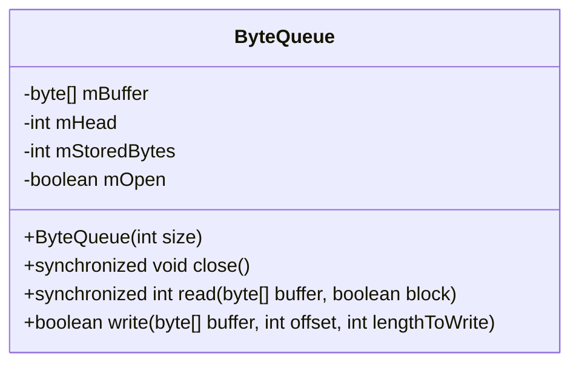
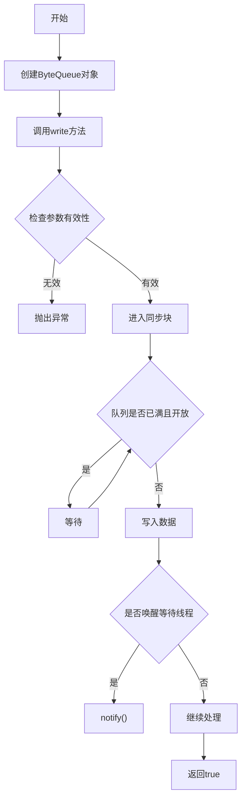
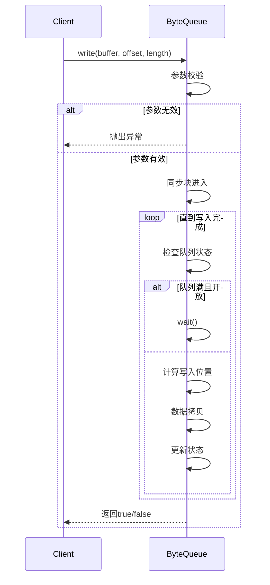
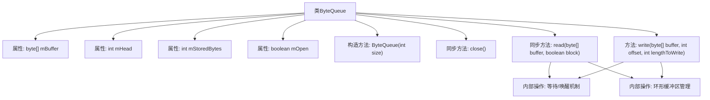
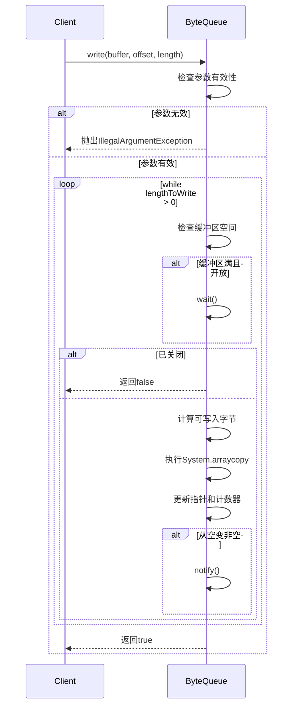

# 基础信息

|      |      |
|------|------|
| 名称 | ByteQueue |
| 编码语言 | .java |
| 代码路径 | termux-app/terminal-emulator/src/main/java/com/termux/terminal/ByteQueue.java |
| 包名 | com.termux.terminal |
| 依赖项 | [] |
| 概述说明 | 字节队列类，支持同步读写和阻塞操作，含关闭功能。 |

# 说明

ByteQueue是一个线程安全的字节队列实现，使用循环缓冲区存储数据。主要功能包括：构造函数初始化指定大小的缓冲区；close方法关闭队列并唤醒等待线程；read方法从队列读取数据到指定缓冲区，支持阻塞和非阻塞模式，返回读取的字节数或-1（队列关闭时）；write方法将数据写入队列，处理缓冲区循环逻辑，返回写入是否成功。通过synchronized实现线程安全，使用wait/notify机制协调读写操作，确保缓冲区满时写等待、空时读等待。

# 类列表 Class Summary

| 名称   | 类型  | 说明 |
|-------|------|-------------|
| ByteQueue | class | 字节队列类，支持同步读写操作，含关闭功能。 |

## 类 ByteQueue

|      |      |
|------|------|
| 访问范围 | final |
| 类型 | class |
| 名称 | ByteQueue |
| 说明 | 字节队列类，支持同步读写操作，含关闭功能。 |

### UML类图

这段代码实现了一个线程安全的字节队列(ByteQueue)，采用环形缓冲区设计。类包含三个核心方法：构造函数初始化缓冲区，write()方法实现带阻塞的写入功能，read()方法实现带阻塞的读取功能。通过synchronized关键字和wait()/notify()机制实现线程同步，处理了缓冲区满/空时的等待逻辑，并确保多线程环境下的数据一致性。环形缓冲区通过维护头指针(mHead)和存储字节数(mStoredBytes)来实现高效的数据存取。

### 内部方法调用关系图

该流程图展示了ByteQueue类的核心结构和交互关系，包含环形缓冲区管理、线程同步机制和两种主要操作（read/write）。时序图详细描述了write方法的执行过程，包括参数验证、阻塞等待、数据拷贝和状态通知等关键步骤。类设计采用同步机制确保线程安全，通过wait/notify实现生产者-消费者模式，缓冲区采用环形结构高效管理数据存取。

### 字段列表 Field List

| 名称  | 类型  | 说明 |
|-------|-------|------|
| mHead | int | 私有整型变量mHead |
| mOpen = true | boolean | 私有布尔变量mOpen初始值为true。 |
| mBuffer | byte[] | 私有字节数组mBuffer |
| mStoredBytes | int | 私有整型变量mStoredBytes |

### 方法列表 Method List

| 名称  | 类型  | 说明 |
|-------|-------|------|
| close | void | 同步关闭方法，设置mOpen为false并唤醒等待线程。 |
| read | int | 同步读取方法，支持阻塞模式，处理缓冲区数据并返回读取字节数。 |
| write | boolean | 写入缓冲数据，检查长度和偏移量，同步处理循环写入，空时唤醒等待。 |

