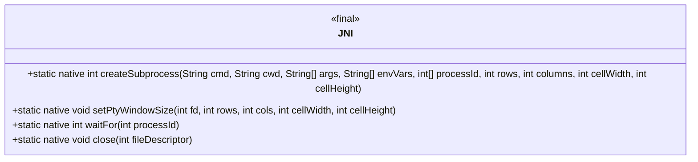
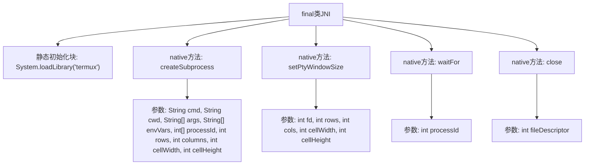

# 基础信息

|      |      |
|------|------|
| 名称 | JNI |
| 编码语言 | .java |
| 代码路径 | termux-app/terminal-emulator/src/main/java/com/termux/terminal/JNI.java |
| 包名 | com.termux.terminal |
| 依赖项 | [] |
| 概述说明 | JNI类提供创建子进程、设置终端窗口大小、等待进程结束和关闭文件描述符的本地方法。 |

# 说明

该JNI类提供了通过伪终端创建和管理子进程的功能。主要方法包括：createSubprocess用于创建子进程并返回主设备文件描述符，支持设置命令、工作目录、参数、环境变量及获取进程ID；setPtyWindowSize用于调整伪终端窗口尺寸；waitFor用于等待进程结束并返回状态码；close用于关闭文件描述符。所有方法均为静态原生实现，需加载termux库。

# 类列表 Class Summary

| 名称   | 类型  | 说明 |
|-------|------|-------------|
| JNI | class | JNI类用于创建带伪终端的子进程，支持设置窗口大小、等待进程结束和关闭文件描述符。 |

## 类 JNI

|      |      |
|------|------|
| 访问范围 | final |
| 类型 | class |
| 名称 | JNI |
| 说明 | JNI类用于创建带伪终端的子进程，支持设置窗口大小、等待进程结束和关闭文件描述符。 |

### UML类图

该代码定义了一个名为JNI的final类，主要用于通过本地方法接口与底层系统交互。类中包含四个native方法：createSubprocess用于创建带伪终端的子进程，setPtyWindowSize设置终端窗口大小，waitFor等待进程结束，close关闭文件描述符。所有方法均为静态且公有，通过System.loadLibrary加载本地库"termux"实现功能。该类封装了与进程管理和终端控制相关的底层系统调用。

### 内部方法调用关系图

这段代码描述了一个final类JNI，通过静态初始化块加载本地库"termux"，并声明了四个native方法用于进程管理。createSubprocess方法用于创建带伪终端的子进程，setPtyWindowSize设置终端窗口尺寸，waitFor等待进程结束并返回状态，close用于关闭文件描述符。所有方法都通过JNI调用本地系统功能，参数包含进程控制、终端配置等必要信息。

### 字段列表 Field List

| 名称  | 类型  | 说明 |
|-------|-------|------|

### 方法列表 Method List

| 名称  | 类型  | 说明 |
|-------|-------|------|
| createSubprocess | int | 创建子进程，指定命令、目录、参数、环境变量、进程ID及终端尺寸。 |
| setPtyWindowSize | void | 设置PTY窗口大小：fd、行、列、单元格宽高。 |
| waitFor | int | 等待指定进程结束并返回状态。 |
| close | void | 关闭指定文件描述符。 |

