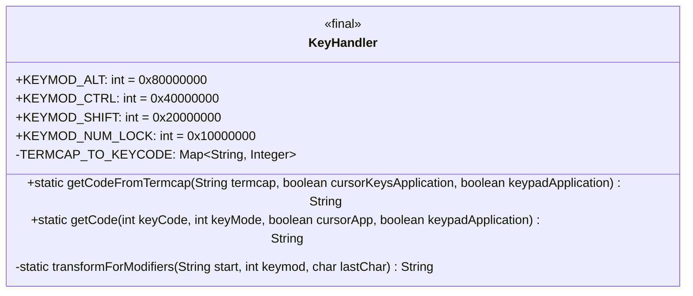
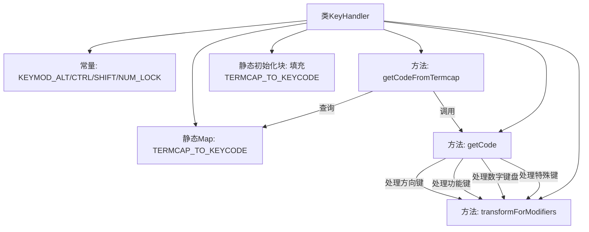

# 基础信息

|      |      |
|------|------|
| 名称 | KeyHandler |
| 编码语言 | .java |
| 代码路径 | termux-app/terminal-emulator/src/main/java/com/termux/terminal/KeyHandler.java |
| 包名 | com.termux.terminal |
| 依赖项 | ['java.util.HashMap', 'java.util.Map', 'android.view.KeyEvent.KEYCODE_BACK', 'android.view.KeyEvent.KEYCODE_BREAK', 'android.view.KeyEvent.KEYCODE_DEL', 'android.view.KeyEvent.KEYCODE_DPAD_CENTER', 'android.view.KeyEvent.KEYCODE_DPAD_DOWN', 'android.view.KeyEvent.KEYCODE_DPAD_LEFT', 'android.view.KeyEvent.KEYCODE_DPAD_RIGHT', 'android.view.KeyEvent.KEYCODE_DPAD_UP', 'android.view.KeyEvent.KEYCODE_ENTER', 'android.view.KeyEvent.KEYCODE_ESCAPE', 'android.view.KeyEvent.KEYCODE_F1', 'android.view.KeyEvent.KEYCODE_F10', 'android.view.KeyEvent.KEYCODE_F11', 'android.view.KeyEvent.KEYCODE_F12', 'android.view.KeyEvent.KEYCODE_F2', 'android.view.KeyEvent.KEYCODE_F3', 'android.view.KeyEvent.KEYCODE_F4', 'android.view.KeyEvent.KEYCODE_F5', 'android.view.KeyEvent.KEYCODE_F6', 'android.view.KeyEvent.KEYCODE_F7', 'android.view.KeyEvent.KEYCODE_F8', 'android.view.KeyEvent.KEYCODE_F9', 'android.view.KeyEvent.KEYCODE_FORWARD_DEL', 'android.view.KeyEvent.KEYCODE_INSERT', 'android.view.KeyEvent.KEYCODE_MOVE_END', 'android.view.KeyEvent.KEYCODE_MOVE_HOME', 'android.view.KeyEvent.KEYCODE_NUMPAD_0', 'android.view.KeyEvent.KEYCODE_NUMPAD_1', 'android.view.KeyEvent.KEYCODE_NUMPAD_2', 'android.view.KeyEvent.KEYCODE_NUMPAD_3', 'android.view.KeyEvent.KEYCODE_NUMPAD_4', 'android.view.KeyEvent.KEYCODE_NUMPAD_5', 'android.view.KeyEvent.KEYCODE_NUMPAD_6', 'android.view.KeyEvent.KEYCODE_NUMPAD_7', 'android.view.KeyEvent.KEYCODE_NUMPAD_8', 'android.view.KeyEvent.KEYCODE_NUMPAD_9', 'android.view.KeyEvent.KEYCODE_NUMPAD_ADD', 'android.view.KeyEvent.KEYCODE_NUMPAD_COMMA', 'android.view.KeyEvent.KEYCODE_NUMPAD_DIVIDE', 'android.view.KeyEvent.KEYCODE_NUMPAD_DOT', 'android.view.KeyEvent.KEYCODE_NUMPAD_ENTER', 'android.view.KeyEvent.KEYCODE_NUMPAD_EQUALS', 'android.view.KeyEvent.KEYCODE_NUMPAD_MULTIPLY', 'android.view.KeyEvent.KEYCODE_NUMPAD_SUBTRACT', 'android.view.KeyEvent.KEYCODE_NUM_LOCK', 'android.view.KeyEvent.KEYCODE_PAGE_DOWN', 'android.view.KeyEvent.KEYCODE_PAGE_UP', 'android.view.KeyEvent.KEYCODE_SPACE', 'android.view.KeyEvent.KEYCODE_SYSRQ', 'android.view.KeyEvent.KEYCODE_TAB'] |
| 概述说明 | KeyHandler类定义键盘码与终端转义序列的映射关系，处理修饰键组合。 |

# 说明

KeyHandler类是一个用于处理键盘输入的实用工具类，主要功能是将终端能力（termcap）和键码映射到对应的转义序列。它定义了四个键修饰符常量（ALT、CTRL、SHIFT、NUM_LOCK），并通过静态哈希表TERMCAP_TO_KEYCODE存储termcap到键码的映射关系。该类提供了两个核心方法：getCodeFromTermcap根据termcap字符串获取对应的转义序列，考虑修饰键状态和终端模式；getCode直接根据键码和修饰键生成转义序列，支持多种终端行为模式（如光标键应用模式和数字键盘应用模式）。方法内部处理了各种特殊键（功能键、方向键、编辑键等）的转义序列生成逻辑，并支持修饰键组合。transformForModifiers私有方法用于为转义序列添加修饰键参数。整体设计旨在兼容不同终端设备的键盘输入处理需求。

# 类列表 Class Summary

| 名称   | 类型  | 说明 |
|-------|------|-------------|
| KeyHandler | class | KeyHandler类将终端键码映射为键盘事件，处理修饰键组合并生成对应转义序列。 |

## 类 KeyHandler

|      |      |
|------|------|
| 访问范围 | public final |
| 类型 | class |
| 名称 | KeyHandler |
| 说明 | KeyHandler类将终端键码映射为键盘事件，处理修饰键组合并生成对应转义序列。 |

### UML类图

这段代码定义了一个`KeyHandler`类，主要用于处理终端键盘输入的键位映射和转换。该类包含多个静态常量表示不同的键盘修饰符状态（如ALT、CTRL等），并通过静态方法`getCodeFromTermcap`和`getCode`将终端键位编码转换为对应的转义序列。其中`TERMCAP_TO_KEYCODE`是一个静态映射表，存储了终端键位到键盘码的对应关系。私有方法`transformForModifiers`用于处理带修饰符的键位转换逻辑。整个类设计为不可继承（final），所有功能通过静态方法提供，适合作为键盘输入处理的工具类。

### 内部方法调用关系图

这段代码流程图展示了KeyHandler类的核心结构和工作流程。该类主要功能是将终端键盘输入转换为标准键码，包含常量定义、键位映射初始化和三个核心方法。getCodeFromTermcap方法通过查询映射表获取键码，getCode方法处理不同键位的转义序列生成，transformForModifiers方法专门处理带修饰键的组合键转换。整个流程特别注重处理方向键、功能键、数字键盘等特殊键位的转换逻辑，并考虑了Ctrl/Alt/Shift等修饰键的组合情况。

### 字段列表 Field List

| 名称  | 类型  | 说明 |
|-------|-------|------|
| KEYMOD_NUM_LOCK = 0x10000000 | int | 静态常量KEYMOD_NUM_LOCK值为0x10000000。 |
| KEYMOD_CTRL = 0x40000000 | int | 静态常量KEYMOD_CTRL值为十六进制0x40000000。 |
| KEYMOD_SHIFT = 0x20000000 | int | 静态常量KEYMOD_SHIFT值为0x20000000 |
| TERMCAP_TO_KEYCODE = new HashMap<>() | Map<String, Integer> | 私有静态常量映射表，键为字符串，值为整型。 |
| KEYMOD_ALT = 0x80000000 | int | 静态常量KEYMOD_ALT值为0x80000000。 |

### 方法列表 Method List

| 名称  | 类型  | 说明 |
|-------|-------|------|
| getCodeFromTermcap | String | 从termcap获取键码，处理修饰键后返回最终键码。 |
| getCode | String | 代码根据键码和模式返回对应转义序列，处理方向键、功能键、数字键盘等。 |
| transformForModifiers | String | 方法根据按键修饰符转换字符串，未修饰返回原字符串，否则添加对应修饰符编号。 |

