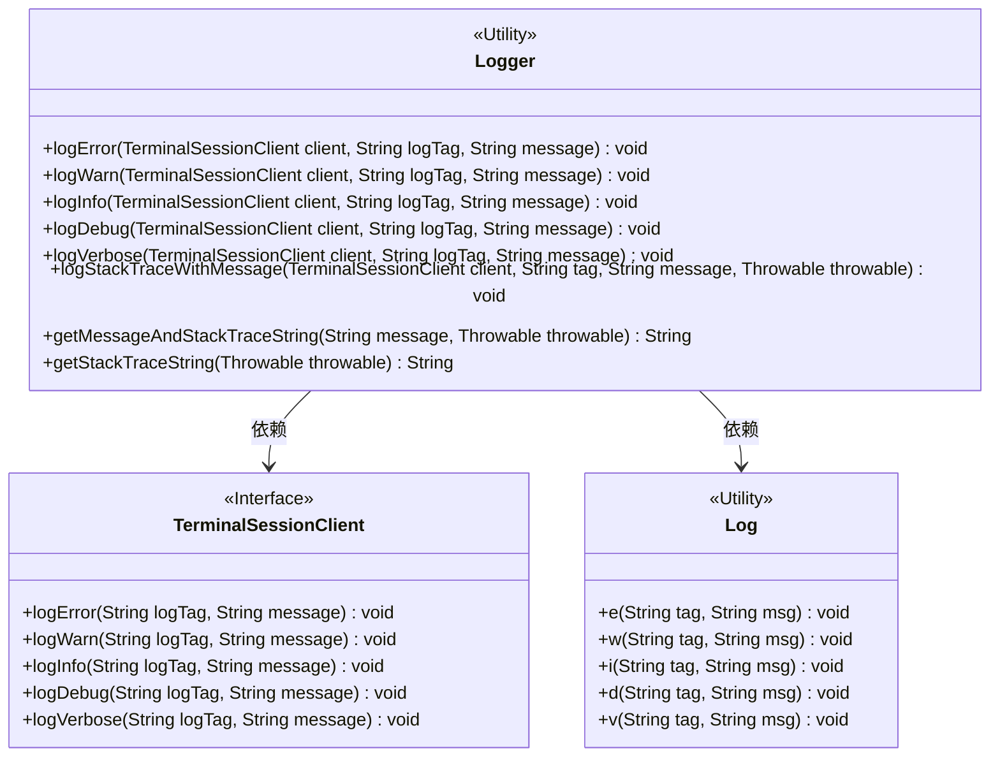
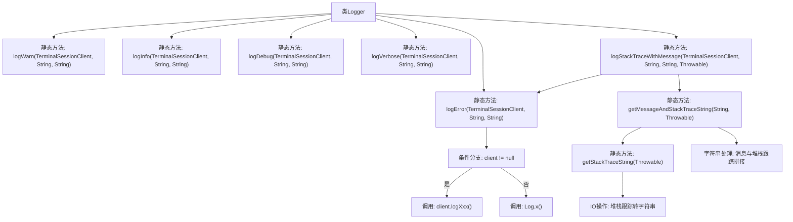

# 基础信息

|      |      |
|------|------|
| 名称 | Logger |
| 编码语言 | .java |
| 代码路径 | termux-app/terminal-emulator/src/main/java/com/termux/terminal/Logger.java |
| 包名 | com.termux.terminal |
| 依赖项 | ['android.util.Log', 'java.io.IOException', 'java.io.PrintWriter', 'java.io.StringWriter'] |
| 概述说明 | Logger类提供日志方法，根据client存在与否选择输出方式，支持错误、警告、信息、调试和详细日志，含堆栈跟踪处理。 |

# 说明

该代码定义了一个Logger类，提供静态方法处理不同级别的日志记录。包含logError、logWarn、logInfo、logDebug和logVerbose方法，根据TerminalSessionClient是否存在选择不同日志输出方式。还提供logStackTraceWithMessage方法记录异常堆栈，以及getMessageAndStackTraceString和getStackTraceString辅助方法构建异常信息字符串。所有方法都支持自定义标签和消息，并处理空值情况。

# 类列表 Class Summary

| 名称   | 类型  | 说明 |
|-------|------|-------------|
| Logger | class | Logger类提供日志方法，支持不同级别日志记录和异常堆栈处理。 |

## 类 Logger

|      |      |
|------|------|
| 访问范围 | public |
| 类型 | class |
| 名称 | Logger |
| 说明 | Logger类提供日志方法，支持不同级别日志记录和异常堆栈处理。 |

### UML类图

这段代码展示了一个日志工具类Logger，它提供了多种日志级别的方法（如error、warn、info等），并能根据是否传入TerminalSessionClient客户端决定日志输出方式。当客户端存在时，日志通过客户端输出；否则使用Android的Log工具类输出。类图清晰地展示了Logger与TerminalSessionClient接口和Log工具类之间的依赖关系，其中Logger作为核心类，通过条件判断实现了灵活的多渠道日志记录功能。

### 内部方法调用关系图

该流程图展示了Logger类的核心结构和调用关系。类包含6个日志级别方法（error/warn/info/debug/verbose）和3个辅助方法，所有方法均为静态。主要流程表现为：日志方法首先检查client参数，非空则调用client对应方法，否则使用系统Log类；异常处理方法通过getStackTraceString将堆栈转为字符串，并与消息拼接。关键路径涉及条件分支、IO流操作和字符串处理，形成完整的日志处理链条。

### 字段列表 Field List

| 名称  | 类型  | 说明 |
|-------|-------|------|

### 方法列表 Method List

| 名称  | 类型  | 说明 |
|-------|-------|------|
| logStackTraceWithMessage | void | 记录带消息的异常堆栈到客户端日志。 |
| logDebug | void | 调试日志方法：检查客户端非空则调用其日志方法，否则使用系统Log输出。 |
| logVerbose | void | 静态方法logVerbose记录日志，优先用client输出，无client则用Log.v。 |
| logInfo | void | 静态方法logInfo记录日志，优先使用client，否则用Log.i。 |
| logWarn | void | 静态方法logWarn：客户端非空时调用其logWarn，否则调用Log.w。 |
| logError | void | 静态方法logError通过客户端记录错误，若无客户端则用Log.e输出。 |
| getMessageAndStackTraceString | String | 静态方法合并消息与异常堆栈，无输入返回空，否则返回组合或单独内容。 |
| getStackTraceString | String | 获取异常堆栈信息的静态方法，返回字符串形式。 |

