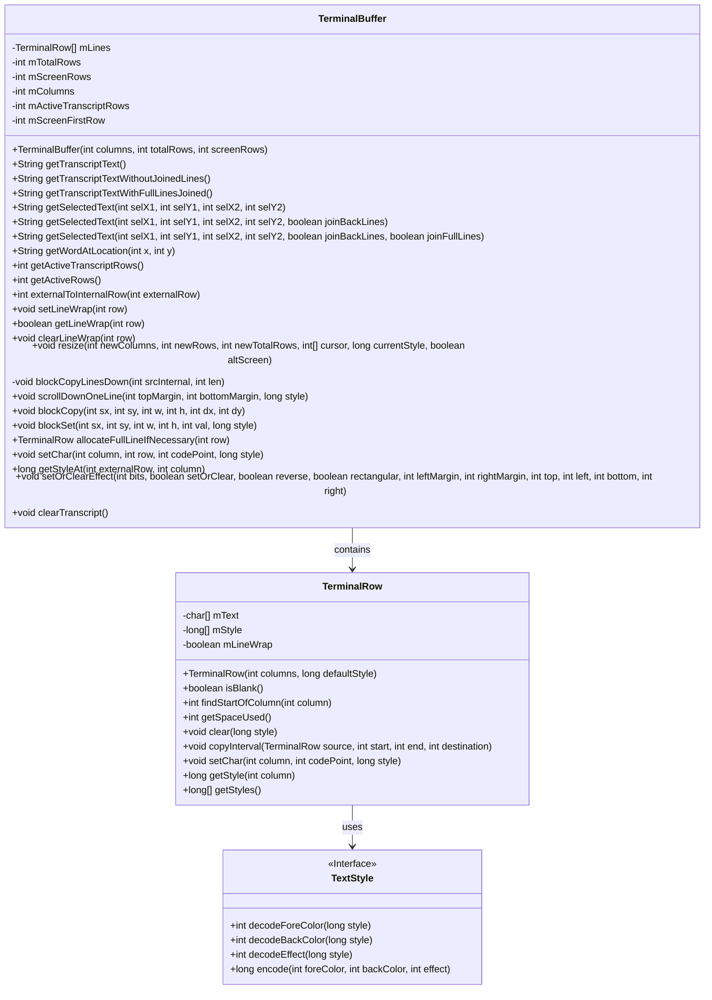
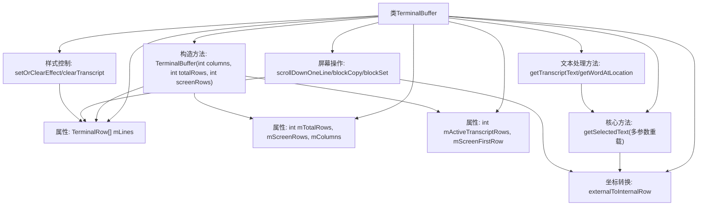

# 基础信息

|      |      |
|------|------|
| 名称 | TerminalBuffer |
| 编码语言 | .java |
| 代码路径 | termux-app/terminal-emulator/src/main/java/com/termux/terminal/TerminalBuffer.java |
| 包名 | com.termux.terminal |
| 依赖项 | ['java.util.Arrays'] |
| 概述说明 | 终端缓冲区类，管理屏幕行和滚动历史，支持文本选择、复制和样式设置。 |

# 说明

TerminalBuffer是一个终端缓冲区实现，用于管理终端屏幕内容和历史记录。它使用循环数组存储终端行，支持屏幕滚动、文本选择、调整大小等操作。主要功能包括：管理可见屏幕和滚动历史（mScreenRows和mActiveTranscriptRows），通过externalToInternalRow转换内外坐标系统，提供多种文本获取方法（如getTranscriptText），支持行包装标记（setLineWrap），处理终端调整大小（resize），实现块操作（blockCopy/blockSet）和滚动（scrollDownOneLine）。还包含样式管理、光标位置处理和清除历史等功能。实现考虑了宽字符、组合字符和性能优化。

# 类列表 Class Summary

| 名称   | 类型  | 说明 |
|-------|------|-------------|
| TerminalBuffer | class | 终端缓冲区类，管理屏幕行和滚动历史，支持文本选择、复制和样式设置。 |

## 类 TerminalBuffer

|      |      |
|------|------|
| 访问范围 | public final |
| 类型 | class |
| 名称 | TerminalBuffer |
| 说明 | 终端缓冲区类，管理屏幕行和滚动历史，支持文本选择、复制和样式设置。 |

### UML类图

这段代码实现了一个终端缓冲区(TerminalBuffer)的核心功能，用于管理终端屏幕的文本内容和样式。主要特点包括：1) 使用环形缓冲区存储终端行(TerminalRow)；2) 支持屏幕滚动和文本选择；3) 处理文本换行和样式设置；4) 提供多种获取文本内容的方法；5) 支持终端大小调整时的内容重排。TerminalBuffer通过TerminalRow管理每行文本内容和样式，同时依赖TextStyle接口处理样式编码/解码。该设计高效处理了终端显示的各种边缘情况，如宽字符、组合字符和样式继承等。

### 内部方法调用关系图

该流程图展示了TerminalBuffer类的核心结构和功能关系。该类主要实现终端缓冲区管理，包含环形缓冲区存储结构（mLines数组）、坐标转换系统（externalToInternalRow）和多种屏幕操作功能。关键方法包括处理文本选择的getSelectedText系列方法、实现屏幕滚动的scrollDownOneLine、以及支持块操作的blockCopy/blockSet。样式控制系统通过setOrClearEffect实现属性修改，而clearTranscript可清空历史记录。所有操作都基于内部的行坐标转换机制，维护着终端屏幕和历史记录的显示状态。

### 字段列表 Field List

| 名称  | 类型  | 说明 |
|-------|-------|------|
| mColumns | int | 定义整型变量mScreenRows和mColumns |
| mScreenFirstRow = 0 | int | 私有整型变量mScreenFirstRow初始值为0。 |
| mLines | TerminalRow[] | 终端行数组mLines |
| mActiveTranscriptRows = 0 | int | 私有整型变量mActiveTranscriptRows初始值为0。 |
| mTotalRows | int | 整型变量mTotalRows记录总行数。 |

### 方法列表 Method List

| 名称  | 类型  | 说明 |
|-------|-------|------|
| getActiveTranscriptRows | int | 获取活动转录行数的方法，返回整型值mActiveTranscriptRows。 |
| getTranscriptTextWithoutJoinedLines | String | 获取无连接行的转录文本，返回选定区域修剪后的文本。 |
| resize | void | 终端窗口调整大小逻辑：处理行列变化、光标位置和屏幕滚动。 |
| getTranscriptTextWithFullLinesJoined | String | 方法返回拼接后的完整文本行，去除首尾空格。 |
| setLineWrap | void | 设置指定行自动换行。 |
| getLineWrap | boolean | 检查指定行是否自动换行。 |
| scrollDownOneLine | void | 滚动屏幕一行，检查边界，复制固定行，更新缓冲区，清空新行。 |
| setChar | void | 设置终端字符，检查行列范围，转换行号后存储字符和样式。 |
| clearTranscript | void | 清除屏幕转录行数据，重置活跃行数为零。 |
| clearLineWrap | void | 清除指定行的自动换行设置。 |
| allocateFullLineIfNecessary | TerminalRow | 分配行空间，若空则新建。 |
| setOrClearEffect | void | 设置或清除终端行效果，包括颜色反转、矩形区域处理及边距控制。 |
| blockCopyLinesDown | void | 向下复制指定行块，保留被覆盖行。 |
| getTranscriptText | String | 获取选中文本并修剪空白字符。 |
| blockSet | void | 设置矩形区域字符值，检查边界后循环赋值。 |
| blockCopy | void | 方法blockCopy实现块复制，检查边界后按行复制指定区域。 |
| getActiveRows | int | 获取活动行数，返回活跃行与屏幕行之和。 |
| getSelectedText | String | 获取选定区域文本的方法，调用带布尔参数的重载版本。 |
| externalToInternalRow | int | 将外部行号转换为内部行号，处理越界并循环调整。 |
| getSelectedText | String | 获取选定文本，处理行尾和换行。 |
| getSelectedText | String | 获取选定文本，参数为坐标和是否合并行。 |
| getWordAtLocation | String | 获取指定坐标处的单词，若无则返回空字符串。 |
| getStyleAt | long | 获取指定行列的样式值。 |

