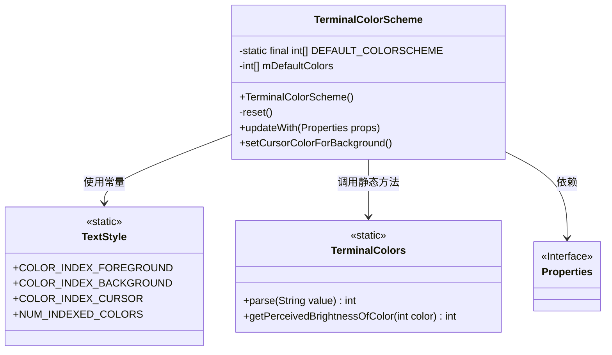
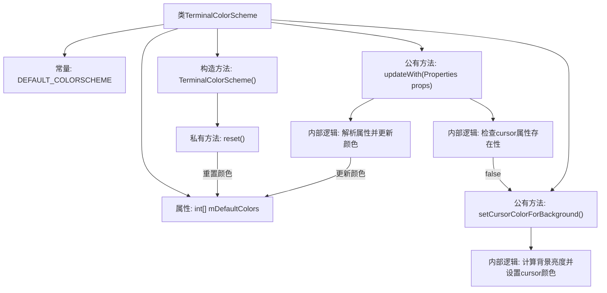

# 基础信息

|      |      |
|------|------|
| 名称 | TerminalColorScheme |
| 编码语言 | .java |
| 代码路径 | termux-app/terminal-emulator/src/main/java/com/termux/terminal/TerminalColorScheme.java |
| 包名 | com.termux.terminal |
| 依赖项 | ['java.util.Map', 'java.util.Properties'] |
| 概述说明 | 终端颜色方案类，包含默认颜色数组，支持属性更新和光标颜色自动调整。 |

# 说明

TerminalColorScheme类定义了一个终端颜色方案，包含默认颜色数组DEFAULT_COLORSCHEME，其中包含16种基础色、216种颜色立方体和24种灰度。类提供了重置颜色方案的方法reset()，以及通过Properties对象更新颜色的方法updateWith()。若未设置光标颜色，setCursorColorForBackground()会根据背景亮度自动选择黑白光标色以确保可见性。颜色值以十六进制格式存储，支持自定义前景、背景和光标颜色。

# 类列表 Class Summary

| 名称   | 类型  | 说明 |
|-------|------|-------------|
| TerminalColorScheme | class | 终端颜色方案类，包含默认颜色数组及更新方法，支持自定义前景、背景和光标色。 |

## 类 TerminalColorScheme

|      |      |
|------|------|
| 访问范围 | public final |
| 类型 | class |
| 名称 | TerminalColorScheme |
| 说明 | 终端颜色方案类，包含默认颜色数组及更新方法，支持自定义前景、背景和光标色。 |

### UML类图

这段代码描述了一个终端颜色方案管理类TerminalColorScheme，它维护一个默认颜色数组，支持通过属性更新颜色配置，并自动处理光标颜色的可见性。类图中包含四个主要元素：TerminalColorScheme类（核心实现）、TextStyle类（提供颜色索引常量）、TerminalColors类（颜色解析工具）和Properties接口（配置来源）。TerminalColorScheme通过reset()初始化默认颜色，updateWith()根据属性更新颜色，setCursorColorForBackground()智能设置光标颜色。整个设计体现了配置管理、颜色处理和智能默认值的组合模式。

### 内部方法调用关系图

这段代码实现了一个终端颜色方案管理类，主要功能包括：1) 通过DEFAULT_COLORSCHEME常量存储256种标准终端颜色；2) 提供reset()方法重置为默认颜色配置；3) 通过updateWith()方法根据属性动态更新颜色值；4) 自动计算背景亮度并智能设置光标颜色。核心逻辑涉及颜色值解析、属性验证和亮度计算，确保终端显示在各种背景下都保持可见性。

### 字段列表 Field List

| 名称  | 类型  | 说明 |
|-------|-------|------|
| DEFAULT_COLORSCHEME = {        // 16 original colors. First 8 are dim.        0xff000000, // black        0xffcd0000, // dim red        0xff00cd00, // dim green        0xffcdcd00, // dim yellow        0xff6495ed, // dim blue        0xffcd00cd, // dim magenta        0xff00cdcd, // dim cyan        0xffe5e5e5, // dim white        // Second 8 are bright:        0xff7f7f7f, // medium grey        0xffff0000, // bright red        0xff00ff00, // bright green        0xffffff00, // bright yellow        0xff5c5cff, // light blue        0xffff00ff, // bright magenta        0xff00ffff, // bright cyan        0xffffffff, // bright white        // 216 color cube, six shades of each color:        0xff000000, 0xff00005f, 0xff000087, 0xff0000af, 0xff0000d7, 0xff0000ff, 0xff005f00, 0xff005f5f, 0xff005f87, 0xff005faf, 0xff005fd7, 0xff005fff,        0xff008700, 0xff00875f, 0xff008787, 0xff0087af, 0xff0087d7, 0xff0087ff, 0xff00af00, 0xff00af5f, 0xff00af87, 0xff00afaf, 0xff00afd7, 0xff00afff,        0xff00d700, 0xff00d75f, 0xff00d787, 0xff00d7af, 0xff00d7d7, 0xff00d7ff, 0xff00ff00, 0xff00ff5f, 0xff00ff87, 0xff00ffaf, 0xff00ffd7, 0xff00ffff,        0xff5f0000, 0xff5f005f, 0xff5f0087, 0xff5f00af, 0xff5f00d7, 0xff5f00ff, 0xff5f5f00, 0xff5f5f5f, 0xff5f5f87, 0xff5f5faf, 0xff5f5fd7, 0xff5f5fff,        0xff5f8700, 0xff5f875f, 0xff5f8787, 0xff5f87af, 0xff5f87d7, 0xff5f87ff, 0xff5faf00, 0xff5faf5f, 0xff5faf87, 0xff5fafaf, 0xff5fafd7, 0xff5fafff,        0xff5fd700, 0xff5fd75f, 0xff5fd787, 0xff5fd7af, 0xff5fd7d7, 0xff5fd7ff, 0xff5fff00, 0xff5fff5f, 0xff5fff87, 0xff5fffaf, 0xff5fffd7, 0xff5fffff,        0xff870000, 0xff87005f, 0xff870087, 0xff8700af, 0xff8700d7, 0xff8700ff, 0xff875f00, 0xff875f5f, 0xff875f87, 0xff875faf, 0xff875fd7, 0xff875fff,        0xff878700, 0xff87875f, 0xff878787, 0xff8787af, 0xff8787d7, 0xff8787ff, 0xff87af00, 0xff87af5f, 0xff87af87, 0xff87afaf, 0xff87afd7, 0xff87afff,        0xff87d700, 0xff87d75f, 0xff87d787, 0xff87d7af, 0xff87d7d7, 0xff87d7ff, 0xff87ff00, 0xff87ff5f, 0xff87ff87, 0xff87ffaf, 0xff87ffd7, 0xff87ffff,        0xffaf0000, 0xffaf005f, 0xffaf0087, 0xffaf00af, 0xffaf00d7, 0xffaf00ff, 0xffaf5f00, 0xffaf5f5f, 0xffaf5f87, 0xffaf5faf, 0xffaf5fd7, 0xffaf5fff,        0xffaf8700, 0xffaf875f, 0xffaf8787, 0xffaf87af, 0xffaf87d7, 0xffaf87ff, 0xffafaf00, 0xffafaf5f, 0xffafaf87, 0xffafafaf, 0xffafafd7, 0xffafafff,        0xffafd700, 0xffafd75f, 0xffafd787, 0xffafd7af, 0xffafd7d7, 0xffafd7ff, 0xffafff00, 0xffafff5f, 0xffafff87, 0xffafffaf, 0xffafffd7, 0xffafffff,        0xffd70000, 0xffd7005f, 0xffd70087, 0xffd700af, 0xffd700d7, 0xffd700ff, 0xffd75f00, 0xffd75f5f, 0xffd75f87, 0xffd75faf, 0xffd75fd7, 0xffd75fff,        0xffd78700, 0xffd7875f, 0xffd78787, 0xffd787af, 0xffd787d7, 0xffd787ff, 0xffd7af00, 0xffd7af5f, 0xffd7af87, 0xffd7afaf, 0xffd7afd7, 0xffd7afff,        0xffd7d700, 0xffd7d75f, 0xffd7d787, 0xffd7d7af, 0xffd7d7d7, 0xffd7d7ff, 0xffd7ff00, 0xffd7ff5f, 0xffd7ff87, 0xffd7ffaf, 0xffd7ffd7, 0xffd7ffff,        0xffff0000, 0xffff005f, 0xffff0087, 0xffff00af, 0xffff00d7, 0xffff00ff, 0xffff5f00, 0xffff5f5f, 0xffff5f87, 0xffff5faf, 0xffff5fd7, 0xffff5fff,        0xffff8700, 0xffff875f, 0xffff8787, 0xffff87af, 0xffff87d7, 0xffff87ff, 0xffffaf00, 0xffffaf5f, 0xffffaf87, 0xffffafaf, 0xffffafd7, 0xffffafff,        0xffffd700, 0xffffd75f, 0xffffd787, 0xffffd7af, 0xffffd7d7, 0xffffd7ff, 0xffffff00, 0xffffff5f, 0xffffff87, 0xffffffaf, 0xffffffd7, 0xffffffff,        // 24 grey scale ramp:        0xff080808, 0xff121212, 0xff1c1c1c, 0xff262626, 0xff303030, 0xff3a3a3a, 0xff444444, 0xff4e4e4e, 0xff585858, 0xff626262, 0xff6c6c6c, 0xff767676,        0xff808080, 0xff8a8a8a, 0xff949494, 0xff9e9e9e, 0xffa8a8a8, 0xffb2b2b2, 0xffbcbcbc, 0xffc6c6c6, 0xffd0d0d0, 0xffdadada, 0xffe4e4e4, 0xffeeeeee,        // COLOR_INDEX_DEFAULT_FOREGROUND, COLOR_INDEX_DEFAULT_BACKGROUND and COLOR_INDEX_DEFAULT_CURSOR:        0xffffffff, 0xff000000, 0xffffffff} | int[] | 默认色彩方案包含16原色、216色立方和24灰度级。 |
| mDefaultColors = new int[TextStyle.NUM_INDEXED_COLORS] | int[] | 声明一个不可变的整型数组mDefaultColors，大小为TextStyle.NUM_INDEXED_COLORS。 |

### 方法列表 Method List

| 名称  | 类型  | 说明 |
|-------|-------|------|
| setCursorColorForBackground | void | 根据背景亮度设置光标颜色，亮背景用黑色，暗背景用白色。 |
| updateWith | void | 方法更新属性，处理颜色值，验证有效性，设置默认颜色。 |
| reset | void | 重置颜色方案为默认值。 |

