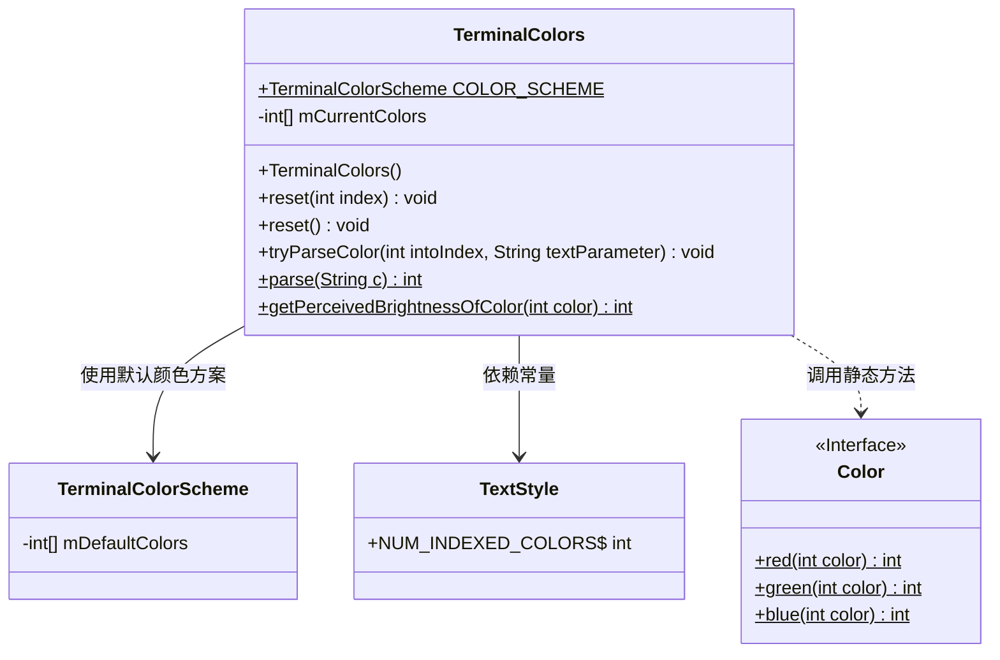

# 基础信息

|      |      |
|------|------|
| 名称 | TerminalColors |
| 编码语言 | .java |
| 代码路径 | termux-app/terminal-emulator/src/main/java/com/termux/terminal/TerminalColors.java |
| 包名 | com.termux.terminal |
| 依赖项 | ['android.graphics.Color'] |
| 概述说明 | 终端颜色管理类，支持重置、解析颜色及计算亮度。 |

# 说明

TerminalColors类用于管理终端颜色，包含默认颜色方案和当前颜色数组。构造函数初始化默认颜色，提供reset方法重置单个或全部颜色至默认值。parse方法解析颜色字符串（支持#RGB和rgb:格式），返回0xFFRRGGBB格式或0表示失败。tryParseColor尝试解析颜色并存入指定索引。getPerceivedBrightnessOfColor根据RGB分量计算颜色感知亮度（0-255）。该类支持动态修改颜色，并处理颜色格式转换与亮度计算。

# 类列表 Class Summary

| 名称   | 类型  | 说明 |
|-------|------|-------------|
| TerminalColors | class | 终端颜色类，含默认配色、重置方法及颜色解析功能。 |


## 类 TerminalColors

|      |      |
|------|------|
| 访问范围 | public final |
| 类型 | class |
| 名称 | TerminalColors |
| 说明 | 终端颜色类，含默认配色、重置方法及颜色解析功能。 |


### UML类图



类图描述：
TerminalColors类用于管理终端颜色，包含静态颜色方案COLOR_SCHEME和当前颜色数组mCurrentColors。提供颜色重置、解析和亮度计算功能，依赖于TerminalColorScheme获取默认颜色，使用TextStyle的常量定义颜色数量，并调用Color接口的静态方法处理RGB分量。解析方法支持#RGB和rgb:格式，亮度计算采用HSP感知模型。


### 内部方法调用关系图

```mermaid
graph TD
    A["类TerminalColors"]
    B["静态属性: TerminalColorScheme COLOR_SCHEME"]
    C["实例属性: int[] mCurrentColors"]
    D["构造方法: TerminalColors()"]
    E["方法: reset(int index)"]
    F["方法: reset()"]
    G["静态方法: parse(String c)"]
    H["方法: tryParseColor(int intoIndex, String textParameter)"]
    I["静态方法: getPerceivedBrightnessOfColor(int color)"]

    A --> B
    A --> C
    A --> D
    A --> E
    A --> F
    A -.-> G
    A --> H
    A -.-> I

    D --> F
    E -->|调用| B
    F -->|调用| B
    H -->|调用| G
    G -->|可能抛出| "异常处理"
    I -->|调用| "Color.red/green/blue"
```

该流程图展示了TerminalColors类的完整结构，包含静态属性、实例属性、构造方法和主要功能方法。核心流程包括：1) 构造时通过reset()初始化颜色数组；2) 通过parse()方法解析颜色字符串；3) tryParseColor()将解析结果存入指定索引；4) 亮度计算通过静态方法实现。异常处理体现在parse()方法对非法格式的容错，颜色操作均依赖静态COLOR_SCHEME的默认值。

### 字段列表 Field List

| 名称  | 类型  | 说明 |
|-------|-------|------|
| mCurrentColors = new int[TextStyle.NUM_INDEXED_COLORS] | int[] | 声明一个不可变整型数组，长度由TextStyle.NUM_INDEXED_COLORS确定。 |
| COLOR_SCHEME = new TerminalColorScheme() | TerminalColorScheme | 定义静态常量COLOR_SCHEME，类型为TerminalColorScheme。 |

### 方法列表 Method List

| 名称  | 类型  | 说明 |
|-------|-------|------|
| reset | void | 重置指定索引的颜色为默认值。 |
| parse | int | 解析颜色字符串为RGB整数值，支持#和rgb:格式，错误返回0。 |
| reset | void | 重置颜色：将默认颜色复制到当前颜色数组。 |
| tryParseColor | void | 解析颜色并存入数组，非零时更新指定位置。 |
| getPerceivedBrightnessOfColor | int | 计算颜色感知亮度的静态方法，基于RGB分量加权平方和开方。 |


