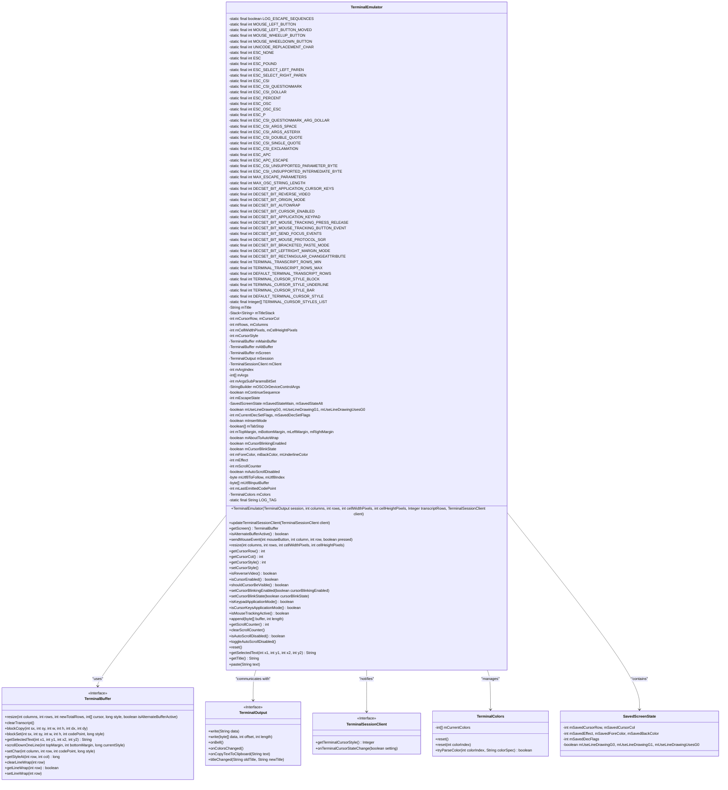
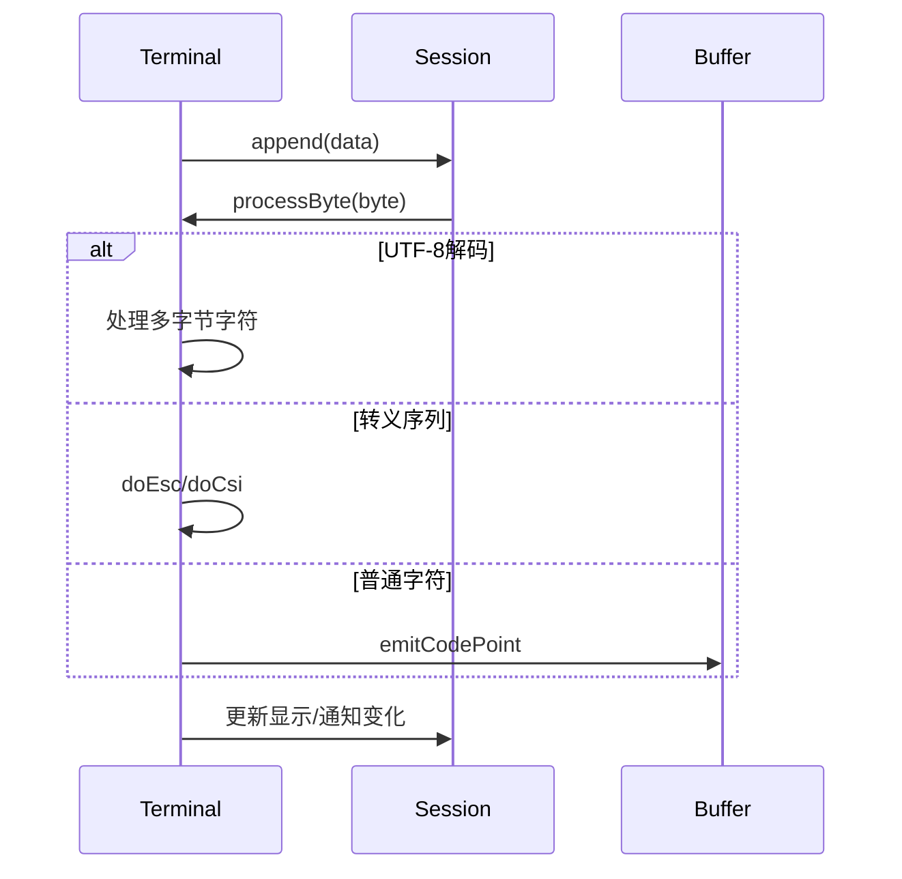

# 基础信息

|      |      |
|------|------|
| 名称 | TerminalEmulator |
| 编码语言 | .java |
| 代码路径 | termux-app/terminal-emulator/src/main/java/com/termux/terminal/TerminalEmulator.java |
| 包名 | com.termux.terminal |
| 依赖项 | ['android.util.Base64', 'java.nio.charset.StandardCharsets', 'java.util.Arrays', 'java.util.Locale', 'java.util.Objects', 'java.util.Stack'] |
| 概述说明 | 终端模拟器类，实现VT100/VT420终端功能，支持鼠标、颜色、滚动等控制序列。 |

# 说明

TerminalEmulator是一个终端模拟器类，用于处理终端输入输出和状态管理。它支持多种终端控制序列、鼠标事件、字符编码转换、光标控制、屏幕滚动等功能。关键特性包括：

1. 支持多种终端控制序列处理，包括CSI、OSC、DCS等
2. 实现鼠标事件报告和鼠标跟踪模式
3. 支持UTF-8字符编码处理
4. 提供主缓冲区和备用缓冲区切换功能
5. 支持多种光标样式（块状、下划线、竖线）
6. 实现文本属性控制（颜色、粗体、斜体、下划线等）
7. 支持滚动区域和边距设置
8. 提供复制粘贴功能，支持括号粘贴模式
9. 实现DEC私有模式设置和查询
10. 支持终端标题设置和颜色配置

该类维护终端状态包括光标位置、字符属性、边距设置、缓冲区状态等，并通过TerminalOutput接口与外部会话交互。它能够解析和处理各种终端控制序列，更新内部状态，并生成相应的输出响应。

# 类列表 Class Summary

| 名称   | 类型  | 说明 |
|-------|------|-------------|
| TerminalEmulator | class | 终端模拟器类，实现VT100/VT420终端功能。支持UTF-8输入处理、鼠标事件、光标控制、屏幕滚动、文本属性设置等。包含字符集切换、转义序列解析、颜色管理等核心功能，用于构建终端仿真环境。 |

## 类 TerminalEmulator

|      |      |
|------|------|
| 访问范围 | public final |
| 类型 | class |
| 名称 | TerminalEmulator |
| 说明 | 终端模拟器类，实现VT100/VT420终端功能。支持UTF-8输入处理、鼠标事件、光标控制、屏幕滚动、文本属性设置等。包含字符集切换、转义序列解析、颜色管理等核心功能，用于构建终端仿真环境。 |

### UML类图

这段代码实现了一个完整的终端模拟器TerminalEmulator，支持VT100/VT520终端协议，包含光标控制、屏幕缓冲区管理、鼠标事件处理、颜色设置、滚动区域等功能。类图展示了核心组件及其关系：TerminalEmulator作为主类，通过TerminalBuffer管理屏幕内容，通过TerminalOutput与外部通信，通过TerminalSessionClient接收回调，并使用TerminalColors管理颜色配置。SavedScreenState保存终端状态用于恢复。该实现处理了多种转义序列、控制字符和终端特性，包括UTF-8输入处理、鼠标协议、交替屏幕缓冲区等复杂功能。

### 内部方法调用关系图

```mermaid
graph TD
    A["TerminalEmulator"]
    B["常量定义"]
    C["状态变量"]
    D["缓冲区管理"]
    E["光标控制"]
    F["转义序列处理"]
    G["鼠标事件处理"]
    H["颜色管理"]
    I["终端属性控制"]
    J["UTF-8解码"]

    A --> B
    A --> C
    A --> D
    A --> E
    A --> F
    A --> G
    A --> H
    A --> I
    A --> J

    B --> K["LOG_ESCAPE_SEQUENCES"]
    B --> L["MOUSE_*常量"]
    B --> M["UNICODE_REPLACEMENT_CHAR"]
    B --> N["ESC_*状态常量"]
    B --> O["DECSET_*位标志"]

    C --> P["mCursorRow/Col"]
    C --> Q["mEscapeState"]
    C --> R["mArgs/mArgIndex"]
    C --> S["mAboutToAutoWrap"]

    D --> T["mMainBuffer"]
    D --> U["mAltBuffer"]
    D --> V["mScreen"]

    E --> W["setCursorPosition"]
    E --> X["scrollDownOneLine"]
    E --> Y["save/restoreCursor"]

    F --> Z["processByte"]
    F --> AA["doEsc/doCsi"]
    F --> AB["selectGraphicRendition"]

    G --> AC["sendMouseEvent"]
    G --> AD["isMouseTrackingActive"]

    H --> AE["TerminalColors"]
    H --> AF["mFore/mBackColor"]

    I --> AG["setDecsetinternalBit"]
    I --> AH["reset"]

    J --> AI["processCodePoint"]
    J --> AJ["UTF-8解码逻辑"]
```

这段代码实现了一个完整的VT100/VT420终端模拟器，主要功能包括：

1. 终端状态管理：维护光标位置、滚动区域、字符属性等200+个状态变量
2. 转义序列处理：实现CSI、OSC、DCS等50+种ANSI转义序列的解析状态机
3. 双缓冲机制：支持主缓冲区和交替缓冲区切换（DECSET 1047/1049）
4. 高级功能：
   - 鼠标事件报告（SGR/X10协议）
   - 256色和真彩色支持
   - 矩形区域操作（DECCRA/DECFRA）
   - 带保护的字符属性（DECSCA）
5. 性能优化：
   - UTF-8增量解码
   - 滚动区域局部更新
   - 高效的屏幕缓冲区拷贝

代码结构清晰分为输入处理、状态维护和输出渲染三大部分，通过精细的状态机实现与物理终端的兼容性。特别值得注意的是其对边缘情况的处理，如组合字符、自动换行和滚动边界的精确控制。

### 字段列表 Field List

| 名称  | 类型  | 说明 |
|-------|-------|------|
| DECSET_BIT_ORIGIN_MODE = 1 << 2 | int | 私有静态常量DECSET_BIT_ORIGIN_MODE值为1左移2位。 |
| mRightMargin | int | 私有变量：上下左右边距 |
| TERMINAL_CURSOR_STYLE_BAR = 2 | int | 终端光标样式为竖线 |
| ESC_PERCENT = 9 | int | 私有静态常量ESC_PERCENT值为9。 |
| ESC_CSI_DOLLAR = 8 | int | 私有静态常量ESC_CSI_DOLLAR值为8。 |
| DECSET_BIT_REVERSE_VIDEO = 1 << 1 | int | 私有静态常量DECSET_BIT_REVERSE_VIDEO值为2（1左移1位）。 |
| mUnderlineColor | int | 声明三个整型变量：前景色、背景色、下划线颜色。 |
| TERMINAL_CURSOR_STYLE_BLOCK = 0 | int | 终端光标样式：块状 |
| DEFAULT_TERMINAL_CURSOR_STYLE = TERMINAL_CURSOR_STYLE_BLOCK | int | 终端光标默认样式为块状。 |
| ESC_CSI_QUESTIONMARK = 7 | int | 私有常量ESC_CSI_QUESTIONMARK值为7。 |
| mInsertMode | boolean | 私有布尔变量mInsertMode |
| mEffect | int | 整型变量mEffect |
| ESC_CSI_UNSUPPORTED_PARAMETER_BYTE = 22 | int | 私有常量ESC_CSI_UNSUPPORTED_PARAMETER_BYTE值为22。 |
| LOG_TAG = "TerminalEmulator" | String | 终端模拟器日志标签 |
| mTitle | String | 私有字符串变量mTitle |
| DECSET_BIT_RECTANGULAR_CHANGEATTRIBUTE = 1 << 12 | int | 私有静态常量DECSET_BIT_RECTANGULAR_CHANGEATTRIBUTE值为1左移12位。 |
| mArgsSubParamsBitSet = 0 | int | 私有整型变量mArgsSubParamsBitSet初始化为0。 |
| ESC_CSI_SINGLE_QUOTE = 18 | int | 私有静态常量ESC_CSI_SINGLE_QUOTE值为18。 |
| mArgs = new int[MAX_ESCAPE_PARAMETERS] | int[] | 私有整型数组mArgs，大小为MAX_ESCAPE_PARAMETERS。 |
| UNICODE_REPLACEMENT_CHAR = 0xFFFD | int | UNICODE替换字符常量值为0xFFFD。 |
| MOUSE_WHEELDOWN_BUTTON = 65 | int | 鼠标滚轮向下按钮常量值为65。 |
| DECSET_BIT_LEFTRIGHT_MARGIN_MODE = 1 << 11 | int | 私有常量DECSET_BIT_LEFTRIGHT_MARGIN_MODE值为1左移11位。 |
| ESC_SELECT_RIGHT_PAREN = 4 | int | 私有静态常量ESC_SELECT_RIGHT_PAREN值为4。 |
| mLastEmittedCodePoint = -1 | int | 私有整型变量，记录最后发出的代码点，初始值为-1。 |
| mTitleStack = new Stack<>() | Stack<String> | 私有栈变量mTitleStack，存储字符串类型。 |
| ESC_CSI_DOUBLE_QUOTE = 17 | int | 私有常量ESC_CSI_DOUBLE_QUOTE值为17。 |
| MOUSE_WHEELUP_BUTTON = 64 | int | 定义鼠标滚轮上滚按钮常量值为64。 |
| DECSET_BIT_BRACKETED_PASTE_MODE = 1 << 10 | int | 定义常量DECSET_BIT_BRACKETED_PASTE_MODE，值为1左移10位。 |
| mUtf8InputBuffer = new byte[4] | byte[] | 私有字节数组，长度4，存储UTF8输入。 |
| mClient | TerminalSessionClient | 终端会话客户端变量mClient |
| mOSCOrDeviceControlArgs = new StringBuilder() | StringBuilder | 私有StringBuilder变量mOSCOrDeviceControlArgs用于存储OSC或设备控制参数。 |
| DECSET_BIT_MOUSE_PROTOCOL_SGR = 1 << 9 | int | 私有常量DECSET_BIT_MOUSE_PROTOCOL_SGR值为1左移9位。 |
| mUtf8Index | byte | 私有字节变量mUtf8ToFollow和mUtf8Index。 |
| mSession | TerminalOutput | 私有终端输出会话实例mSession |
| MOUSE_LEFT_BUTTON_MOVED = 32 | int | 鼠标左键移动事件常量，值为32。 |
| ESC_CSI_ARGS_SPACE = 15 | int | 私有常量ESC_CSI_ARGS_SPACE值为15 |
| ESC_CSI_QUESTIONMARK_ARG_DOLLAR = 14 | int | 私有静态常量ESC_CSI_QUESTIONMARK_ARG_DOLLAR值为14。 |
| mAutoScrollDisabled | boolean | 自动滚动禁用标志 |
| mScreen | TerminalBuffer | 私有终端缓冲区mScreen |
| DECSET_BIT_SEND_FOCUS_EVENTS = 1 << 8 | int | 私有静态常量DECSET_BIT_SEND_FOCUS_EVENTS值为256（1左移8位）。 |
| MOUSE_LEFT_BUTTON = 0 | int | 定义鼠标左键常量值为0。 |
| mColors = new TerminalColors() | TerminalColors | 声明并初始化终端颜色对象mColors。 |
| ESC_CSI_UNSUPPORTED_INTERMEDIATE_BYTE = 23 | int | 私有静态常量ESC_CSI_UNSUPPORTED_INTERMEDIATE_BYTE值为23。 |
| ESC_P = 13 | int | 私有静态常量ESC_P值为13。 |
| mAltBuffer | TerminalBuffer | 终端备用缓冲区变量 |
| DECSET_BIT_MOUSE_TRACKING_BUTTON_EVENT = 1 << 7 | int | 私有常量，鼠标跟踪按钮事件标志位，值为128。 |
| mArgIndex | int | 私有整型变量mArgIndex |
| mCursorCol | int | 私有整型变量mCursorRow和mCursorCol |
| mScrollCounter = 0 | int | 私有整型变量mScrollCounter初始化为0。 |
| ESC_CSI_ARGS_ASTERIX = 16 | int | 私有静态常量ESC_CSI_ARGS_ASTERIX值为16。 |
| ESC_CSI_BIGGERTHAN = 12 | int | 私有静态常量ESC_CSI_BIGGERTHAN值为12。 |
| mMainBuffer | TerminalBuffer | 私有终端缓冲区主实例 |
| ESC_OSC_ESC = 11 | int | 私有静态常量ESC_OSC_ESC值为11。 |
| ESC_CSI_EXCLAMATION = 19 | int | 私有静态常量ESC_CSI_EXCLAMATION值为19。 |
| DECSET_BIT_CURSOR_ENABLED = 1 << 4 | int | 定义静态常量DECSET_BIT_CURSOR_ENABLED，值为16（1左移4位）。 |
| mCursorStyle = DEFAULT_TERMINAL_CURSOR_STYLE | int | 私有整型变量mCursorStyle，默认值为DEFAULT_TERMINAL_CURSOR_STYLE。 |
| mCursorBlinkState | boolean | 私有布尔变量，控制光标闪烁状态。 |
| mContinueSequence | boolean | 私有布尔变量mContinueSequence |
| DECSET_BIT_AUTOWRAP = 1 << 3 | int | 私有常量DECSET_BIT_AUTOWRAP值为8，用于位操作。 |
| mAboutToAutoWrap | boolean | 私有布尔变量，标记即将自动换行状态。 |
| mCursorBlinkingEnabled | boolean | 私有布尔型变量，控制光标闪烁开关。 |
| DECSET_BIT_APPLICATION_KEYPAD = 1 << 5 | int | 私有常量DECSET_BIT_APPLICATION_KEYPAD值为1左移5位。 |
| DECSET_BIT_APPLICATION_CURSOR_KEYS = 1 | int | 私有静态常量DECSET_BIT_APPLICATION_CURSOR_KEYS值为1。 |
| DEFAULT_TERMINAL_TRANSCRIPT_ROWS = 2000 | int | 终端默认行数2000。 |
| ESC_OSC = 10 | int | 私有静态常量ESC_OSC值为10。 |
| ESC_CSI = 6 | int | 定义私有静态常量ESC_CSI值为6。 |
| DECSET_BIT_MOUSE_TRACKING_PRESS_RELEASE = 1 << 6 | int | 私有静态常量DECSET_BIT_MOUSE_TRACKING_PRESS_RELEASE值为1左移6位。 |
| mSavedDecSetFlags | int | 私有整型变量：当前和保存的解码标志位。 |
| MAX_OSC_STRING_LENGTH = 8192 | int | 定义最大OSC字符串长度为8192。 |
| LOG_ESCAPE_SEQUENCES = false | boolean | 私有静态常量LOG_ESCAPE_SEQUENCES设为false |
| TERMINAL_TRANSCRIPT_ROWS_MAX = 50000 | int | 终端日志最大行数限制为50000。 |
| mUseLineDrawingUsesG0 = true | boolean | 三个布尔变量控制线绘制功能，默认启用G0。 |
| TERMINAL_TRANSCRIPT_ROWS_MIN = 100 | int | 终端最小行数设为100。 |
| TERMINAL_CURSOR_STYLE_UNDERLINE = 1 | int | 终端光标样式为下划线 |
| mSavedStateAlt = new SavedScreenState() | SavedScreenState | 私有变量mSavedStateAlt初始化为SavedScreenState实例。 |
| mTabStop | boolean[] | 私有布尔数组mTabStop |
| mCellHeightPixels | int | 私有整型变量：单元格宽高像素值 |
| ESC_SELECT_LEFT_PAREN = 3 | int | 私有静态常量ESC_SELECT_LEFT_PAREN值为3。 |
| ESC_POUND = 2 | int | 私有常量ESC_POUND值为2。 |
| ESC_APC_ESCAPE = 21 | int | 私有静态常量ESC_APC_ESCAPE值为21。 |
| mSavedStateMain = new SavedScreenState() | SavedScreenState | 私有变量mSavedStateMain初始化为SavedScreenState实例。 |
| TERMINAL_CURSOR_STYLES_LIST = new Integer[]{TERMINAL_CURSOR_STYLE_BLOCK, TERMINAL_CURSOR_STYLE_UNDERLINE, TERMINAL_CURSOR_STYLE_BAR} | Integer[] | 终端光标样式列表：块状、下划线、条状。 |
| mColumns | int | 声明两个整型变量mRows和mColumns。 |
| ESC = 1 | int | 私有静态整型常量ESC值为1。 |
| MAX_ESCAPE_PARAMETERS = 32 | int | 私有常量MAX_ESCAPE_PARAMETERS值为32。 |
| ESC_APC = 20 | int | 私有静态常量ESC_APC值为20。 |
| mEscapeState | int | 私有整型变量mEscapeState |
| ESC_NONE = 0 | int | 私有静态常量ESC_NONE值为0。 |

### 方法列表 Method List

| 名称  | 类型  | 说明 |
|-------|-------|------|
| doDecSetOrReset | void | 方法处理终端设置重置，包括光标、边距、屏幕缓冲等操作。 |
| setCursorRow | void | 设置光标行并关闭自动换行。 |
| getCursorStyle | int | 获取当前光标样式值的方法。 |
| getTerminalTranscriptRows | int | 检查并返回有效的终端行数，无效则返回默认值。 |
| doDeviceControl | void | 处理设备控制请求，支持DECRQSS和Termcap/Terminfo查询，响应颜色、名称等参数。 |
| mapDecSetBitToInternalBit | int | 静态方法将DECSET位映射到内部位，无匹配返回-1。 |
| processCodePoint | void | 处理终端控制字符和转义序列，包括光标移动、字符集切换、区域操作等。 |
| blockClear | void | 私有方法，清除指定位置和大小的块。 |
| setDefaultTabStops | void | 设置默认制表位：每8列一个，首列除外。 |
| doOsc | void | 处理OSC指令：响铃、转义或收集参数。 |
| isCursorEnabled | boolean | 检查光标是否启用，返回布尔值。 |
| getArg | int | 获取数组指定索引值，若为负或零且需处理则返回默认值。 |
| getStyle | long | 获取文本样式编码，包含前景色、背景色和特效。 |
| doLinefeed | void | 私有方法处理换行，根据光标位置决定滚动或移动行。 |
| setDecsetinternalBit | void | 设置内部位标志，处理鼠标模式互斥逻辑。 |
| paste | void | 处理文本粘贴：移除控制字符，替换换行符，支持括号粘贴模式。 |
| toString | String | 终端模拟器信息：尺寸mColumns×mScreenRows，边距{mTopMargin,mRightMargin,mBottomMargin,mLeftMargin} |
| doSetMode | void | 私有方法设置模式：处理插入/替换模式、行进模式和光标可见性，未知参数调用unknownParameter。 |
| isMouseTrackingActive | boolean | 检查鼠标跟踪状态是否激活。 |
| selectGraphicRendition | void | 处理文本样式代码，设置颜色、效果等属性。 |
| doCsiQuestionMark | void | 处理终端控制序列，包括擦除、光标操作和状态报告。 |
| emitCodePoint | void | 代码点转换与光标处理函数，包含特殊字符映射和自动换行逻辑。 |
| doCsi | void | 处理CSI转义序列，控制光标、屏幕操作和终端属性。 |
| getScreen | TerminalBuffer | 获取终端屏幕缓冲区的公共方法。 |
| finishSequence | void | 结束序列，重置转义状态。 |
| blockClear | void | 清除屏幕指定区域内容。 |
| finishSequenceAndLogError | void | 私有方法：记录错误日志并结束序列。 |
| setCursorPosition | void | 设置光标位置，考虑边界和原点模式。 |
| saveCursor | void | 保存当前光标位置、颜色、效果及绘图标志位到状态对象。 |
| shouldCursorBeVisible | boolean | 检查光标是否可见：启用且不闪烁时为真，否则根据闪烁状态决定。 |
| logError | void | 私有方法记录错误信息，包含错误类型、转义状态及参数值。 |
| doEsc | void | 处理转义字符的开关语句，包括光标控制、屏幕操作和序列处理。 |
| isReverseVideo | boolean | 检查视频是否反转，返回布尔值。 |
| isAlternateBufferActive | boolean | 检查当前屏幕是否为备用缓冲区。 |
| unknownParameter | void | 未知参数处理：记录错误并终止流程。 |
| doEscPound | void | 私有方法处理ESC#指令：'8'时屏幕填充'E'，否则报未知序列。 |
| setCursorBlinkingEnabled | void | 设置光标闪烁开关状态。 |
| setCursorStyle | void | 设置终端光标样式，优先使用客户端指定值，无效则用默认值。 |
| unknownSequence | void | 处理未知序列字符，记录错误并结束序列。 |
| continueSequence | void | 私有方法：设置状态并继续序列。 |
| restoreCursor | void | 恢复光标位置、颜色、效果及绘图模式设置。 |
| scrollDownOneLine | void | 滚动屏幕一行：根据边距情况执行块复制或整行滚动，保持样式一致。 |
| unimplementedSequence | void | 未实现序列字符处理，记录错误并结束序列。 |
| doCsiBiggerThan | void | 处理CSI指令：'c'返回终端属性，'m'设置键盘修饰符，其他情况解析参数。 |
| getCursorRow | int | 获取当前光标行数。 |
| setCursorBlinkState | void | 设置光标闪烁状态的方法。 |
| doCsiUnsupportedParameterOrIntermediateByte | void | 处理CSI不支持的参数或中间字节，根据字节范围决定后续操作。 |
| resizeScreen | void | 调整屏幕尺寸，更新光标位置和缓冲区状态。 |
| getArg1 | int | 获取参数1的值，默认返回defaultValue。 |
| nextTabStop | int | 方法计算下一个制表位位置，基于当前列和制表符数量，返回右边界内最近的有效位置。 |
| resize | void | 调整终端尺寸，更新行列数和单元格像素大小，处理边距和制表位。 |
| startEscapeSequence | void | 启动转义序列：重置状态、参数索引和参数数组。 |
| getArg0 | int | 获取参数0，默认值defaultValue |
| doApcEscape | void | 处理APC转义：遇反斜杠结束序列，否则继续。 |
| sendMouseEvent | void | 发送鼠标事件方法：处理按钮、行列坐标，根据协议格式输出控制序列。 |
| getCursorCol | int | 获取当前光标列位置。 |
| parseArg | void | 解析参数：处理数字、分号或冒号，更新参数值或标记子参数，错误时记录。 |
| collectOSCArgs | void | 收集OSC参数，长度超限时处理未知序列。 |
| doApc | void | Java方法：处理APC序列，若b为27则调用continueSequence。 |
| isKeypadApplicationMode | boolean | 检查键盘是否为应用模式。 |
| processByte | void | 处理UTF-8字节流，验证并解码字符，处理无效序列。 |
| doOscSetTextParameters | void | 解析OSC指令，处理文本参数，设置颜色、标题等终端属性。 |
| isCursorKeysApplicationMode | boolean | 检查光标键是否为应用模式。 |
| isDecsetInternalBitSet | boolean | 检查内部位标志是否设置 |
| updateTerminalSessionClient | void | 更新终端会话客户端并设置光标样式和闪烁状态。 |
| append | void | 将字节数组内容按长度逐个处理。 |
| doOscEsc | void | 处理OSC转义序列：遇反斜杠设置文本参数，否则收集参数并继续序列。 |
| setCursorCol | void | 设置光标列位置并关闭自动换行。 |
| setCursorColRespectingOriginMode | void | 设置光标列位置，考虑原点模式。 |
| setCursorRowCol | void | 设置光标行列位置，确保在有效范围内，并重置自动换行标志。 |
| getScrollCounter | int | 获取滚动计数器值的方法。 |
| clearScrollCounter | void | 清除滚动计数器，重置为0。 |
| isAutoScrollDisabled | boolean | 方法返回自动滚动是否禁用。 |
| toggleAutoScrollDisabled | void | 切换自动滚动禁用状态的方法。 |
| reset | void | 重置终端状态：恢复默认设置、光标、边距、颜色、编码等。 |
| getSelectedText | String | 获取屏幕指定区域选中文本，参数为坐标x1,y1到x2,y2。 |
| getTitle | String | 获取标题字符串的方法。 |
| setTitle | void | 私有方法更新标题，若新旧不同则触发变更事件。 |

