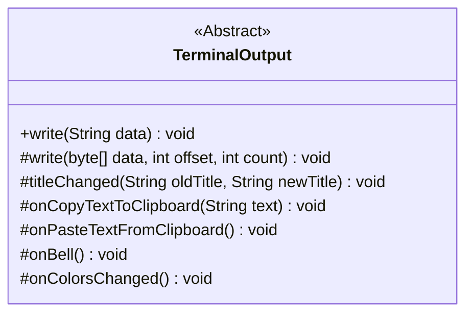
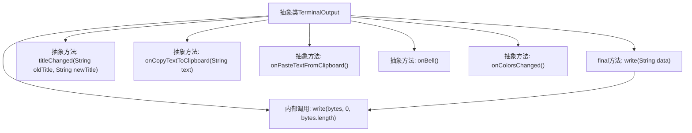

# 基础信息

|      |      |
|------|------|
| 名称 | TerminalOutput |
| 编码语言 | .java |
| 代码路径 | termux-app/terminal-emulator/src/main/java/com/termux/terminal/TerminalOutput.java |
| 包名 | com.termux.terminal |
| 依赖项 | ['java.nio.charset.StandardCharsets'] |
| 概述说明 | 终端输出类，提供写入字符串、字节、标题变更、剪贴板操作、响铃和颜色变更通知功能。 |

# 说明

这是一个抽象类TerminalOutput，定义了终端输出的基本功能。包含一个最终方法write(String)用于UTF-8编码字符串输出，以及多个抽象方法：write(byte[],int,int)处理字节输出，titleChanged(String,String)处理标题变更，onCopyTextToClipboard(String)处理复制文本，onPasteTextFromClipboard()处理粘贴文本，onBell()处理响铃通知，onColorsChanged()处理颜色变更通知。所有方法都用于与终端客户端交互。

# 类列表 Class Summary

| 名称   | 类型  | 说明 |
|-------|------|-------------|
| TerminalOutput | class | 终端输出类，提供写入字符串、字节、标题变更、剪贴板操作、响铃和颜色变更通知功能。 |

## 类 TerminalOutput

|      |      |
|------|------|
| 访问范围 | public abstract |
| 类型 | class |
| 名称 | TerminalOutput |
| 说明 | 终端输出类，提供写入字符串、字节、标题变更、剪贴板操作、响铃和颜色变更通知功能。 |

### UML类图

这段代码定义了一个抽象类`TerminalOutput`，用于处理终端输出相关的操作。该类包含一个具体方法`write(String)`和六个抽象方法，分别用于处理字节写入、标题变更、剪贴板操作（复制/粘贴）、响铃事件和颜色变更通知。所有抽象方法需要子类实现，体现了终端功能的可扩展性。`write(String)`方法内部将字符串转为UTF-8字节流后调用抽象写入方法，实现了编码逻辑的复用。

### 内部方法调用关系图

这段流程图描述了TerminalOutput抽象类的结构及其方法调用关系。该类包含一个final方法write(String)和六个抽象方法，分别处理终端输出、标题变更、剪贴板操作、响铃事件和颜色变更通知。其中write(String)方法会转换为UTF-8字节数组后调用抽象write(byte[])方法，体现了模板方法设计模式。所有抽象方法都需要子类实现，为终端客户端提供不同的功能接口。

### 字段列表 Field List

| 名称  | 类型  | 说明 |
|-------|-------|------|

### 方法列表 Method List

| 名称  | 类型  | 说明 |
|-------|-------|------|
| onBell | void | 抽象方法：响铃事件处理。 |
| write | void | 抽象方法：写入字节数组的指定部分。 |
| onPasteTextFromClipboard | void | 粘贴剪贴板文本时的抽象方法。 |
| titleChanged | void | 抽象方法：标题变更时触发，参数为旧标题和新标题。 |
| onCopyTextToClipboard | void | 复制文本到剪贴板的抽象方法。 |
| write | void | 写入UTF-8编码的字符串数据，忽略null。 |
| onColorsChanged | void | 颜色变化时触发的抽象方法。 |

