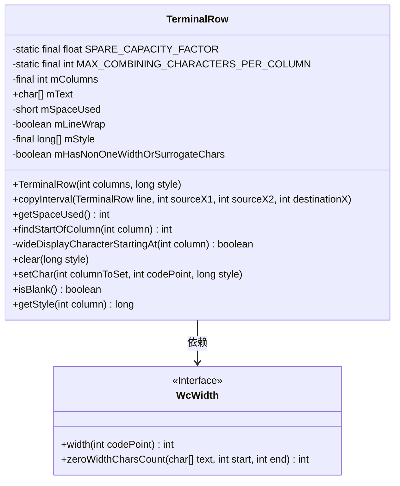

# 基础信息

|      |      |
|------|------|
| 名称 | TerminalRow |
| 编码语言 | .java |
| 代码路径 | termux-app/terminal-emulator/src/main/java/com/termux/terminal/TerminalRow.java |
| 包名 | com.termux.terminal |
| 依赖项 | ['java.util.Arrays'] |
| 概述说明 | 终端行类，管理字符、样式及组合字符限制，支持宽字符处理。 |

# 说明

TerminalRow类是一个终端行实现，用于管理终端显示行的文本和样式。它包含以下核心功能：1. 使用字符数组存储文本，支持宽字符和组合字符处理；2. 通过样式数组管理每个单元格的显示样式；3. 实现了字符操作逻辑，包括设置字符、复制区间、查找列起始位置等；4. 处理组合字符时限制最大数量为15个；5. 支持宽字符(占两列)的特殊处理；6. 提供清空行和空白检查功能。类内部维护了列数、已用空间、换行标志等状态，并采用1.5倍容量因子优化数组分配。

# 类列表 Class Summary

| 名称   | 类型  | 说明 |
|-------|------|-------------|
| TerminalRow | class | 终端行类，管理字符、样式及组合字符限制，支持宽字符处理。 |

## 类 TerminalRow

|      |      |
|------|------|
| 访问范围 | public final |
| 类型 | class |
| 名称 | TerminalRow |
| 说明 | 终端行类，管理字符、样式及组合字符限制，支持宽字符处理。 |

### UML类图

类图描述：
TerminalRow类表示终端行，用于管理终端文本行的显示和样式。它包含字符数组mText存储文本内容，long数组mStyle存储样式信息，并维护列数、空间使用等状态。关键方法包括setChar()处理字符插入（含宽字符和组合字符处理）、findStartOfColumn()定位列起始位置、copyInterval()复制行片段等。该类依赖WcWidth接口计算字符宽度，实现了终端显示的核心逻辑，包括组合字符限制、宽字符处理等边缘情况。

### 内部方法调用关系图

```mermaid
graph TD
    A["类TerminalRow"]
    B["常量: SPARE_CAPACITY_FACTOR = 1.5f"]
    C["常量: MAX_COMBINING_CHARACTERS_PER_COLUMN = 15"]
    D["属性: int mColumns"]
    E["属性: char[] mText"]
    F["属性: short mSpaceUsed"]
    G["属性: boolean mLineWrap"]
    H["属性: long[] mStyle"]
    I["属性: boolean mHasNonOneWidthOrSurrogateChars"]
    J["构造方法: TerminalRow(int columns, long style)"]
    K["方法: copyInterval(TerminalRow line, int sourceX1, int sourceX2, int destinationX)"]
    L["方法: getSpaceUsed()"]
    M["方法: findStartOfColumn(int column)"]
    N["方法: wideDisplayCharacterStartingAt(int column)"]
    O["方法: clear(long style)"]
    P["方法: setChar(int columnToSet, int codePoint, long style)"]
    Q["方法: isBlank()"]
    R["方法: getStyle(int column)"]

    A --> B
    A --> C
    A --> D
    A --> E
    A --> F
    A --> G
    A --> H
    A --> I
    A --> J
    A --> K
    A --> L
    A --> M
    A --> N
    A --> O
    A --> P
    A --> Q
    A --> R
```

该流程图展示了TerminalRow类的完整结构，包含2个静态常量、7个成员属性和8个主要方法。核心功能包括终端行文本管理（mText数组）、样式控制（mStyle数组）和字符宽度处理（通过WcWidth.width()）。关键方法setChar()实现了复杂的字符插入逻辑，处理组合字符、宽字符和边界条件，而findStartOfColumn()和wideDisplayCharacterStartingAt()方法辅助完成列位置计算。类设计注重内存效率（SPARE_CAPACITY_FACTOR）和安全性（MAX_COMBINING_CHARACTERS限制）。

### 字段列表 Field List

| 名称  | 类型  | 说明 |
|-------|-------|------|
| mSpaceUsed | short | 私有短整型变量mSpaceUsed |
| mHasNonOneWidthOrSurrogateChars | boolean | 布尔变量标记非单位宽度或代理字符存在 |
| SPARE_CAPACITY_FACTOR = 1.5f | float | 定义静态常量SPARE_CAPACITY_FACTOR，值为1.5。 |
| mText | char[] | 公开字符数组mText |
| MAX_COMBINING_CHARACTERS_PER_COLUMN = 15 | int | 私有常量MAX_COMBINING_CHARACTERS_PER_COLUMN值为15。 |
| mColumns | int | 私有整型变量mColumns，表示列数。 |
| mLineWrap | boolean | 布尔变量控制行换行 |
| mStyle | long[] | 声明长整型数组mStyle |

### 方法列表 Method List

| 名称  | 类型  | 说明 |
|-------|-------|------|
| isBlank | boolean | 检查字符串是否全为空格，是则返回true，否则false。 |
| getStyle | long | 获取指定列的样式值。 |
| wideDisplayCharacterStartingAt | boolean | 检查指定列起始字符是否为宽字符。遍历文本，计算宽度，匹配列且宽度为2时返回真。 |
| getSpaceUsed | int | 获取已用空间的方法，返回整数值mSpaceUsed。 |
| setChar | void | 设置终端行字符，处理宽字符和组合字符，调整数组空间。 |
| clear | void | 清空文本和样式，重置空间使用和字符宽度标记。 |
| findStartOfColumn | int | 查找列起始位置，处理宽字符和组合字符。 |
| copyInterval | void | 复制终端行指定区间字符到目标位置，处理宽字符和代理对。 |

