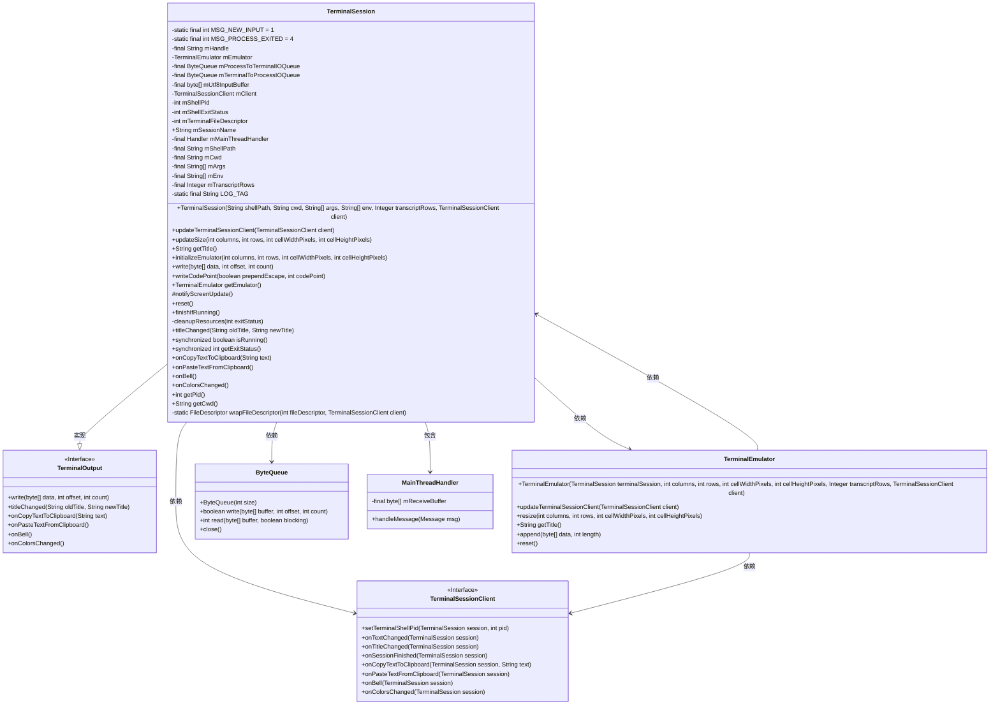

# 基础信息

|      |      |
|------|------|
| 名称 | TerminalSession |
| 编码语言 | .java |
| 代码路径 | termux-app/terminal-emulator/src/main/java/com/termux/terminal/TerminalSession.java |
| 包名 | com.termux.terminal |
| 依赖项 | ['android.annotation.SuppressLint', 'android.os.Handler', 'android.os.Message', 'android.system.ErrnoException', 'android.system.Os', 'android.system.OsConstants', 'java.io.File', 'java.io.FileDescriptor', 'java.io.FileInputStream', 'java.io.FileOutputStream', 'java.io.IOException', 'java.io.InputStream', 'java.lang.reflect.Field', 'java.nio.charset.StandardCharsets', 'java.util.UUID'] |
| 概述说明 | 终端会话类，管理伪终端进程和I/O队列，支持UTF-8输入和尺寸调整。 |

# 说明

TerminalSession类是一个终端会话管理类，继承自TerminalOutput，用于处理与终端模拟器的交互。它包含两个线程间通信的字节队列（mProcessToTerminalIOQueue和mTerminalToProcessIOQueue），用于处理进程输出和用户输入。类中定义了终端模拟器mEmulator、客户端回调接口mClient、Shell进程ID mShellPid及其退出状态mShellExitStatus。通过JNI创建子进程并设置伪终端文件描述符mTerminalFileDescriptor。提供初始化模拟器、更新终端大小、写入数据、处理UTF-8编码、重置会话、终止进程等功能。通过MainThreadHandler处理消息，包括新输入和进程退出事件。支持会话状态检查、获取工作目录、剪贴板操作和终端事件通知等。

# 类列表 Class Summary

| 名称   | 类型  | 说明 |
|-------|------|-------------|
| TerminalSession | class | 终端会话类，管理Shell进程和终端模拟器交互，处理输入输出队列及进程状态。 |

## 类 TerminalSession

|      |      |
|------|------|
| 访问范围 | public final |
| 类型 | class |
| 名称 | TerminalSession |
| 说明 | 终端会话类，管理Shell进程和终端模拟器交互，处理输入输出队列及进程状态。 |

### UML类图

这段代码描述了一个终端会话类TerminalSession，它继承自TerminalOutput接口，实现了终端输入输出、会话管理、进程控制等功能。类图中展示了TerminalSession与TerminalEmulator、TerminalSessionClient、ByteQueue等关键组件的关系，以及内部类MainThreadHandler的结构。TerminalSession通过JNI与底层系统交互，管理伪终端(pty)和shell进程的生命周期，处理终端I/O队列，并提供了丰富的终端控制功能如大小调整、编码转换、会话重置等。整个设计体现了清晰的职责划分和模块化思想，适合构建复杂的终端模拟器应用。

### 内部方法调用关系图

这段代码实现了一个终端会话管理类TerminalSession，主要功能包括：通过伪终端与Shell进程交互、处理终端输入输出队列、管理终端模拟器状态、处理进程生命周期事件。核心流程涉及三个后台线程（输入读取、输出写入、进程等待）和主线程Handler的消息处理机制，支持终端尺寸调整、编码转换、会话清理等功能，并通过回调接口与客户端交互。

### 字段列表 Field List

| 名称  | 类型  | 说明 |
|-------|-------|------|
| mProcessToTerminalIOQueue = new ByteQueue(4096) | ByteQueue | 创建4096字节的终端IO队列。 |
| MSG_PROCESS_EXITED = 4 | int | 私有静态常量MSG_PROCESS_EXITED值为4 |
| mHandle = UUID.randomUUID().toString() | String | 声明一个不可变字符串mHandle，值为随机UUID。 |
| mShellPid | int | 声明整型变量mShellPid |
| mTerminalFileDescriptor | int | 私有整型变量mTerminalFileDescriptor |
| mShellPath | String | 私有字符串变量mShellPath |
| mTerminalToProcessIOQueue = new ByteQueue(4096) | ByteQueue | 创建大小为4096的字节队列mTerminalToProcessIOQueue。 |
| mTranscriptRows | Integer | 私有整型变量mTranscriptRows |
| mUtf8InputBuffer = new byte[5] | byte[] | 私有字节数组mUtf8InputBuffer，长度5。 |
| MSG_NEW_INPUT = 1 | int | 私有静态常量MSG_NEW_INPUT值为1。 |
| mMainThreadHandler = new MainThreadHandler() | Handler | 主线程Handler初始化 |
| mShellExitStatus | int | 变量mShellExitStatus存储shell退出状态。 |
| mSessionName | String | 公开字符串变量mSessionName。 |
| mEmulator | TerminalEmulator | 终端模拟器实例mEmulator |
| mClient | TerminalSessionClient | 终端会话客户端实例mClient |
| mCwd | String | 私有字符串变量mCwd |
| LOG_TAG = "TerminalSession" | String | 私有静态常量LOG_TAG值为TerminalSession |
| mEnv | String[] | 私有字符串数组mEnv |
| mArgs | String[] | 私有字符串数组mArgs |

### 方法列表 Method List

| 名称  | 类型  | 说明 |
|-------|-------|------|
| titleChanged | void | 方法重写，标题变更时通知客户端。 |
| getTitle | String | 获取标题方法：若模拟器为空返回null，否则返回模拟器标题。 |
| onPasteTextFromClipboard | void | 重写方法，调用客户端剪贴板粘贴文本处理。 |
| finishIfRunning | void | 终止运行中的进程，失败时记录警告。 |
| write | void | 重写write方法，若mShellPid大于0则写入数据到队列。 |
| getExitStatus | int | 同步方法返回shell退出状态码。 |
| reset | void | 重置模拟器并更新屏幕。 |
| cleanupResources | void | 清理资源：设PID为-1，设退出状态，关闭IO队列和文件描述符。 |
| isRunning | boolean | 检查Shell进程是否运行，返回PID是否有效。 |
| notifyScreenUpdate | void | 通知屏幕更新：调用mClient的onTextChanged方法。 |
| writeCodePoint | void | 方法将Unicode码点转为UTF-8字节，支持转义前缀，处理1到4字节编码。 |
| onCopyTextToClipboard | void | 重写方法，调用客户端接口将文本复制到剪贴板。 |
| updateTerminalSessionClient | void | 更新终端会话客户端，同步至模拟器。 |
| updateSize | void | 更新终端尺寸，初始化或调整模拟器行列数和像素大小。 |
| getEmulator | TerminalEmulator | 获取终端模拟器实例。 |
| initializeEmulator | void | 初始化终端模拟器，创建子进程并启动输入输出线程。 |
| onBell | void | 重写onBell方法，调用mClient.onBell(this)。 |
| onColorsChanged | void | 重写方法，颜色变化时通知客户端。 |
| getPid | int | 获取进程ID方法，返回mShellPid值。 |
| getCwd | String | 获取当前工作目录，若进程无效或出错返回null。 |
| wrapFileDescriptor | FileDescriptor | 包装文件描述符，处理异常并返回结果。 |

