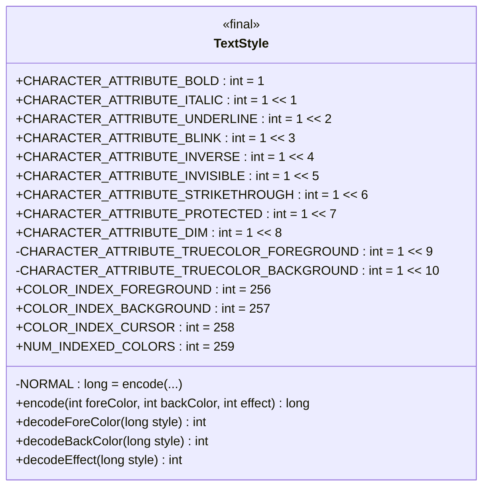

# 基础信息

|      |      |
|------|------|
| 名称 | TextStyle |
| 编码语言 | .java |
| 代码路径 | termux-app/terminal-emulator/src/main/java/com/termux/terminal/TextStyle.java |
| 包名 | com.termux.terminal |
| 依赖项 | [] |
| 概述说明 | 文本样式类，定义字符属性和颜色编码方法。 |

# 说明

TextStyle类定义了文本样式相关的常量和方法，包括字符属性（如粗体、斜体、下划线、闪烁、反色、隐藏、删除线、保护、暗淡）、颜色索引（前景、背景、光标）和颜色数量。提供了编码和解码方法，支持索引颜色和24位真彩色处理，用于组合或分解样式信息。

# 类列表 Class Summary

| 名称   | 类型  | 说明 |
|-------|------|-------------|
| TextStyle | class | 文本样式类，定义字符属性、颜色索引及编解码方法。 |

## 类 TextStyle

|      |      |
|------|------|
| 访问范围 | public final |
| 类型 | class |
| 名称 | TextStyle |
| 说明 | 文本样式类，定义字符属性、颜色索引及编解码方法。 |

### UML类图

该代码定义了一个不可变的`TextStyle`类，用于处理终端字符的样式属性编码和解码。它包含多种字符属性常量（如粗体、斜体等），支持256种标准颜色和3种特殊颜色（前景、背景、光标），并提供静态方法进行样式编码（将颜色和效果组合为long值）和解码（从long值提取颜色和效果）。关键特性包括位运算处理、24位真彩色支持，以及保护字符等特殊属性的处理，适用于终端文本的样式控制场景。

### 内部方法调用关系图

```mermaid
graph TD
    A["类TextStyle"]
    B["常量: CHARACTER_ATTRIBUTE_BOLD"]
    C["常量: CHARACTER_ATTRIBUTE_ITALIC"]
    D["常量: CHARACTER_ATTRIBUTE_UNDERLINE"]
    E["常量: CHARACTER_ATTRIBUTE_BLINK"]
    F["常量: CHARACTER_ATTRIBUTE_INVERSE"]
    G["常量: CHARACTER_ATTRIBUTE_INVISIBLE"]
    H["常量: CHARACTER_ATTRIBUTE_STRIKETHROUGH"]
    I["常量: CHARACTER_ATTRIBUTE_PROTECTED"]
    J["常量: CHARACTER_ATTRIBUTE_DIM"]
    K["私有常量: CHARACTER_ATTRIBUTE_TRUECOLOR_FOREGROUND"]
    L["私有常量: CHARACTER_ATTRIBUTE_TRUECOLOR_BACKGROUND"]
    M["常量: COLOR_INDEX_FOREGROUND"]
    N["常量: COLOR_INDEX_BACKGROUND"]
    O["常量: COLOR_INDEX_CURSOR"]
    P["常量: NUM_INDEXED_COLORS"]
    Q["常量: NORMAL"]
    R["静态方法: encode(int foreColor, int backColor, int effect)"]
    S["静态方法: decodeForeColor(long style)"]
    T["静态方法: decodeBackColor(long style)"]
    U["静态方法: decodeEffect(long style)"]

    A --> B
    A --> C
    A --> D
    A --> E
    A --> F
    A --> G
    A --> H
    A --> I
    A --> J
    A --> K
    A --> L
    A --> M
    A --> N
    A --> O
    A --> P
    A --> Q
    A --> R
    A --> S
    A --> T
    A --> U
```

这段代码定义了一个名为TextStyle的final类，主要用于处理文本样式和颜色的编码与解码。类中包含多个静态常量，用于表示不同的文本属性（如粗体、斜体、下划线等）和颜色索引。核心功能通过encode方法将前景色、背景色和效果编码为一个long值，以及通过decodeForeColor、decodeBackColor和decodeEffect方法从编码值中解码出原始信息。这些方法支持索引颜色和24位真彩色两种模式，适用于终端或图形界面中的文本渲染场景。

### 字段列表 Field List

| 名称  | 类型  | 说明 |
|-------|-------|------|
| CHARACTER_ATTRIBUTE_DIM = 1 << 8 | int | 定义常量CHARACTER_ATTRIBUTE_DIM值为256。 |
| COLOR_INDEX_BACKGROUND = 257 | int | 背景颜色索引值为257。 |
| CHARACTER_ATTRIBUTE_TRUECOLOR_FOREGROUND = 1 << 9 | int | 定义常量：真彩色前景属性标志位。 |
| CHARACTER_ATTRIBUTE_INVERSE = 1 << 4 | int | 定义常量CHARACTER_ATTRIBUTE_INVERSE，值为16（1左移4位）。 |
| CHARACTER_ATTRIBUTE_INVISIBLE = 1 << 5 | int | 定义不可见角色属性常量，值为32。 |
| CHARACTER_ATTRIBUTE_PROTECTED = 1 << 7 | int | 声明一个受保护的字符属性常量，值为128。 |
| CHARACTER_ATTRIBUTE_TRUECOLOR_BACKGROUND= 1 << 10 | int | 私有静态常量，定义真彩色背景属性标志位。 |
| COLOR_INDEX_CURSOR = 258 | int | 定义光标颜色索引常量258。 |
| CHARACTER_ATTRIBUTE_BOLD = 1 | int | 字符属性粗体值为1 |
| NORMAL = encode(COLOR_INDEX_FOREGROUND, COLOR_INDEX_BACKGROUND, 0) | long | 定义静态常量NORMAL，编码前景色、背景色和样式0。 |
| CHARACTER_ATTRIBUTE_ITALIC = 1 << 1 | int | 定义字符斜体属性常量，值为1左移1位。 |
| NUM_INDEXED_COLORS = 259 | int | 定义索引颜色数量常量，值为259。 |
| CHARACTER_ATTRIBUTE_STRIKETHROUGH = 1 << 6 | int | 定义字符属性：删除线（位掩码1左移6位） |
| CHARACTER_ATTRIBUTE_BLINK = 1 << 3 | int | 定义常量CHARACTER_ATTRIBUTE_BLINK，值为8（1左移3位）。 |
| CHARACTER_ATTRIBUTE_UNDERLINE = 1 << 2 | int | 定义常量CHARACTER_ATTRIBUTE_UNDERLINE，值为4，表示下划线属性。 |
| COLOR_INDEX_FOREGROUND = 256 | int | 定义前景色常量COLOR_INDEX_FOREGROUND值为256。 |

### 方法列表 Method List

| 名称  | 类型  | 说明 |
|-------|-------|------|
| decodeEffect | int | 解码长整型参数style的低11位并返回整型结果。 |
| decodeForeColor | int | 解码前景色：检查是否为真彩色，非真彩返回索引色，真彩返回ARGB值。 |
| encode | long | 编码函数：合并前景色、背景色和效果为长整型，支持24位和索引颜色。 |
| decodeBackColor | int | 解码背景色：无真彩返回9位色值，有真彩返回ARGB格式色值。 |

