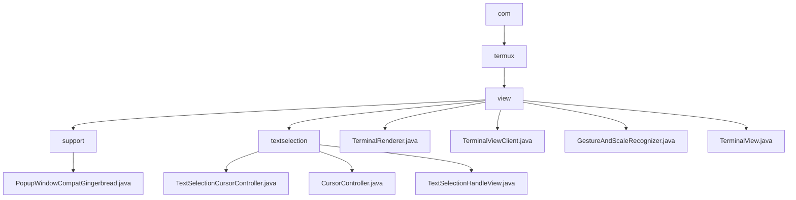

# 基础信息

|      |      |
|------|------|
| 名称 | com |
| 编码语言 | .java |
| 代码路径 | termux-app/terminal-view/src/main/java/com |
| 包名 | termux-app.terminal-view.src.main.java.com |
| 概述说明 | PopupWindowCompatGingerbread类通过反射设置和获取PopupWindow布局类型。Termux终端应用包含文本选择、渲染和交互组件，支持手势操作和终端会话管理。 |

# 说明

```markdown
## 概述
该代码模块是Termux Android终端模拟器的核心视图组件集合，主要实现终端内容渲染、用户交互和文本选择三大核心功能。模块采用分层设计，包含终端渲染引擎（TerminalRenderer）、手势识别系统（GestureAndScaleRecognizer）、文本选择子系统（textselection包）和主视图容器（TerminalView），通过反射机制（PopupWindowCompatGingerbread）增强系统兼容性。各组件通过TerminalViewClient接口进行通信，形成完整的终端显示与交互解决方案。

## 主要业务场景
1. **终端内容渲染**
   - 通过`TerminalRenderer`处理ANSI转义序列，支持多文本样式（加粗/斜体/下划线）
   - 动态计算字符度量（`drawTextRun`），处理颜色反转等特殊效果
   - 实时绘制光标、选区和高亮文本（`render`方法）

2. **复合手势交互**
   - 识别单指滚动、双指缩放等操作（`GestureAndScaleRecognizer`）
   - 处理长按触发文本选择与上下文菜单（`isAfterLongPress`标志）
   - 通过`ScaleGestureDetector`实现终端字体大小动态调整

3. **高级文本选择**
   - 双向拖拽手柄控制选区（`TextSelectionHandleView`）
   - 自动调整手柄方向与位置（`checkChangedOrientation`）
   - 与系统剪贴板集成实现复制/粘贴功能

4. **跨版本兼容处理**
   - 使用`PopupWindowCompatGingerbread`反射修改窗口布局类型
   - 延迟加载反射Method对象优化性能（setWindowLayoutType）
   - 静默失败机制保障低版本系统兼容性

5. **终端会话管理**
   - 通过`TerminalView`管理会话生命周期（attach/detach）
   - 处理键盘/鼠标输入事件与自动填充请求
   - 控制光标闪烁频率和显示状态（setCursorBlink）

6. **辅助功能支持**
   - 提供浮动工具栏和上下文菜单
   - 实现无障碍服务的文本内容访问
   - 动态调整视图布局适应软键盘弹出
```


### 包内部结构视图



该流程图展示了Termux终端视图模块的Java类文件组织结构。从根包com开始，逐级展开到termux和view子包，view包下包含support工具类和textselection文本选择功能相关类，以及多个终端视图核心功能类如TerminalView.java和TerminalRenderer.java。整个结构清晰地反映了终端视图模块的功能划分，包含手势识别、渲染引擎和文本选择等关键组件。

# 文件列表 File List

| 名称   | 类型  | 说明 |
|-------|------|-------------|
| [termux](termux/_module.md) | package | PopupWindowCompatGingerbread类通过反射设置和获取PopupWindow布局类型。Termux终端应用包含文本选择、渲染和交互组件，支持手势操作和终端会话管理。 |


