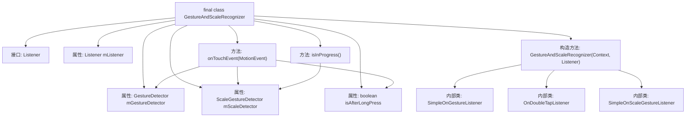

# 基础信息

|      |      |
|------|------|
| 名称 | GestureAndScaleRecognizer |
| 编码语言 | .java |
| 代码路径 | termux-app/terminal-view/src/main/java/com/termux/view/GestureAndScaleRecognizer.java |
| 包名 | com.termux.view |
| 依赖项 | ['android.content.Context', 'android.view.GestureDetector', 'android.view.MotionEvent', 'android.view.ScaleGestureDetector'] |
| 概述说明 | 手势缩放识别器，处理点击、滑动、长按、双指缩放等触摸事件。 |

# 说明

GestureAndScaleRecognizer是一个结合手势和缩放的识别类，通过Listener接口处理各种触摸事件。它包含GestureDetector和ScaleGestureDetector，分别处理手势和缩放操作。Listener接口定义了单点点击、双击、滚动、滑动、缩放、按下、抬起和长按等事件的回调方法。类内部维护了isAfterLongPress标志，用于处理长按后的抬起事件。onTouchEvent方法将触摸事件分发给两个检测器，并根据事件类型更新状态。isInProgress方法用于检测是否正在进行缩放操作。

# 类列表 Class Summary

| 名称   | 类型  | 说明 |
|-------|------|-------------|
| GestureAndScaleRecognizer | class | 手势缩放识别器，处理点击、滑动、长按、双指缩放等触摸事件。 |


## 类 GestureAndScaleRecognizer

|      |      |
|------|------|
| 访问范围 | final |
| 类型 | class |
| 名称 | GestureAndScaleRecognizer |
| 说明 | 手势缩放识别器，处理点击、滑动、长按、双指缩放等触摸事件。 |


### UML类图

```mermaid
classDiagram
    class GestureAndScaleRecognizer {
        -GestureDetector mGestureDetector
        -ScaleGestureDetector mScaleDetector
        -Listener mListener
        -boolean isAfterLongPress
        +GestureAndScaleRecognizer(Context context, Listener listener)
        +void onTouchEvent(MotionEvent event)
        +boolean isInProgress()
    }

    class <<Interface>> Listener {
        <<Interface>>
        +boolean onSingleTapUp(MotionEvent e)
        +boolean onDoubleTap(MotionEvent e)
        +boolean onScroll(MotionEvent e2, float dx, float dy)
        +boolean onFling(MotionEvent e, float velocityX, float velocityY)
        +boolean onScale(float focusX, float focusY, float scale)
        +boolean onDown(float x, float y)
        +boolean onUp(MotionEvent e)
        +void onLongPress(MotionEvent e)
    }

    class GestureDetector {
        +setOnDoubleTapListener(OnDoubleTapListener listener)
        +boolean onTouchEvent(MotionEvent event)
    }

    class ScaleGestureDetector {
        +boolean onTouchEvent(MotionEvent event)
        +boolean isInProgress()
        +setQuickScaleEnabled(boolean enabled)
    }

    GestureAndScaleRecognizer --> Listener : 实现
    GestureAndScaleRecognizer --> GestureDetector : 使用
    GestureAndScaleRecognizer --> ScaleGestureDetector : 使用
```

这段代码描述了一个手势和缩放识别器`GestureAndScaleRecognizer`，它通过组合`GestureDetector`和`ScaleGestureDetector`来实现多种手势识别功能。该类实现了`Listener`接口来处理各种手势事件，包括单击、双击、滚动、滑动、缩放、按下、抬起和长按等操作。通过`onTouchEvent`方法接收触摸事件并分发给相应的检测器处理，同时维护了一个状态标志`isAfterLongPress`来跟踪长按后的操作。整体设计采用了组合模式，将复杂的手势识别逻辑委托给专门的检测器处理。


### 内部方法调用关系图



这段代码定义了一个手势和缩放识别器类`GestureAndScaleRecognizer`，它通过组合`GestureDetector`和`ScaleGestureDetector`来监听和处理各种触摸事件。该类包含一个`Listener`接口用于回调各种手势事件，如单击、双击、滚动、快速滑动、缩放等。流程图展示了类的主要结构，包括属性、构造方法、主要方法以及内部类的调用关系。构造方法中初始化了手势检测器和缩放检测器，并设置了相应的事件监听器。`onTouchEvent`方法负责将触摸事件分发给两个检测器，并根据事件类型更新状态。

### 字段列表 Field List

| 名称  | 类型  | 说明 |
|-------|-------|------|
| isAfterLongPress | boolean | 布尔值标记长按后状态 |
| mScaleDetector | ScaleGestureDetector | 私有缩放手势检测器mScaleDetector |
| mGestureDetector | GestureDetector | 私有手势检测器实例。 |
| mListener | Listener | 最终监听器mListener |

### 方法列表 Method List

| 名称  | 类型  | 说明 |
|-------|-------|------|
| onTouchEvent | void | 处理触摸事件：传递手势和缩放检测，根据动作类型执行不同操作。 |
| isInProgress | boolean | 方法检查缩放操作是否进行中。 |


