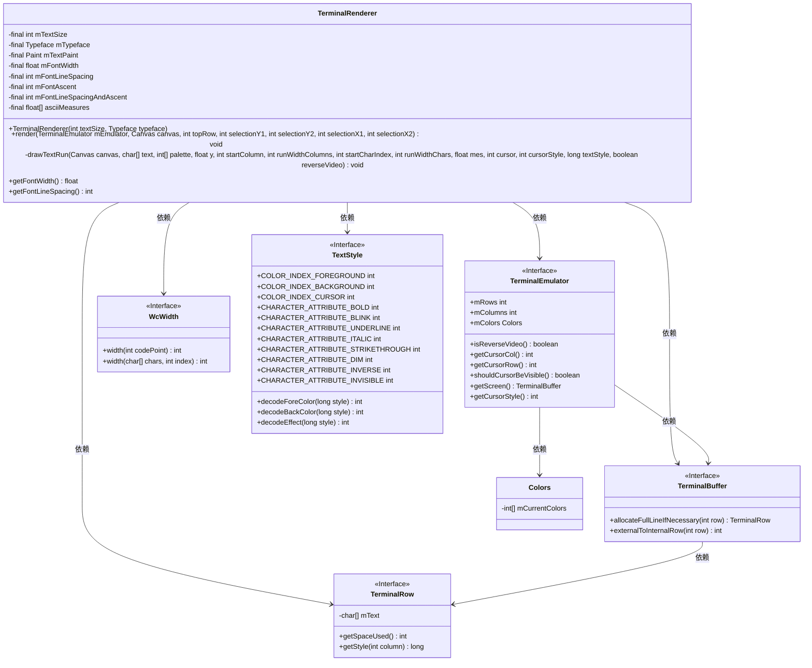
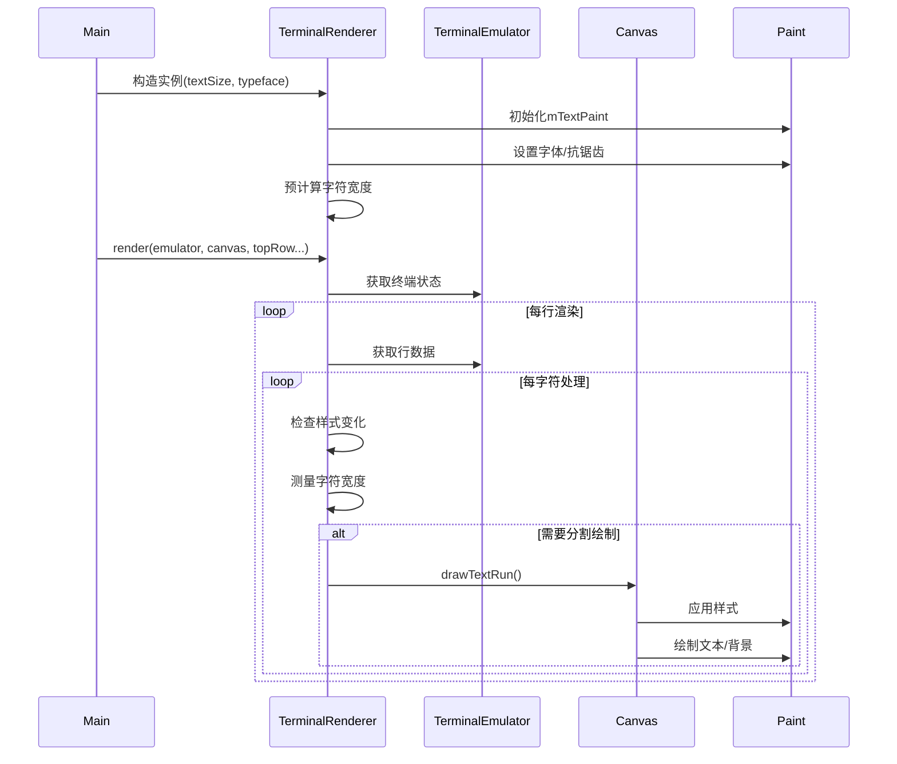

# 基础信息

|      |      |
|------|------|
| 名称 | TerminalRenderer |
| 编码语言 | .java |
| 代码路径 | termux-app/terminal-view/src/main/java/com/termux/view/TerminalRenderer.java |
| 包名 | com.termux.view |
| 依赖项 | ['android.graphics.Canvas', 'android.graphics.Paint', 'android.graphics.PorterDuff', 'android.graphics.Typeface', 'com.termux.terminal.TerminalBuffer', 'com.termux.terminal.TerminalEmulator', 'com.termux.terminal.TerminalRow', 'com.termux.terminal.TextStyle', 'com.termux.terminal.WcWidth'] |
| 概述说明 | 终端渲染器类，用于绘制终端界面，支持文本样式、光标和选择区域。 |

# 说明

TerminalRenderer是一个用于终端模拟器渲染的类，负责在Canvas上绘制终端内容。它初始化时设置字体大小、类型和文本绘制属性，计算字符宽度、行间距等度量值。render方法处理终端内容的绘制，包括光标、选区、文本样式（如加粗、斜体、下划线等）和颜色反转效果。drawTextRun方法具体执行文本块的绘制，处理背景色、光标样式、文本缩放和特殊效果。类还提供获取字体宽度和行间距的方法。整体设计高效处理终端字符的复杂渲染需求，支持多种文本样式和视觉效果。

# 类列表 Class Summary

| 名称   | 类型  | 说明 |
|-------|------|-------------|
| TerminalRenderer | class | 终端渲染器类，处理文本绘制、光标和样式。 |

## 类 TerminalRenderer

|      |      |
|------|------|
| 访问范围 | public final |
| 类型 | class |
| 名称 | TerminalRenderer |
| 说明 | 终端渲染器类，处理文本绘制、光标和样式。 |

### UML类图

这段代码描述了一个终端渲染器TerminalRenderer，用于在Android画布上绘制终端界面。该类通过计算字体尺寸、处理文本样式（如粗体/斜体）、管理光标和选择区域，将TerminalEmulator的状态渲染到Canvas上。核心功能包括测量字符宽度、处理Unicode组合字符、应用颜色调色板，并支持反向视频、光标样式等终端特性。通过多个接口与终端模拟器、缓冲区、样式系统交互，实现了完整的终端文本渲染流程。

### 内部方法调用关系图

```mermaid
graph TD
    A["类TerminalRenderer"]
    B["属性: int mTextSize"]
    C["属性: Typeface mTypeface"]
    D["属性: Paint mTextPaint"]
    E["属性: float mFontWidth"]
    F["属性: int mFontLineSpacing"]
    G["属性: int mFontAscent"]
    H["属性: int mFontLineSpacingAndAscent"]
    I["属性: float[] asciiMeasures"]
    J["构造方法: TerminalRenderer(int textSize, Typeface typeface)"]
    K["方法: render(TerminalEmulator, Canvas, int, int, int, int, int)"]
    L["方法: drawTextRun(Canvas, char[], int[], float, int, int, int, int, float, int, int, long, boolean)"]
    M["方法: getFontWidth()"]
    N["方法: getFontLineSpacing()"]

    A --> B
    A --> C
    A --> D
    A --> E
    A --> F
    A --> G
    A --> H
    A --> I
    A --> J
    A --> K
    A --> L
    A --> M
    A --> N

    J --> D1["mTextPaint.setTypeface"]
    J --> D2["mTextPaint.setTextSize"]
    J --> D3["预计算asciiMeasures数组"]
    K --> K1["处理反向视频模式"]
    K --> K2["遍历行渲染文本"]
    K --> K3["处理光标/选区逻辑"]
    K --> K4["调用drawTextRun绘制文本段"]
    L --> L1["解析文本样式"]
    L --> L2["处理颜色反转"]
    L --> L3["绘制背景/光标"]
    L --> L4["应用字体效果"]
    L --> L5["绘制文本内容"]
```

该流程图展示了TerminalRenderer类的完整结构，包含字体渲染核心逻辑。类通过Paint对象处理文本测量和绘制，render()方法实现终端界面分块渲染，drawTextRun()处理样式应用和实际绘制。时序图演示了从初始化到渲染的完整调用链，重点展示了字符测量、样式处理和分段绘制的协作过程。该设计针对终端字符渲染优化，支持光标高亮、选区反色等特性，同时处理了非等宽字符的特殊情况。

### 字段列表 Field List

| 名称  | 类型  | 说明 |
|-------|-------|------|
| mFontWidth | float | 最终浮点型字体宽度变量 |
| mTextSize | int | 声明一个不可变的整型变量mTextSize。 |
| mTypeface | Typeface | 字体类型变量mTypeface |
| mTextPaint = new Paint() | Paint | 私有文本画笔对象初始化 |
| mFontLineSpacingAndAscent | int | 最终整型变量：字体行间距与基线高度 |
| mFontAscent | int | 私有整型变量mFontAscent |
| asciiMeasures = new float[127] | float[] | 声明一个私有浮点数组asciiMeasures，长度为127。 |
| mFontLineSpacing | int | 声明一个不可变的整型变量mFontLineSpacing。 |

### 方法列表 Method List

| 名称  | 类型  | 说明 |
|-------|-------|------|
| render | void | 终端模拟器渲染方法，处理光标、选择和字符绘制。 |
| getFontWidth | float | 获取字体宽度的方法，返回mFontWidth值。 |
| getFontLineSpacing | int | 获取字体行间距值的方法。 |
| drawTextRun | void | 绘制文本到画布，处理颜色、样式、光标及反转视频效果。 |

