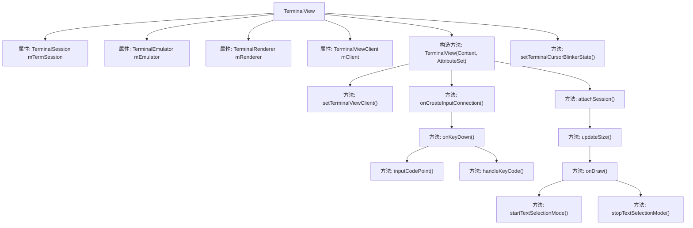
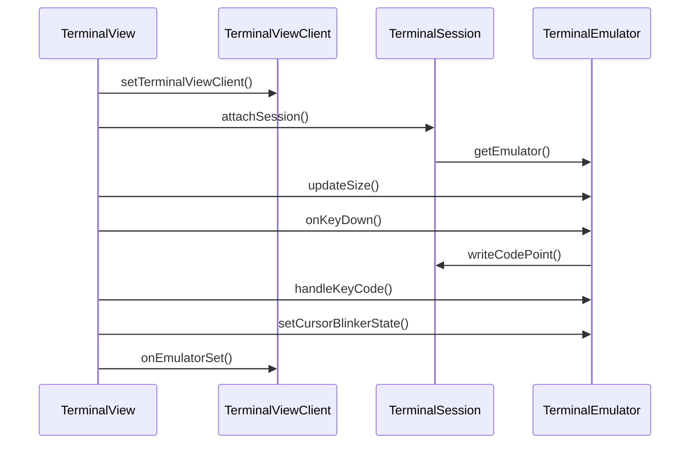

# 基础信息

|      |      |
|------|------|
| 名称 | TerminalView |
| 编码语言 | .java |
| 代码路径 | termux-app/terminal-view/src/main/java/com/termux/view/TerminalView.java |
| 包名 | com.termux.view |
| 依赖项 | ['android.annotation.SuppressLint', 'android.annotation.TargetApi', 'android.app.Activity', 'android.content.ClipData', 'android.content.ClipboardManager', 'android.content.Context', 'android.graphics.Canvas', 'android.graphics.Typeface', 'android.os.Build', 'android.os.Handler', 'android.os.Looper', 'android.os.SystemClock', 'android.text.Editable', 'android.text.InputType', 'android.text.TextUtils', 'android.util.AttributeSet', 'android.view.ActionMode', 'android.view.HapticFeedbackConstants', 'android.view.InputDevice', 'android.view.KeyCharacterMap', 'android.view.KeyEvent', 'android.view.Menu', 'android.view.MotionEvent', 'android.view.View', 'android.view.ViewConfiguration', 'android.view.ViewTreeObserver', 'android.view.accessibility.AccessibilityManager', 'android.view.autofill.AutofillManager', 'android.view.autofill.AutofillValue', 'android.view.inputmethod.BaseInputConnection', 'android.view.inputmethod.EditorInfo', 'android.view.inputmethod.InputConnection', 'android.widget.Scroller', 'androidx.annotation.Nullable', 'androidx.annotation.RequiresApi', 'com.termux.terminal.KeyHandler', 'com.termux.terminal.TerminalEmulator', 'com.termux.terminal.TerminalSession', 'com.termux.view.textselection.TextSelectionCursorController'] |
| 概述说明 | 终端视图类，用于显示终端会话，支持文本选择、光标闪烁、自动填充等功能。 |

# 说明

TerminalView是一个Android终端视图组件，用于显示和交互终端会话。它继承自View类，包含终端会话管理、输入处理、文本选择、光标控制等功能。主要特性包括：

1. 支持终端会话的附加和分离，管理终端模拟器状态。
2. 处理键盘输入、鼠标事件和触摸手势，包括滚动、缩放等交互。
3. 实现文本选择功能，支持选择、复制文本操作。
4. 光标控制，包括光标闪烁频率设置和状态管理。
5. 自动填充支持，处理用户名和密码的自动填充请求。
6. 视图渲染，负责终端内容的绘制和显示。
7. 手势识别，处理各种触摸事件和手势操作。

组件通过TerminalViewClient接口与客户端通信，提供高度可定制的终端显示和交互体验。它还包括辅助功能支持、上下文菜单和浮动工具栏等功能，增强用户体验。

# 类列表 Class Summary

| 名称   | 类型  | 说明 |
|-------|------|-------------|
| TerminalView | class | 终端视图类，用于显示终端会话，支持文本选择、光标闪烁、自动填充等功能。 |

## 类 TerminalView

|      |      |
|------|------|
| 访问范围 | public final |
| 类型 | class |
| 名称 | TerminalView |
| 说明 | 终端视图类，用于显示终端会话，支持文本选择、光标闪烁、自动填充等功能。 |

### UML类图

```mermaid
classDiagram
    class TerminalView {
        -static TERMINAL_VIEW_KEY_LOGGING_ENABLED: boolean
        +mTermSession: TerminalSession
        +mEmulator: TerminalEmulator
        +mRenderer: TerminalRenderer
        +mClient: TerminalViewClient
        -mTextSelectionCursorController: TextSelectionCursorController
        -mTerminalCursorBlinkerHandler: Handler
        -mTerminalCursorBlinkerRunnable: TerminalCursorBlinkerRunnable
        -mTerminalCursorBlinkerRate: int
        -mCursorInvisibleIgnoreOnce: boolean
        +TERMINAL_CURSOR_BLINK_RATE_MIN: int
        +TERMINAL_CURSOR_BLINK_RATE_MAX: int
        -mTopRow: int
        -mDefaultSelectors: int[]
        -mScaleFactor: float
        -mGestureRecognizer: GestureAndScaleRecognizer
        -mMouseScrollStartX: int
        -mMouseScrollStartY: int
        -mMouseStartDownTime: long
        -mScroller: Scroller
        -mScrollRemainder: float
        -mCombiningAccent: int
        -mAutoFillType: int
        -mAutoFillImportance: int
        -mAutoFillHints: String[]
        -mAccessibilityEnabled: boolean
        +KEY_EVENT_SOURCE_VIRTUAL_KEYBOARD: int
        +KEY_EVENT_SOURCE_SOFT_KEYBOARD: int
        -LOG_TAG: String
        +TerminalView(Context context, AttributeSet attributes)
        +setTerminalViewClient(TerminalViewClient client)
        +setIsTerminalViewKeyLoggingEnabled(boolean value)
        +attachSession(TerminalSession session): boolean
        +onCreateInputConnection(EditorInfo outAttrs): InputConnection
        +computeVerticalScrollRange(): int
        +computeVerticalScrollExtent(): int
        +computeVerticalScrollOffset(): int
        +onScreenUpdated()
        +onScreenUpdated(boolean skipScrolling)
        +onContextMenuClosed(Menu menu)
        +setTextSize(int textSize)
        +setTypeface(Typeface newTypeface)
        +onCheckIsTextEditor(): boolean
        +isOpaque(): boolean
        +getColumnAndRow(MotionEvent event, boolean relativeToScroll): int[]
        +sendMouseEventCode(MotionEvent e, int button, boolean pressed)
        +doScroll(MotionEvent event, int rowsDown)
        +onGenericMotionEvent(MotionEvent event): boolean
        +onTouchEvent(MotionEvent event): boolean
        +onKeyPreIme(int keyCode, KeyEvent event): boolean
        +onKeyDown(int keyCode, KeyEvent event): boolean
        +inputCodePoint(int eventSource, int codePoint, boolean controlDownFromEvent, boolean leftAltDownFromEvent)
        +handleKeyCode(int keyCode, int keyMod): boolean
        +handleKeyCodeAction(int keyCode, int keyMod): boolean
        +onKeyUp(int keyCode, KeyEvent event): boolean
        +onSizeChanged(int w, int h, int oldw, int oldh)
        +updateSize()
        +onDraw(Canvas canvas)
        +getCurrentSession(): TerminalSession
        +getText(): CharSequence
        +getCursorX(float x): int
        +getCursorY(float y): int
        +getPointX(int cx): int
        +getPointY(int cy): int
        +getTopRow(): int
        +setTopRow(int mTopRow)
        +autofill(AutofillValue value)
        +getAutofillType(): int
        +getAutofillHints(): String[]
        +getAutofillValue(): AutofillValue
        +getImportantForAutofill(): int
        -resetAutoFill()
        +getAutoFillManagerService(): AutofillManager
        +isAutoFillEnabled(): boolean
        +requestAutoFillUsername()
        +requestAutoFillPassword()
        +requestAutoFill(String[] autoFillHints)
        +cancelRequestAutoFill()
        +setTerminalCursorBlinkerRate(int blinkRate): boolean
        +setTerminalCursorBlinkerState(boolean start, boolean startOnlyIfCursorEnabled)
        -stopTerminalCursorBlinker()
        +getTextSelectionCursorController(): TextSelectionCursorController
        -showTextSelectionCursors(MotionEvent event)
        -hideTextSelectionCursors(): boolean
        -renderTextSelection()
        +isSelectingText(): boolean
        +getSelectedText(): String
        +getStoredSelectedText(): String
        +unsetStoredSelectedText()
        -getTextSelectionActionMode(): ActionMode
        +startTextSelectionMode(MotionEvent event)
        +stopTextSelectionMode()
        -decrementYTextSelectionCursors(int decrement)
        +onAttachedToWindow()
        +onDetachedFromWindow()
        -mShowFloatingToolbar: Runnable
        -showFloatingToolbar()
        -hideFloatingToolbar()
        +updateFloatingToolbarVisibility(MotionEvent event)
    }

    class TerminalViewClient {
        <<Interface>>
        +onSingleTapUp(MotionEvent event): boolean
        +onScale(float scaleFactor): float
        +onLongPress(MotionEvent event): boolean
        +logInfo(String tag, String message)
        +logError(String tag, String message)
        +logVerbose(String tag, String message)
        +logStackTraceWithMessage(String tag, String message, Exception e)
        +shouldBackButtonBeMappedToEscape(): boolean
        +shouldUseCtrlSpaceWorkaround(): boolean
        +shouldEnforceCharBasedInput(): boolean
        +isTerminalViewSelected(): boolean
        +onEmulatorSet()
        +copyModeChanged(boolean newState)
        +onKeyDown(int keyCode, KeyEvent event, TerminalSession session): boolean
        +onKeyUp(int keyCode, KeyEvent event): boolean
        +onCodePoint(int codePoint, boolean controlDown, TerminalSession session): boolean
        +readShiftKey(): boolean
        +readControlKey(): boolean
        +readAltKey(): boolean
        +readFnKey(): boolean
    }

    class TerminalSession {
        +getEmulator(): TerminalEmulator
        +updateSize(int columns, int rows, int fontWidth, int fontLineSpacing)
        +write(String text)
        +writeCodePoint(boolean altDown, int codePoint)
    }

    class TerminalEmulator {
        +isMouseTrackingActive(): boolean
        +isAlternateBufferActive(): boolean
        +isAutoScrollDisabled(): boolean
        +mRows: int
        +mColumns: int
        +getScreen(): TerminalScreen
        +getScrollCounter(): int
        +clearScrollCounter()
        +sendMouseEvent(int button, int x, int y, boolean pressed)
        +setCursorBlinkState(boolean state)
        +setCursorBlinkingEnabled(boolean enabled)
        +isCursorEnabled(): boolean
    }

    class TerminalRenderer {
        +mFontWidth: float
        +mFontLineSpacing: float
        +mFontLineSpacingAndAscent: float
        +mTextSize: int
        +mTypeface: Typeface
        +TerminalRenderer(int textSize, Typeface typeface)
        +render(TerminalEmulator emulator, Canvas canvas, int topRow, int selX1, int selY1, int selX2, int selY2)
        +getFontWidth(): float
        +getFontLineSpacing(): float
    }

    class TextSelectionCursorController {
        +getSelectors(int[] sel)
        +isActive(): boolean
        +getSelectedText(): String
        +getStoredSelectedText(): String
        +unsetStoredSelectedText()
        +getActionMode(): ActionMode
        +decrementYTextSelectionCursors(int decrement)
        +onDetached()
    }

    class GestureAndScaleRecognizer {
        <<Interface>>
        +onUp(MotionEvent event): boolean
        +onSingleTapUp(MotionEvent event): boolean
        +onScroll(MotionEvent e, float distanceX, float distanceY): boolean
        +onScale(float focusX, float focusY, float scale): boolean
        +onFling(MotionEvent e2, float velocityX, float velocityY): boolean
        +onDown(float x, float y): boolean
        +onDoubleTap(MotionEvent event): boolean
        +onLongPress(MotionEvent event)
    }

    TerminalView --> TerminalViewClient : "依赖"
    TerminalView --> TerminalSession : "依赖"
    TerminalView --> TerminalEmulator : "依赖"
    TerminalView --> TerminalRenderer : "依赖"
    TerminalView --> TextSelectionCursorController : "依赖"
    TerminalView --> GestureAndScaleRecognizer : "依赖"
    TerminalSession --> TerminalEmulator : "依赖"
    TerminalViewClient --> TerminalSession : "依赖"
```

这段代码定义了一个终端视图类 `TerminalView`，用于显示和交互终端会话。它包含了处理终端渲染、输入事件、文本选择、自动填充、光标闪烁等功能。类图展示了 `TerminalView` 与其他关键类（如 `TerminalSession`、`TerminalEmulator`、`TerminalRenderer` 等）之间的关系，以及它们之间的依赖和交互方式。`TerminalView` 通过 `TerminalViewClient` 接口与客户端通信，处理用户输入和显示逻辑。

### 内部方法调用关系图

这段代码实现了一个终端视图组件TerminalView，主要功能包括：1) 管理终端会话和模拟器；2) 处理键盘/触摸输入；3) 渲染终端内容；4) 支持文本选择和光标控制；5) 实现光标闪烁效果。它通过TerminalViewClient接口与宿主应用交互，使用TerminalRenderer进行内容绘制，并支持多种输入方式包括硬件键盘、软件键盘和触摸手势。代码结构清晰，将不同功能模块化，如输入处理、渲染、文本选择和自动填充等，同时考虑了多种边缘情况如组合字符输入、光标控制等。

### 字段列表 Field List

| 名称  | 类型  | 说明 |
|-------|-------|------|
| mCombiningAccent | int | 整型变量mCombiningAccent |
| mEmulator | TerminalEmulator | 公开终端模拟器对象mEmulator。 |
| TERMINAL_VIEW_KEY_LOGGING_ENABLED = false | boolean | 终端视图按键记录功能已禁用。 |
| mAccessibilityEnabled | boolean | 私有布尔变量mAccessibilityEnabled，表示无障碍功能是否启用。 |
| mGestureRecognizer | GestureAndScaleRecognizer | 手势与缩放识别器实例 |
| mTerminalCursorBlinkerRunnable | TerminalCursorBlinkerRunnable | 终端光标闪烁线程对象 |
| mClient | TerminalViewClient | 终端视图客户端实例mClient |
| TERMINAL_CURSOR_BLINK_RATE_MIN = 100 | int | 终端光标最小闪烁频率为100 |
| mTerminalCursorBlinkerHandler | Handler | 私有Handler控制终端光标闪烁 |
| mTerminalCursorBlinkerRate | int | 私有整型变量，控制终端光标闪烁速率。 |
| mTextSelectionCursorController | TextSelectionCursorController | 私有文本选择光标控制器mTextSelectionCursorController |
| LOG_TAG = "TerminalView" | String | 私有静态常量LOG_TAG值为TerminalView |
| mRenderer | TerminalRenderer | 公开终端渲染器实例mRenderer。 |
| KEY_EVENT_SOURCE_SOFT_KEYBOARD = 0 | int | 软键盘按键事件源标识符，值为0。 |
| mMouseStartDownTime = -1 | long | 定义长整型变量mMouseStartDownTime，初始值为-1。 |
| mTermSession | TerminalSession | 公开终端会话对象mTermSession |
| mScroller | Scroller | 滚动控制器实例mScroller |
| KEY_EVENT_SOURCE_VIRTUAL_KEYBOARD = KeyCharacterMap.VIRTUAL_KEYBOARD | int | 虚拟键盘按键事件源常量 |
| mDefaultSelectors = new int[]{-1,-1,-1,-1} | int[] | 声明一个长度为4的整型数组，初始值全为-1。 |
| mAutoFillHints = new String[0] | String[] | 私有字符串数组mAutoFillHints初始化为空。 |
| mCursorInvisibleIgnoreOnce | boolean | 忽略光标不可见状态一次 |
| mAutoFillImportance = IMPORTANT_FOR_AUTOFILL_NO | int | 安卓代码：设置自动填充重要性为不启用。 |
| mMouseScrollStartY = -1 | int | 私有整型变量，记录鼠标滚动起始坐标X和Y，默认值-1。 |
| mScrollRemainder | float | 浮点型变量mScrollRemainder，用于存储滚动余量。 |
| mTopRow | int | 定义整型变量mTopRow |
| mAutoFillType = AUTOFILL_TYPE_NONE | int | Android O及以上版本支持的自动填充类型变量，默认无类型。 |
| TERMINAL_CURSOR_BLINK_RATE_MAX = 2000 | int | 终端光标最大闪烁频率为2000。 |
| mShowFloatingToolbar = new Runnable() {        @RequiresApi(api = Build.VERSION_CODES.M)        @Override        public void run() {            if (getTextSelectionActionMode() != null) {                getTextSelectionActionMode().hide(0);  // hide off.            }        }    } | Runnable | 私有Runnable mShowFloatingToolbar在API>=23时隐藏文本选择操作模式。 |
| mScaleFactor = 1.f | float | 定义浮点变量mScaleFactor，初始值为1.0。 |

### 方法列表 Method List

| 名称  | 类型  | 说明 |
|-------|-------|------|
| onKeyDown | boolean | 处理按键事件，包括日志记录、文本选择、按键映射和组合字符处理。 |
| getTopRow | int | 获取顶部行数值的方法。 |
| isAutoFillEnabled | boolean | 检查安卓系统自动填充功能是否开启，低于版本O返回false，异常时记录日志并返回false。 |
| isOpaque | boolean | 方法重写，返回不透明属性为真。 |
| onKeyPreIme | boolean | 处理键盘预输入事件：拦截返回键映射为ESC，处理Ctrl+Space兼容性问题。 |
| getText | CharSequence | 获取终端屏幕选定区域的文本内容。 |
| getColumnAndRow | int[] | 获取点击事件的列行坐标，考虑滚动偏移。 |
| setTopRow | void | 设置顶部行数为指定值。 |
| onContextMenuClosed | void | 方法onContextMenuClosed在上下文菜单关闭时调用，执行unsetStoredSelectedText清除存储的选中文本。 |
| getPointX | int | 方法getPointX根据输入cx计算X坐标，限制cx不超过列数mColumns，返回cx乘以字体宽度mFontWidth的舍入值。 |
| onGenericMotionEvent | boolean | 处理鼠标滚轮事件：检测滚动方向并执行相应操作。 |
| onTouchEvent | boolean | 触摸事件处理：文本选择时更新工具栏，鼠标右键显示菜单，中键粘贴，左键发送鼠标事件。 |
| requestAutoFillPassword | void | 请求自动填充密码功能，适配不同安卓版本。 |
| renderTextSelection | void | 私有方法渲染文本选择，若控制器存在则调用其渲染方法。 |
| getAutofillValue | AutofillValue | Android O及以上版本，返回空文本自动填充值。 |
| getAutoFillManagerService | AutofillManager | 获取AutofillManager服务，SDK低于O返回null，异常时记录日志并返回null。 |
| getAutofillType | int | Android方法：返回自动填充类型值。 |
| showTextSelectionCursors | void | 显示文本选择光标控制器。 |
| onCheckIsTextEditor | boolean | 重写方法，始终返回true表示可编辑。 |
| startTextSelectionMode | void | 启动文本选择模式，显示光标并通知客户端选择状态变化。 |
| setIsTerminalViewKeyLoggingEnabled | void | 设置终端视图按键记录启用状态。 |
| setTerminalCursorBlinkerRate | boolean | 同步方法设置光标闪烁率，检查有效性后更新状态并返回结果。 |
| getCurrentSession | TerminalSession | 获取当前终端会话的方法，返回mTermSession对象。 |
| getStoredSelectedText | String | 检查mTextSelectionCursorController非空后返回存储的选中文本，否则返回null。 |
| onCreateInputConnection | InputConnection | 终端输入处理：根据视图选择设置输入类型，处理键盘事件，发送文本到终端。 |
| setTextSize | void | 设置文本大小并更新渲染器。 |
| isSelectingText | boolean | 检查文本选择控制器是否激活，未激活则返回false。 |
| hideTextSelectionCursors | boolean | 隐藏文本选择光标控制器。 |
| stopTerminalCursorBlinker | void | 停止终端光标闪烁，移除回调处理。 |
| computeVerticalScrollExtent | int | 重写方法，返回模拟器行数或默认值1。 |
| stopTextSelectionMode | void | 停止文本选择模式：隐藏光标并通知客户端变更，触发界面更新。 |
| decrementYTextSelectionCursors | void | 减少文本选择光标Y轴位置 |
| onAttachedToWindow | void | 重写onAttachedToWindow方法，添加触摸模式变化监听器。 |
| onDetachedFromWindow | void | 视图解绑时停止文本选择模式并释放资源。 |
| showFloatingToolbar | void | 显示浮动工具栏：检查文本选择模式后延迟执行。 |
| hideFloatingToolbar | void | 隐藏浮动工具栏：检查并关闭文本选择操作模式。 |
| updateFloatingToolbarVisibility | void | 根据手势事件控制浮动工具栏显示或隐藏。 |
| cancelRequestAutoFill | void | 取消自动填充请求，检查SDK版本和类型，重置并调用取消方法，异常时记录日志。 |
| onScreenUpdated | void | 屏幕更新时调用，默认参数为false。 |
| onSizeChanged | void | 视图尺寸变化时更新大小 |
| getTextSelectionCursorController | TextSelectionCursorController | 获取文本选择光标控制器，若不存在则创建并添加触摸模式监听。 |
| computeVerticalScrollRange | int | 重写方法，返回模拟器活动行数或默认值1。 |
| setTerminalViewClient | void | 设置终端视图客户端实例。 |
| handleKeyCodeAction | boolean | 处理键盘事件，Shift+PageUp/Down滚动历史记录，否则返回false。 |
| onDraw | void | 重写onDraw方法，无模拟器时画黑屏，否则渲染终端视图和选中文本。 |
| getAutofillHints | String[] | 获取自动填充提示的API方法，需Android O及以上版本。 |
| getImportantForAutofill | int | Android API 26及以上获取自动填充重要性值的方法。 |
| computeVerticalScrollOffset | int | 重写方法计算垂直滚动偏移，基于模拟器状态返回行数差或默认值1。 |
| attachSession | boolean | 方法绑定终端会话，更新状态并启用滚动条。 |
| handleKeyCode | boolean | 处理按键事件：更新光标状态，执行按键动作，发送终端编码。 |
| doScroll | void | 滚动处理函数，根据方向发送鼠标滚轮或方向键事件，或调整顶部行位置。 |
| autofill | void | Android API 26及以上自动填充文本值并重置。 |
| getCursorY | int | 方法将输入y转换为整数Y坐标，基于字体行距和顶部偏移计算。 |
| getCursorX | int | 方法将输入x除以字体宽度后取整返回。 |
| onKeyUp | boolean | 重写onKeyUp方法，处理按键事件，记录日志并决定是否传递事件。 |
| requestAutoFill | void | 同步方法请求自动填充，检查SDK版本和提示有效性，更新类型、重要性和提示后调用服务。异常时记录日志。 |
| getPointY | int | 方法返回基于输入cy计算后的Y坐标，使用行间距和顶部偏移调整。 |
| requestAutoFillUsername | void | 同步方法请求自动填充用户名，根据SDK版本传递不同参数。 |
| resetAutoFill | void | 重置自动填充功能，清除类型、重要性和提示。 |
| getSelectedText | String | 获取选中文本，未选中则返回空。 |
| setTypeface | void | 设置终端渲染器的字体并更新显示。 |
| onScreenUpdated | void | 屏幕更新处理逻辑：检查滚动、文本选择及历史记录，调整显示位置并刷新界面。 |
| setTerminalCursorBlinkerState | void | 同步方法控制终端光标闪烁：停止现有闪烁，检查条件后启动新闪烁。 |
| updateSize | void | 更新终端视图尺寸，计算行列数并调整会话参数。 |
| unsetStoredSelectedText | void | 方法unsetStoredSelectedText用于清除存储的选中文本，若控制器存在则调用其对应方法。 |
| getTextSelectionActionMode | ActionMode | 获取文本选择操作模式，若控制器存在则返回其模式，否则返回空。 |
| inputCodePoint | void | 处理输入字符，记录日志，控制键转换，发送终端会话。 |
| sendMouseEventCode | void | 处理鼠标事件，计算坐标并发送滚轮或点击事件。 |

