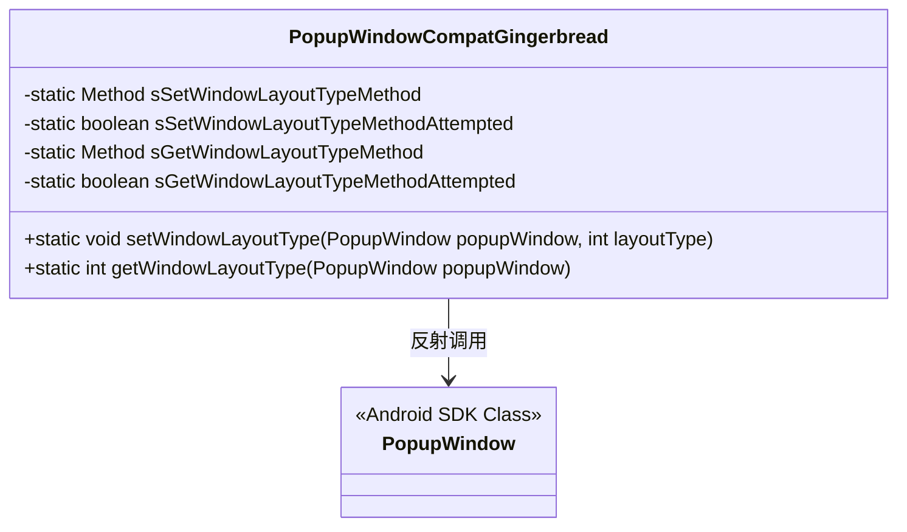
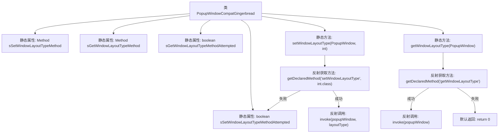

# 基础信息

|      |      |
|------|------|
| 名称 | PopupWindowCompatGingerbread |
| 编码语言 | .java |
| 代码路径 | termux-app/terminal-view/src/main/java/com/termux/view/support/PopupWindowCompatGingerbread.java |
| 包名 | com.termux.view.support |
| 依赖项 | ['android.util.Log', 'android.widget.PopupWindow', 'java.lang.reflect.Method'] |
| 概述说明 | PopupWindowCompatGingerbread类通过反射设置和获取PopupWindow的布局类型。 |

# 说明

PopupWindowCompatGingerbread类通过反射机制实现对PopupWindow的窗口布局类型设置和获取。该类包含两个静态方法：setWindowLayoutType用于设置布局类型，getWindowLayoutType用于获取当前布局类型。方法内部使用延迟加载策略，仅在首次调用时尝试通过反射获取对应Method对象，并缓存结果避免重复反射操作。若反射失败则静默处理异常，get方法默认返回0。通过Method.setAccessible(true)确保能访问私有方法。

# 类列表 Class Summary

| 名称   | 类型  | 说明 |
|-------|------|-------------|
| PopupWindowCompatGingerbread | class | PopupWindow兼容类，通过反射设置和获取窗口布局类型。 |

## 类 PopupWindowCompatGingerbread

|      |      |
|------|------|
| 访问范围 | public |
| 类型 | class |
| 名称 | PopupWindowCompatGingerbread |
| 说明 | PopupWindow兼容类，通过反射设置和获取窗口布局类型。 |

### UML类图

这段代码描述了一个兼容性工具类`PopupWindowCompatGingerbread`，它通过反射机制访问Android SDK中`PopupWindow`类的私有方法`setWindowLayoutType`和`getWindowLayoutType`。该类使用静态变量缓存反射获取的Method对象和尝试状态，避免重复反射操作。主要提供两个静态方法：设置窗口布局类型和获取当前布局类型，当反射失败时会静默处理异常并返回默认值。这常用于在低版本Android系统上实现高版本API的功能。

### 内部方法调用关系图

这段代码流程图展示了PopupWindowCompatGingerbread类的结构和核心方法调用关系。该类通过反射机制动态调用PopupWindow的窗口布局类型相关方法，包含两个主要静态方法：setWindowLayoutType用于设置布局类型，getWindowLayoutType用于获取布局类型。流程图清晰地反映了反射方法获取和调用的过程，以及失败时的默认处理逻辑，体现了对Android低版本兼容性的处理策略。每个方法都包含完整的异常处理流程，确保在反射失败时系统仍能正常运行。

### 字段列表 Field List

| 名称  | 类型  | 说明 |
|-------|-------|------|
| sGetWindowLayoutTypeMethod | Method | 私有静态方法变量sGetWindowLayoutTypeMethod。 |
| sSetWindowLayoutTypeMethodAttempted | boolean | 已尝试设置窗口布局类型方法 |
| sGetWindowLayoutTypeMethodAttempted | boolean | 尝试获取窗口布局类型方法的静态布尔标志 |
| sSetWindowLayoutTypeMethod | Method | 私有静态方法变量sSetWindowLayoutTypeMethod |

### 方法列表 Method List

| 名称  | 类型  | 说明 |
|-------|-------|------|
| setWindowLayoutType | void | 通过反射设置PopupWindow的窗口布局类型，失败静默处理。 |
| getWindowLayoutType | int | 反射获取PopupWindow布局类型，失败返回0。 |

