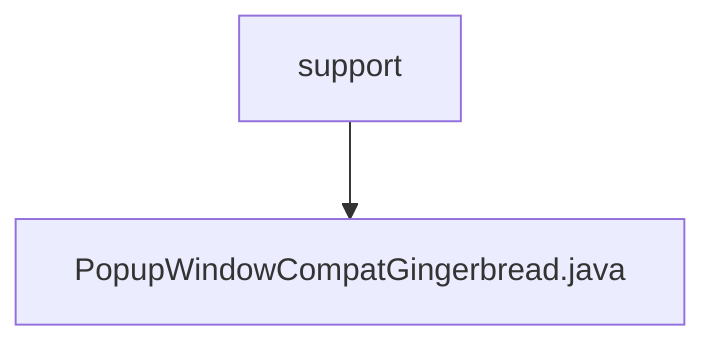

# 基础信息

|      |      |
|------|------|
| 名称 | support |
| 编码语言 | .java |
| 代码路径 | termux-app/terminal-view/src/main/java/com/termux/view/support |
| 包名 | termux-app.terminal-view.src.main.java.com.termux.view.support |
| 概述说明 | PopupWindowCompatGingerbread类通过反射设置和获取PopupWindow的布局类型。 |

# 说明

PopupWindowCompatGingerbread类通过反射机制实现对PopupWindow的窗口布局类型设置和获取。该类包含两个静态方法：setWindowLayoutType用于设置布局类型，getWindowLayoutType用于获取当前布局类型。方法内部使用延迟加载策略，仅在首次调用时尝试通过反射获取对应Method对象，并缓存结果避免重复反射操作。若反射失败则静默处理异常，get方法默认返回0。通过Method.setAccessible(true)确保能访问私有方法。

### 包内部结构视图

该流程图展示了Termux终端视图模块中的支持包层级结构，根节点为support目录，其下包含一个具体实现文件PopupWindowCompatGingerbread.java。这种简洁的树状结构体现了Android兼容性工具类的典型组织方式，其中父目录承载功能分类，子文件实现具体功能逻辑。

# 文件列表 File List

| 名称   | 类型  | 说明 |
|-------|------|-------------|
| [PopupWindowCompatGingerbread.java](PopupWindowCompatGingerbread.md) | file | PopupWindowCompatGingerbread类通过反射设置和获取PopupWindow的布局类型。 |

