# 基础信息

|      |      |
|------|------|
| 名称 | TextSelectionCursorController |
| 编码语言 | .java |
| 代码路径 | termux-app/terminal-view/src/main/java/com/termux/view/textselection/TextSelectionCursorController.java |
| 包名 | com.termux.view.textselection |
| 依赖项 | ['android.content.ClipboardManager', 'android.content.Context', 'android.graphics.Rect', 'android.os.Build', 'android.text.TextUtils', 'android.view.ActionMode', 'android.view.Menu', 'android.view.MenuItem', 'android.view.MotionEvent', 'android.view.View', 'androidx.annotation.Nullable', 'com.termux.terminal.TerminalBuffer', 'com.termux.terminal.WcWidth', 'com.termux.view.R', 'com.termux.view.TerminalView'] |
| 概述说明 | 终端文本选择控制器，管理选择光标和操作菜单。 |

# 说明

TextSelectionCursorController是一个用于控制终端文本选择操作的类，主要管理选择光标的位置、显示和交互逻辑。它包含两个文本选择手柄视图（mStartHandle和mEndHandle），分别控制选择的起始和结束位置。类中定义了复制、粘贴和更多操作的动作模式，并处理手势事件来更新选择区域。通过TerminalView与终端模拟器交互，获取和设置选择文本。还包括防止误触的延迟隐藏逻辑、选择区域边界校验以及滚动同步功能。此外，该类还存储临时选择的文本，支持上下文菜单操作，并提供方法查询当前选择状态和拖拽状态。

# 类列表 Class Summary

| 名称   | 类型  | 说明 |
|-------|------|-------------|
| TextSelectionCursorController | class | 终端文本选择控制器，管理选择光标和操作菜单。 |


## 类 TextSelectionCursorController

|      |      |
|------|------|
| 访问范围 | public |
| 类型 | class |
| 名称 | TextSelectionCursorController |
| 说明 | 终端文本选择控制器，管理选择光标和操作菜单。 |


### UML类图

```mermaid
classDiagram
    class TextSelectionCursorController {
        -TerminalView terminalView
        -TextSelectionHandleView mStartHandle
        -TextSelectionHandleView mEndHandle
        -String mStoredSelectedText
        -boolean mIsSelectingText
        -long mShowStartTime
        -int mHandleHeight
        -int mSelX1, mSelX2, mSelY1, mSelY2
        -ActionMode mActionMode
        +final int ACTION_COPY
        +final int ACTION_PASTE
        +final int ACTION_MORE
        +TextSelectionCursorController(TerminalView terminalView)
        +show(MotionEvent event) void
        +hide() boolean
        +render() void
        +setInitialTextSelectionPosition(MotionEvent event) void
        +setActionModeCallBacks() void
        +updatePosition(TextSelectionHandleView handle, int x, int y) void
        +decrementYTextSelectionCursors(int decrement) void
        +onTouchEvent(MotionEvent event) boolean
        +onTouchModeChanged(boolean isInTouchMode) void
        +onDetached() void
        +isActive() boolean
        +getSelectors(int[] sel) void
        +getSelectedText() String
        +getStoredSelectedText() String
        +unsetStoredSelectedText() void
        +getActionMode() ActionMode
        +isSelectionStartDragged() boolean
        +isSelectionEndDragged() boolean
        -getValidCurX(TerminalBuffer screen, int cy, int cx) int
    }

    class TerminalView {
        +getColumnAndRow(MotionEvent event, boolean b) int[]
        +mEmulator TerminalEmulator
        +mRenderer TerminalRenderer
        +mTermSession TerminalSession
        +startActionMode(ActionMode$Callback callback) ActionMode
        +stopTextSelectionMode() void
        +showContextMenu() void
        +getTopRow() int
        +setTopRow(int topRow) void
        +invalidate() void
        +getCursorX(int x) int
        +getCursorY(int y) int
        +getBottom() int
        +getContext() Context
    }

    class TextSelectionHandleView {
        +LEFT : int
        +RIGHT : int
        +isDragging() boolean
        +positionAtCursor(int x, int y, boolean force) void
        +hide() void
    }

    class ActionMode {
        <<Interface>>
        +finish() void
        +invalidate() void
    }

    class ActionMode$Callback {
        <<Interface>>
        +onCreateActionMode(ActionMode mode, Menu menu) boolean
        +onPrepareActionMode(ActionMode mode, Menu menu) boolean
        +onActionItemClicked(ActionMode mode, MenuItem item) boolean
        +onDestroyActionMode(ActionMode mode) void
    }

    class ActionMode$Callback2 {
        <<Interface>>
        +onGetContentRect(ActionMode mode, View view, Rect outRect) void
    }

    TextSelectionCursorController --> TerminalView : 依赖
    TextSelectionCursorController --> TextSelectionHandleView : 包含
    TextSelectionCursorController --> ActionMode : 使用
    ActionMode$Callback2 --|> ActionMode$Callback : 继承
```

该代码实现了一个终端文本选择控制器，主要功能包括：通过两个手柄视图(mStartHandle/mEndHandle)控制文本选择范围，处理用户交互事件，管理ActionMode上下文菜单(复制/粘贴/更多操作)，并与TerminalView协同工作。核心逻辑涉及选择位置计算、边界检查、滚动同步和文本处理，同时考虑了不同Android版本的兼容性处理。控制器通过维护选择坐标(mSelX1/Y1等)和状态标志(mIsSelectingText)来跟踪当前选择状态。


### 内部方法调用关系图

```mermaid
graph TD
    A["类TextSelectionCursorController"]
    B["属性: TerminalView terminalView"]
    C["属性: TextSelectionHandleView mStartHandle, mEndHandle"]
    D["属性: String mStoredSelectedText"]
    E["属性: boolean mIsSelectingText"]
    F["属性: long mShowStartTime"]
    G["属性: int mHandleHeight"]
    H["属性: int mSelX1, mSelX2, mSelY1, mSelY2"]
    I["属性: ActionMode mActionMode"]
    J["常量: ACTION_COPY, ACTION_PASTE, ACTION_MORE"]
    K["构造方法: TextSelectionCursorController(TerminalView)"]
    L["方法: show(MotionEvent)"]
    M["方法: hide()"]
    N["方法: render()"]
    O["方法: setInitialTextSelectionPosition(MotionEvent)"]
    P["方法: setActionModeCallBacks()"]
    Q["方法: updatePosition(TextSelectionHandleView, int, int)"]
    R["方法: getValidCurX(TerminalBuffer, int, int)"]
    S["方法: decrementYTextSelectionCursors(int)"]
    T["方法: onTouchEvent(MotionEvent)"]
    U["方法: onTouchModeChanged(boolean)"]
    V["方法: onDetached()"]
    W["方法: isActive()"]
    X["方法: getSelectors(int[])"]
    Y["方法: getSelectedText()"]
    Z["方法: getStoredSelectedText()"]
    AA["方法: unsetStoredSelectedText()"]
    AB["方法: getActionMode()"]
    AC["方法: isSelectionStartDragged()"]
    AD["方法: isSelectionEndDragged()"]

    A --> B
    A --> C
    A --> D
    A --> E
    A --> F
    A --> G
    A --> H
    A --> I
    A --> J
    A --> K
    A --> L
    A --> M
    A --> N
    A --> O
    A --> P
    A --> Q
    A --> R
    A --> S
    A --> T
    A --> U
    A --> V
    A --> W
    A --> X
    A --> Y
    A --> Z
    A --> AA
    A --> AB
    A --> AC
    A --> AD

    L --> C
    L --> G
    O --> H
    P --> I
    Q --> H
    Q --> R
    AC --> C
    AD --> C
```



这段代码实现了一个终端文本选择控制器，主要功能包括：通过两个手柄视图(mStartHandle/mEndHandle)控制文本选择范围，处理用户交互事件，管理选择模式状态，并提供复制/粘贴等操作菜单。核心逻辑涉及坐标计算、边界校验、选择区域更新和动作模式回调，通过TerminalView与终端模拟器交互获取文本内容。控制器严格管理选择状态生命周期，防止误操作，并支持跨行选择和特殊字符处理。

### 字段列表 Field List

| 名称  | 类型  | 说明 |
|-------|-------|------|
| terminalView | TerminalView | 私有终端视图对象 |
| ACTION_MORE = 3 | int | 常量ACTION_MORE值为3 |
| ACTION_PASTE = 2 | int | 定义常量ACTION_PASTE，值为2，不可修改。 |
| mStoredSelectedText | String | 私有字符串变量mStoredSelectedText |
| mActionMode | ActionMode | 私有动作模式变量mActionMode |
| mSelY2 = -1 | int | 私有整型变量mSelX1、mSelX2、mSelY1、mSelY2，初始值均为-1。 |
| mShowStartTime = System.currentTimeMillis() | long | 记录显示开始时间，使用当前系统时间。 |
| mEndHandle | TextSelectionHandleView | 私有成员变量：文本选择起始和结束句柄视图。 |
| mHandleHeight | int | 私有整型变量mHandleHeight |
| ACTION_COPY = 1 | int | 公开常量ACTION_COPY值为1。 |
| mIsSelectingText = false | boolean | 成员变量mIsSelectingText，布尔类型，默认false。 |

### 方法列表 Method List

| 名称  | 类型  | 说明 |
|-------|-------|------|
| isActive | boolean | 重写方法，返回文本选择状态。 |
| setInitialTextSelectionPosition | void | 方法设置初始文本选择位置，基于事件坐标调整选区边界，非空格时扩展至完整单词。 |
| getStoredSelectedText | String | 获取存储的选中文本，可能返回空值。 |
| show | void | 重写show方法，设置文本选择位置和操作回调，标记选择开始时间。 |
| render | void | 重写render方法，更新光标位置并刷新操作模式。 |
| getValidCurX | int | 获取终端屏幕有效列位置的方法，处理字符宽度和代理对。 |
| onDetached | void | 重写onDetached方法，空实现。 |
| onTouchEvent | boolean | 触摸事件处理方法，默认返回false不处理。 |
| onTouchModeChanged | void | 方法在非触摸模式时停止终端视图的文本选择。 |
| setActionModeCallBacks | void | 设置终端文本选择操作模式回调，包括复制、粘贴和更多功能。 |
| decrementYTextSelectionCursors | void | 方法减少文本选择光标Y坐标值。 |
| hide | boolean | 方法hide()检查控件状态，防止快速重复调用，隐藏操作柄并结束选择模式，返回操作结果。 |
| updatePosition | void | 更新文本选择手柄位置，调整坐标并确保在有效范围内。 |
| unsetStoredSelectedText | void | 清除存储的选中文本。 |
| getSelectors | void | 方法将选择器值赋给输入数组，数组需非空且长度为4。 |
| getSelectedText | String | 获取终端视图选中文本的方法。 |
| getActionMode | ActionMode | 获取当前操作模式的方法，返回mActionMode的值。 |
| isSelectionStartDragged | boolean | 方法检查选择起始点是否被拖动。 |
| isSelectionEndDragged | boolean | 方法检查选择结束句柄是否被拖动。 |


