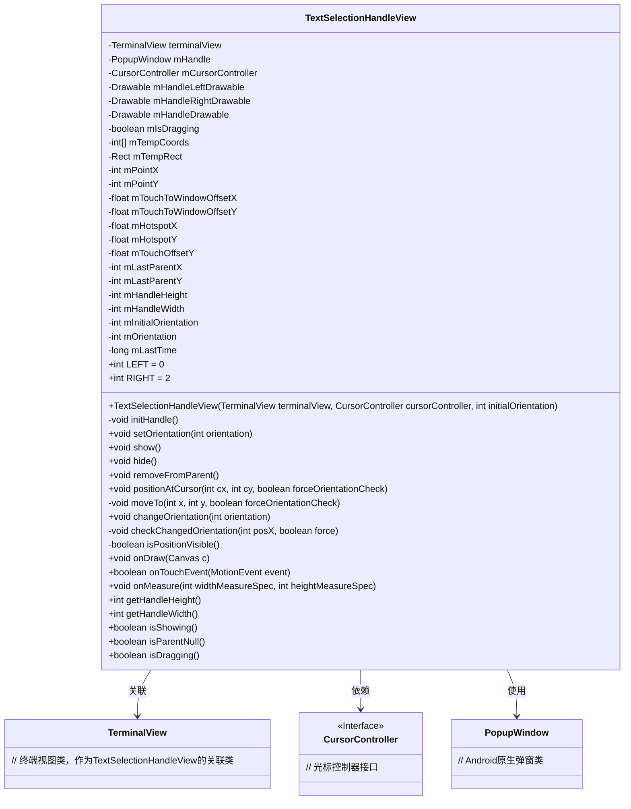
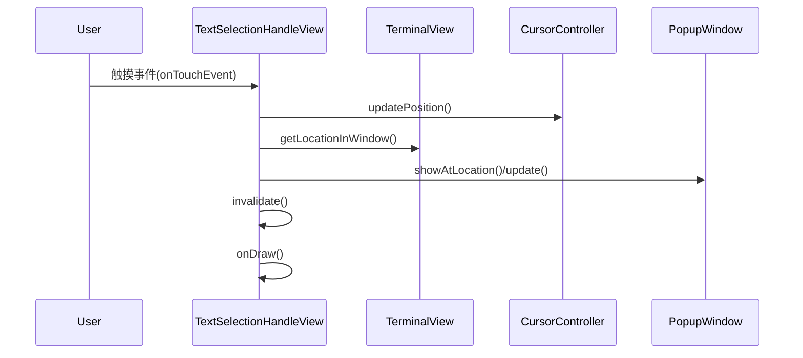

# 基础信息

|      |      |
|------|------|
| 名称 | TextSelectionHandleView |
| 编码语言 | .java |
| 代码路径 | termux-app/terminal-view/src/main/java/com/termux/view/textselection/TextSelectionHandleView.java |
| 包名 | com.termux.view.textselection |
| 依赖项 | ['android.annotation.SuppressLint', 'android.graphics.Canvas', 'android.graphics.Rect', 'android.graphics.drawable.Drawable', 'android.os.Build', 'android.os.SystemClock', 'android.view.MotionEvent', 'android.view.View', 'android.view.ViewGroup', 'android.view.ViewParent', 'android.view.WindowManager', 'android.widget.PopupWindow', 'com.termux.view.R', 'com.termux.view.TerminalView', 'com.termux.view.support.PopupWindowCompatGingerbread'] |
| 概述说明 | 文本选择手柄视图类，用于终端文本选择操作。 |

# 说明

TextSelectionHandleView是一个用于终端文本选择操作的视图组件，继承自View类。它包含左右两种方向的手柄绘制资源，通过PopupWindow实现悬浮显示。主要功能包括：根据初始方向设置手柄图标和热点位置，显示/隐藏手柄，处理拖拽事件更新光标位置，检测边界自动调整手柄方向。组件维护了坐标偏移量、拖拽状态、父窗口位置等变量，并通过invalidate()触发重绘。关键方法包括positionAtCursor移动手柄、checkChangedOrientation检查方向变化、onTouchEvent处理触摸事件。组件还提供手柄尺寸查询和状态检测方法。

# 类列表 Class Summary

| 名称   | 类型  | 说明 |
|-------|------|-------------|
| TextSelectionHandleView | class | 终端文本选择手柄视图类，支持左右拖动和方向调整。 |

## 类 TextSelectionHandleView

|      |      |
|------|------|
| 访问范围 | @SuppressLint("ViewConstructor");public |
| 类型 | class |
| 名称 | TextSelectionHandleView |
| 说明 | 终端文本选择手柄视图类，支持左右拖动和方向调整。 |

### UML类图

这段代码实现了一个文本选择手柄视图(TextSelectionHandleView)，用于在终端视图中显示和操作文本选择手柄。主要功能包括：根据方向(LEFT/RIGHT)显示不同样式的拖拽手柄、处理触摸事件更新光标位置、自动调整手柄方向避免超出边界、通过PopupWindow实现悬浮显示效果。类图中清晰展示了与TerminalView、CursorController和PopupWindow的关联关系，以及手柄视图自身的状态管理和绘制逻辑。

### 内部方法调用关系图

```mermaid
graph TD
    A["类TextSelectionHandleView"]
    B["属性: TerminalView terminalView"]
    C["属性: PopupWindow mHandle"]
    D["属性: CursorController mCursorController"]
    E["属性: Drawable mHandleLeftDrawable"]
    F["属性: Drawable mHandleRightDrawable"]
    G["属性: boolean mIsDragging"]
    H["构造方法: TextSelectionHandleView()"]
    I["方法: initHandle()"]
    J["方法: setOrientation()"]
    K["方法: show()"]
    L["方法: hide()"]
    M["方法: removeFromParent()"]
    N["方法: positionAtCursor()"]
    O["方法: moveTo()"]
    P["方法: checkChangedOrientation()"]
    Q["方法: isPositionVisible()"]
    R["重写方法: onDraw()"]
    S["重写方法: onTouchEvent()"]
    T["重写方法: onMeasure()"]
    U["方法: getHandleHeight()"]
    V["方法: getHandleWidth()"]
    W["方法: isShowing()"]
    X["方法: isParentNull()"]
    Y["方法: isDragging()"]

    A --> B
    A --> C
    A --> D
    A --> E
    A --> F
    A --> G
    A --> H
    H --> I
    H --> J
    A --> K
    K --> I
    K --> Q
    A --> L
    L --> M
    A --> M
    A --> N
    N --> O
    O --> P
    O --> Q
    A --> P
    P --> J
    A --> Q
    A --> R
    A --> S
    S --> K
    S --> L
    A --> T
    A --> U
    A --> V
    A --> W
    A --> X
    A --> Y
```

这段代码实现了一个文本选择手柄视图(TextSelectionHandleView)，用于在终端视图中显示和操作文本选择手柄。主要功能包括：根据方向(左/右)显示不同样式的拖动手柄，处理触摸事件来更新光标位置，动态调整手柄方向以避免超出边界，以及管理弹出窗口的显示/隐藏。核心流程涉及手柄初始化、方向设置、位置计算和触摸事件处理，通过PopupWindow实现浮动显示效果。

### 字段列表 Field List

| 名称  | 类型  | 说明 |
|-------|-------|------|
| mHandleHeight | int | 私有整型变量mHandleHeight |
| mHandleLeftDrawable | Drawable | 私有左把手绘图对象 |
| RIGHT = 2 | int | 定义常量RIGHT，值为2。 |
| mPointX | int | 私有整型变量mPointX |
| mTempRect | Rect | 声明矩形变量mTempRect |
| mHandle | PopupWindow | 私有弹窗变量mHandle |
| mLastParentX | int | 私有整型变量mLastParentX |
| mIsDragging | boolean | 私有布尔变量，表示是否正在拖动。 |
| mHandleDrawable | Drawable | 私有绘图对象mHandleDrawable |
| mPointY | int | 私有整型变量mPointY |
| mHotspotX | float | 私有浮点变量mHotspotX |
| mLastTime | long | 私有长整型变量mLastTime |
| mHotspotY | float | 私有浮点变量mHotspotY |
| mHandleRightDrawable | Drawable | 私有右把手绘图对象 |
| mTouchOffsetY | float | 私有浮点变量，记录触摸Y轴偏移量。 |
| mOrientation | int | 私有整型变量mOrientation，用于存储方向信息。 |
| mTouchToWindowOffsetX | float | 私有浮点变量，记录触摸点到窗口的X轴偏移量。 |
| mHandleWidth | int | 私有整型变量mHandleWidth |
| mLastParentY | int | 私有整型变量，记录上次父级Y坐标。 |
| mTouchToWindowOffsetY | float | 私有浮点变量，记录触摸点到窗口的垂直偏移量。 |
| terminalView | TerminalView | 私有终端视图对象。 |
| LEFT = 0 | int | 定义静态常量LEFT，值为0。 |
| mTempCoords = new int[2] | int[] | 声明并初始化一个大小为2的整型数组mTempCoords。 |
| mInitialOrientation | int | 私有整型变量mInitialOrientation |
| mCursorController | CursorController | 私有游标控制器mCursorController |

### 方法列表 Method List

| 名称  | 类型  | 说明 |
|-------|-------|------|
| isParentNull | boolean | 检查父节点是否为空 |
| removeFromParent | void | 从父视图移除当前视图，若父视图存在。 |
| changeOrientation | void | 方法变更方向，仅在不同时设置新方向。 |
| hide | void | 隐藏拖动控件：停止拖动、销毁句柄并刷新界面。 |
| isPositionVisible | boolean | 检查位置是否可见：拖动时始终显示；否则计算视图边界和坐标，判断位置是否在可见区域内。 |
| onDraw | void | 重写onDraw方法，设置绘制范围并绘制图形。 |
| onMeasure | void | 重写onMeasure方法，设置视图尺寸为mHandleDrawable的固有宽高。 |
| getHandleHeight | int | 获取句柄高度的方法，返回成员变量mHandleHeight的值。 |
| getHandleWidth | int | 获取句柄宽度的方法，返回变量mHandleWidth的值。 |
| isShowing | boolean | 检查mHandle是否显示，非空返回显示状态，否则返回false。 |
| isDragging | boolean | 检查是否正在拖动。 |
| show | void | 检查位置可见性，移除父视图，初始化并显示句柄。 |
| moveTo | void | 移动控件到指定位置，检查方向并更新显示或隐藏。 |
| positionAtCursor | void | 方法根据光标位置移动视图，检查方向。 |
| setOrientation | void | 设置控件方向，根据左右方向调整手柄宽度和热点位置，更新尺寸并重绘。 |
| checkChangedOrientation | void | 检查视图方向变化，根据位置调整方向。 |
| initHandle | void | 初始化弹出窗口，设置样式、尺寸、背景及动画，适配不同系统版本。 |
| onTouchEvent | boolean | 处理触摸事件：按下时记录坐标开始拖动，移动时更新光标位置，抬起或取消时停止拖动。 |

