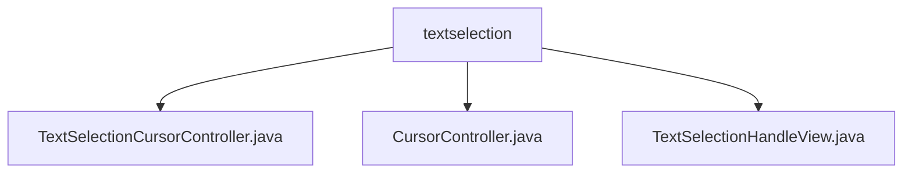

# 基础信息

|      |      |
|------|------|
| 名称 | textselection |
| 编码语言 | .java |
| 代码路径 | termux-app/terminal-view/src/main/java/com/termux/view/textselection |
| 包名 | termux-app.terminal-view.src.main.java.com.termux.view.textselection |
| 概述说明 | TextSelectionCursorController管理终端文本选择光标和交互，包含起始结束手柄、操作模式和手势处理。TextSelectionHandleView是选择手柄组件，处理拖拽和方向调整。 |

# 说明

```markdown
## 概述
该代码模块是Termux终端应用的文本选择控制子系统，主要由三个核心类组成，负责实现终端文本的选择、光标控制及交互操作功能。模块通过分离控制逻辑（CursorController）、视图渲染（HandleView）和交互管理（TextSelectionCursorController）实现职责分离，支持双向选择手柄操作、上下文菜单和防误触机制，与TerminalView紧密集成完成终端文本的选取与操作。

## 主要业务场景
1. **文本选择交互**  
   - 用户通过长按触发选择模式，显示起始/结束手柄（`TextSelectionHandleView`）
   - 拖拽手柄时实时更新选择区域，自动调整手柄方向（左/右）和位置
   - 通过`TextSelectionCursorController`同步选择文本到终端模拟器

2. **上下文菜单操作**  
   - 选中文本后弹出复制/粘贴/更多操作菜单
   - 由`CursorController`维护临时选择文本缓存，支持菜单动作处理

3. **防误触与边界处理**  
   - 延迟隐藏逻辑防止短暂触摸误操作
   - 自动校验选择边界并同步终端滚动位置
   - 手柄拖拽时动态计算热点坐标和方向（`checkChangedOrientation`）

4. **跨组件协作**  
   - 通过`TerminalView`接口获取终端文本布局信息
   - `PopupWindow`实现悬浮手柄视图，`invalidate()`触发重绘
```


### 包内部结构视图



该流程图展示了Termux终端应用中文本选择功能模块的文件结构。根节点textselection文件夹下包含三个关键Java文件：TextSelectionCursorController处理光标控制逻辑，CursorController是基础光标控制器，TextSelectionHandleView实现选择手柄的视图交互。这些文件共同构成了终端文本选择的核心功能组件。

# 文件列表 File List

| 名称   | 类型  | 说明 |
|-------|------|-------------|
| [TextSelectionHandleView.java](TextSelectionHandleView.md) | file | 文本选择手柄视图类，用于终端文本选择操作。 |
| [CursorController.java](CursorController.md) | file | 输入内容为空，无法生成概要描述。 |
| [TextSelectionCursorController.java](TextSelectionCursorController.md) | file | 终端文本选择控制器，管理选择光标和操作菜单。 |


