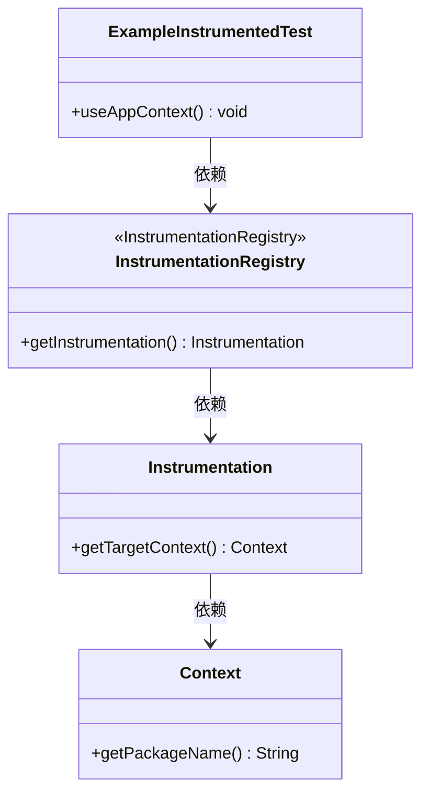
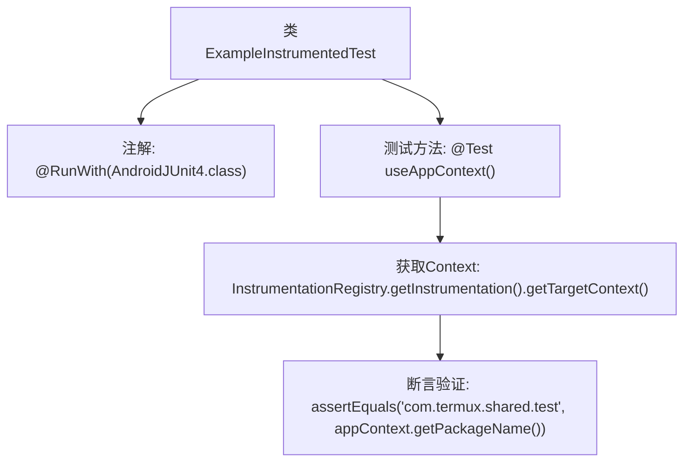

# 基础信息

|      |      |
|------|------|
| 名称 | ExampleInstrumentedTest |
| 编码语言 | .java |
| 代码路径 | termux-app/termux-shared/src/androidTest/java/com/termux/shared/ExampleInstrumentedTest.java |
| 包名 | com.termux.shared |
| 依赖项 | ['android.content.Context', 'androidx.test.platform.app.InstrumentationRegistry', 'androidx.test.ext.junit.runners.AndroidJUnit4', 'org.junit.Test', 'org.junit.runner.RunWith', 'org.junit.Assert'] |
| 概述说明 | 安卓单元测试示例，验证应用上下文包名匹配。 |

# 说明

这是一个使用AndroidJUnit4测试框架的Android单元测试类。测试类名为ExampleInstrumentedTest，包含一个测试方法useAppContext。该方法获取被测应用的上下文对象，并验证应用的包名是否为com.termux.shared.test。测试通过断言来验证预期结果与实际结果是否一致。

# 类列表 Class Summary

| 名称   | 类型  | 说明 |
|-------|------|-------------|
| ExampleInstrumentedTest | class | 安卓测试类验证应用上下文包名正确性。 |

## 类 ExampleInstrumentedTest

|      |      |
|------|------|
| 访问范围 | @RunWith(AndroidJUnit4.class);public |
| 类型 | class |
| 名称 | ExampleInstrumentedTest |
| 说明 | 安卓测试类验证应用上下文包名正确性。 |

### UML类图

这段代码展示了一个Android单元测试类ExampleInstrumentedTest，它通过InstrumentationRegistry获取测试环境上下文(Context)，并验证应用包名是否正确。类图清晰地呈现了测试类与Android测试框架核心组件的依赖关系：测试类调用InstrumentationRegistry获取Instrumentation实例，再通过它获得目标Context，最终调用Context方法验证包名。整个流程体现了Android单元测试获取运行环境上下文的标准方式。

### 内部方法调用关系图

这段代码是一个Android单元测试类，使用JUnit4框架进行测试。主要流程是通过InstrumentationRegistry获取被测应用的Context对象，然后验证其包名是否符合预期值"com.termux.shared.test"。流程图清晰地展示了从测试类初始化到断言验证的完整过程，突出了Android测试特有的Instrumentation API调用和断言检查两个关键环节。

### 字段列表 Field List

| 名称  | 类型  | 说明 |
|-------|-------|------|

### 方法列表 Method List

| 名称  | 类型  | 说明 |
|-------|-------|------|
| useAppContext | void | 测试应用上下文，验证包名匹配。 |

