# 基础信息

|      |      |
|------|------|
| 名称 | termux |
| 编码语言 | .java |
| 代码路径 | termux-app/termux-shared/src/main/java/com/termux |
| 包名 | termux-app.termux-shared.src.main.java.com.termux |
| 概述说明 | NotificationUtils类处理通知功能，含9种模式常量。JniResult封装JNI调用结果。MarkdownUtils处理Markdown文本转换。Shell框架管理命令执行。TextIOInfo和ReportInfo处理文本输入和报告。DataUtils和IntentUtils提供数据处理工具。KeyboardUtils和ViewUtils管理软键盘和视图。ReflectionUtils简化反射操作。Termux模块管理终端会话和配置。ThemeUtils处理主题属性。FileUtils提供文件操作工具。Net模块处理网络通信。CrashHandler记录未捕获异常。MessageDialogUtils和ShareUtils处理交互和分享。ReportActivity和TextIOActivity管理报告和文本输入。Settings模块管理配置。Android工具类封装系统API。Logger提供多级日志记录。Error模块管理错误信息。ActivityUtils简化Activity操作。 |

# 说明

```markdown
## 概述

该代码模块是Termux Android终端模拟器的核心功能组件集合，采用分层架构设计，主要包含以下功能子系统：

1. **通知与交互系统**
   - `NotificationUtils`：支持9种通知模式（静默/声音/振动等）的完整通知管理
   - `MessageDialogUtils`/`ShareUtils`：标准化对话框、分享和剪贴板操作
   - `ReportActivity`/`TextIOActivity`：Markdown报告渲染和文本输入界面

2. **底层工具库**
   - `ReflectionUtils`：Android隐藏API反射突破工具
   - `DataUtils`/`IntentUtils`：安全的数据提取与类型转换
   - `FileUtils`：Unix文件系统操作全集（含权限管理和错误处理）

3. **终端核心功能**
   - Shell命令执行框架（环境管理/进程控制/结果处理）
   - 本地套接字服务系统（AM命令远程执行）
   - 终端会话生命周期管理（TermuxSession）

4. **系统集成层**
   - `AndroidUtils`：多版本兼容的系统API封装
   - `KeyboardUtils`：软硬件键盘综合管理
   - `CrashHandler`：崩溃日志收集与上报

5. **辅助功能组件**
   - 主题管理系统（`ThemeUtils`/`NightMode`）
   - 网络工具集（URL/URI规范化处理）
   - 配置管理（`SharedProperties`多进程同步）

## 主要业务场景

### 终端模拟器核心功能
1. **Shell命令全生命周期管理**
   - 通过`TermuxShellManager`实现命令排队执行
   - 环境变量四级继承体系（系统→应用→插件→命令）
   - 结构化结果输出（exit_code/stdout/stderr分离）

2. **扩展交互场景**
   - 宏命令执行（ExtraKeys系统）
   - 多窗口终端会话同步
   - 硬件键盘适配与组合键处理

### 系统集成与兼容性
1. **Android多版本适配**
   - 通知渠道创建（Android O+）
   - 存储访问框架（SAF）集成
   - 隐藏API反射调用（如`PhantomProcessUtils`）

2. **安全控制**
   - SELinux上下文检查
   - 运行时权限动态申请
   - 进程间通信身份验证（PeerCred）

### 开发支持功能
1. **调试与诊断**
   - 崩溃日志Markdown格式化
   - Intent/Bundle可视化工具
   - 系统属性批量导出

2. **插件系统支持**
   - 跨进程配置同步（SharedPreferences）
   - 标准化结果返回接口（PendingIntent）
   - 模块化错误处理体系（Errno分类）

### 性能关键路径
1. **高效资源管理**
   - 文件操作原子性保证
   - 流处理防死锁机制（StreamGobbler）
   - 内存缓存+磁盘持久化双模式

2. **异步处理体系**
   - 本地套接字非阻塞IO
   - 通知发送的线程隔离
   - 崩溃处理的最后防线机制

### 典型应用场景
- 交互式终端会话（含后台任务）
- 系统管理脚本执行
- 开发环境快速部署
- 自动化测试框架
- 设备信息采集工具
```


### 包内部结构视图

```mermaid
graph TD
    termux --> shared
    shared --> notification
    shared --> jni
    shared --> markdown
    shared --> shell
    shared --> models
    shared --> data
    shared --> view
    shared --> reflection
    shared --> termux
    shared --> theme
    shared --> file
    shared --> net
    shared --> crash
    shared --> interact
    shared --> activities
    shared --> settings
    shared --> android
    shared --> logger
    shared --> errors
    shared --> activity
    notification --> NotificationUtils.java
    jni --> models
    models --> JniResult.java
    markdown --> MarkdownUtils.java
    shell --> command
    shell --> am
    shell --> StreamGobbler.java
    shell --> ArgumentTokenizer.java
    shell --> ShellUtils.java
    command --> runner
    command --> environment
    command --> result
    command --> ExecutionCommand.java
    command --> ShellCommandConstants.java
    runner --> app
    app --> AppShell.java
    environment --> UnixShellEnvironment.java
    environment --> ShellCommandShellEnvironment.java
    environment --> AndroidShellEnvironment.java
    environment --> IShellEnvironment.java
    environment --> ShellEnvironmentUtils.java
    environment --> ShellEnvironmentVariable.java
    result --> ResultConfig.java
    result --> ResultData.java
    result --> ResultSenderErrno.java
    result --> ResultSender.java
    am --> AmSocketServerRunConfig.java
    am --> AmSocketServer.java
    am --> AmSocketServerErrno.java
    models --> TextIOInfo.java
    models --> ReportInfo.java
    data --> DataUtils.java
    data --> IntentUtils.java
    view --> KeyboardUtils.java
    view --> ViewUtils.java
    reflection --> ReflectionUtils.java
    termux --> settings
    termux --> crash
    termux --> interact
    termux --> notification
    termux --> shell
    termux --> models
    termux --> data
    termux --> extrakeys
    termux --> terminal
    termux --> theme
    termux --> plugins
    termux --> file
    termux --> TermuxUtils.java
    termux --> TermuxConstants.java
    termux --> TermuxBootstrap.java
    settings --> preferences
    settings --> properties
    preferences --> TermuxAPIAppSharedPreferences.java
    preferences --> TermuxWidgetAppSharedPreferences.java
    preferences --> TermuxTaskerAppSharedPreferences.java
    preferences --> TermuxFloatAppSharedPreferences.java
    preferences --> TermuxStylingAppSharedPreferences.java
    preferences --> TermuxBootAppSharedPreferences.java
    preferences --> TermuxPreferenceConstants.java
    preferences --> TermuxAppSharedPreferences.java
    properties --> TermuxPropertyConstants.java
    properties --> TermuxAppSharedProperties.java
    properties --> TermuxSharedProperties.java
    crash --> TermuxCrashUtils.java
    interact --> TextInputDialogUtils.java
    notification --> TermuxNotificationUtils.java
    shell --> command
    shell --> am
    shell --> TermuxShellManager.java
    shell --> TermuxShellUtils.java
    command --> runner
    command --> environment
    runner --> terminal
    terminal --> TermuxSession.java
    environment --> TermuxAPIShellEnvironment.java
    environment --> TermuxShellEnvironment.java
    environment --> TermuxAppShellEnvironment.java
    environment --> TermuxShellCommandShellEnvironment.java
    am --> TermuxAmSocketServer.java
    models --> UserAction.java
    data --> TermuxUrlUtils.java
    extrakeys --> ExtraKeyButton.java
    extrakeys --> SpecialButtonState.java
    extrakeys --> ExtraKeysInfo.java
    extrakeys --> ExtraKeysView.java
    extrakeys --> SpecialButton.java
    extrakeys --> ExtraKeysConstants.java
    terminal --> io
    terminal --> TermuxTerminalViewClientBase.java
    terminal --> TermuxTerminalSessionClientBase.java
    io --> TerminalExtraKeys.java
    io --> BellHandler.java
    theme --> TermuxThemeUtils.java
    plugins --> TermuxPluginUtils.java
    file --> TermuxFileUtils.java
    theme --> NightMode.java
    theme --> ThemeUtils.java
    file --> tests
    file --> filesystem
    file --> FileUtilsErrno.java
    file --> FileUtils.java
    tests --> FileUtilsTests.java
    filesystem --> FileAttributes.java
    filesystem --> FileTypes.java
    filesystem --> FileTime.java
    filesystem --> NativeDispatcher.java
    filesystem --> FileType.java
    filesystem --> FilePermissions.java
    filesystem --> FilePermission.java
    filesystem --> UnixConstants.java
    filesystem --> FileKey.java
    net --> socket
    net --> url
    net --> uri
    socket --> local
    local --> LocalSocketRunConfig.java
    local --> LocalSocketErrno.java
    local --> LocalSocketManagerClientBase.java
    local --> PeerCred.java
    local --> LocalSocketManager.java
    local --> LocalServerSocket.java
    local --> ILocalSocketManager.java
    local --> LocalClientSocket.java
    url --> UrlUtils.java
    uri --> UriScheme.java
    uri --> UriUtils.java
    crash --> CrashHandler.java
    interact --> MessageDialogUtils.java
    interact --> ShareUtils.java
    activities --> ReportActivity.java
    activities --> TextIOActivity.java
    settings --> preferences
    settings --> properties
    preferences --> AppSharedPreferences.java
    preferences --> SharedPreferenceUtils.java
    properties --> SharedPropertiesParser.java
    properties --> SharedProperties.java
    android --> PackageUtils.java
    android --> FeatureFlagUtils.java
    android --> ProcessUtils.java
    android --> SELinuxUtils.java
    android --> AndroidUtils.java
    android --> UserUtils.java
    android --> SettingsProviderUtils.java
    android --> PermissionUtils.java
    android --> PhantomProcessUtils.java
    android --> resource
    resource --> ResourceUtils.java
    logger --> Logger.java
    errors --> FunctionErrno.java
    errors --> Errno.java
    errors --> Error.java
    activity --> ActivityUtils.java
    activity --> ActivityErrno.java
    activity --> media
    media --> AppCompatActivityUtils.java
```



该流程图展示了Termux项目的完整目录结构，从顶层termux目录开始，逐级展开到各个子模块和文件。主要包含shared和termux两大核心模块，其中shared模块下又细分为notification、jni、shell等20多个子模块，termux模块则包含settings、shell、terminal等10多个子模块。每个子模块都进一步展开到具体的实现文件，如NotificationUtils.java、TermuxSession.java等，完整呈现了项目的层级关系和组织结构。

# 文件列表 File List

| 名称   | 类型  | 说明 |
|-------|------|-------------|
| [shared](shared/_module.md) | package | NotificationUtils类处理通知功能，含9种模式常量。JniResult封装JNI调用结果。MarkdownUtils处理Markdown文本转换。Shell框架管理命令执行。TextIOInfo和ReportInfo处理文本输入和报告。DataUtils和IntentUtils提供数据处理工具。KeyboardUtils和ViewUtils管理软键盘和视图。ReflectionUtils简化反射操作。Termux模块管理终端会话和配置。ThemeUtils处理主题属性。FileUtils提供文件操作工具。Net模块处理网络通信。CrashHandler记录未捕获异常。MessageDialogUtils和ShareUtils处理交互和分享。ReportActivity和TextIOActivity管理报告和文本输入。Settings模块管理配置。Android工具类封装系统API。Logger提供多级日志记录。Error模块管理错误信息。ActivityUtils简化Activity操作。 |


