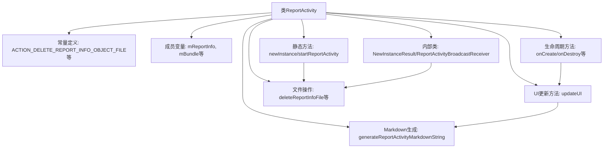
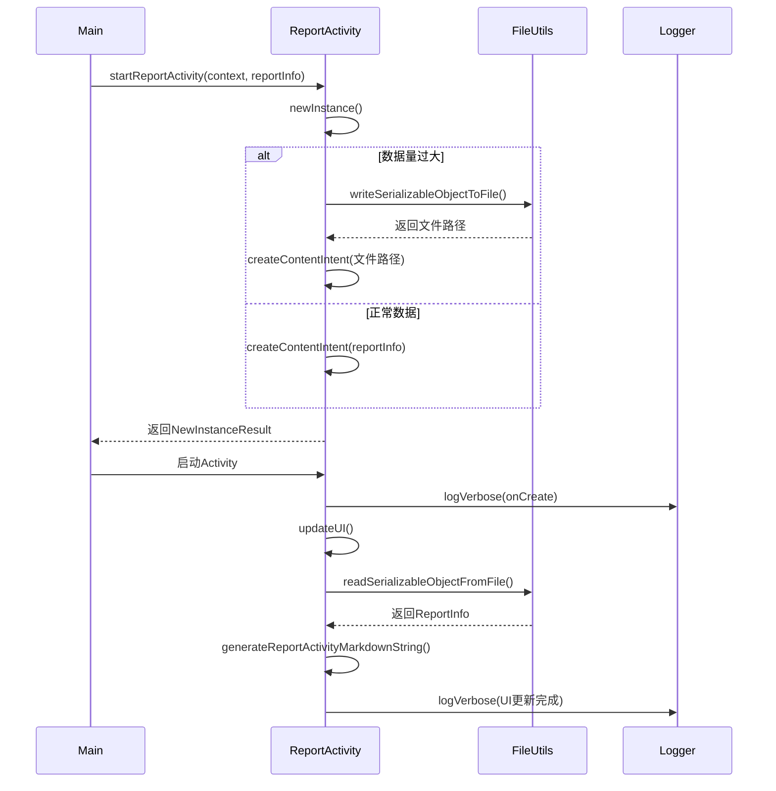

# 基础信息

|      |      |
|------|------|
| 名称 | ReportActivity |
| 编码语言 | .java |
| 代码路径 | termux-app/termux-shared/src/main/java/com/termux/shared/activities/ReportActivity.java |
| 包名 | com.termux.shared.activities |
| 依赖项 | ['androidx.annotation.NonNull', 'androidx.appcompat.app.ActionBar', 'androidx.appcompat.app.AppCompatActivity', 'androidx.appcompat.widget.Toolbar', 'androidx.recyclerview.widget.LinearLayoutManager', 'androidx.recyclerview.widget.RecyclerView', 'android.content.BroadcastReceiver', 'android.content.Context', 'android.content.Intent', 'android.content.pm.PackageManager', 'android.os.Bundle', 'android.view.Menu', 'android.view.MenuInflater', 'android.view.MenuItem', 'com.termux.shared.R', 'com.termux.shared.activity.media.AppCompatActivityUtils', 'com.termux.shared.data.DataUtils', 'com.termux.shared.file.FileUtils', 'com.termux.shared.file.filesystem.FileType', 'com.termux.shared.logger.Logger', 'com.termux.shared.errors.Error', 'com.termux.shared.termux.TermuxConstants', 'com.termux.shared.markdown.MarkdownUtils', 'com.termux.shared.interact.ShareUtils', 'com.termux.shared.models.ReportInfo', 'com.termux.shared.theme.NightMode', 'org.commonmark.node.FencedCodeBlock', 'org.jetbrains.annotations.NotNull', 'io.noties.markwon.Markwon', 'io.noties.markwon.recycler.MarkwonAdapter', 'io.noties.markwon.recycler.SimpleEntry'] |
| 概述说明 | 报告活动类，处理报告信息显示与文件操作，支持分享、复制和保存功能。 |

# 说明

ReportActivity是一个Android应用组件，用于展示报告信息。它继承自AppCompatActivity，主要功能包括处理报告数据的显示、分享、保存和清理。活动通过Intent接收ReportInfo对象或文件路径，支持大文件处理以避免TransactionTooLargeException。界面使用RecyclerView和Markwon库渲染Markdown格式内容，提供分享、复制和保存到文件的功能。活动生命周期管理包括清理临时文件，并通过BroadcastReceiver处理通知删除时的清理任务。还包含工具方法用于定期清理过期缓存文件。

# 类列表 Class Summary

| 名称   | 类型  | 说明 |
|-------|------|-------------|
| ReportActivity | class | 报告活动类，处理报告信息展示与文件操作，支持分享、复制和保存功能。 |

## 类 ReportActivity

|      |      |
|------|------|
| 访问范围 | public |
| 类型 | class |
| 名称 | ReportActivity |
| 说明 | 报告活动类，处理报告信息展示与文件操作，支持分享、复制和保存功能。 |

### UML类图

```mermaid
classDiagram
    class ReportActivity {
        -String CLASS_NAME
        -String ACTION_DELETE_REPORT_INFO_OBJECT_FILE
        -String EXTRA_REPORT_INFO_OBJECT
        -String EXTRA_REPORT_INFO_OBJECT_FILE_PATH
        -String CACHE_DIR_BASENAME
        -String CACHE_FILE_BASENAME_PREFIX
        +int REQUEST_GRANT_STORAGE_PERMISSION_FOR_SAVE_FILE
        +int ACTIVITY_TEXT_SIZE_LIMIT_IN_BYTES
        -ReportInfo mReportInfo
        -String mReportInfoFilePath
        -String mReportActivityMarkdownString
        -Bundle mBundle
        -String LOG_TAG
        +void onCreate(Bundle savedInstanceState)
        +void onNewIntent(Intent intent)
        -void updateUI()
        +void onSaveInstanceState(Bundle outState)
        +void onDestroy()
        +boolean onCreateOptionsMenu(Menu menu)
        +void onBackPressed()
        +boolean onOptionsItemSelected(MenuItem item)
        +void onRequestPermissionsResult(int requestCode, String[] permissions, int[] grantResults)
        -void generateReportActivityMarkdownString()
        +static void startReportActivity(Context context, ReportInfo reportInfo)
        +static NewInstanceResult newInstance(Context context, ReportInfo reportInfo)
        -static Intent createContentIntent(Context context, ReportInfo reportInfo, String reportInfoFilePath)
        -static Intent createDeleteIntent(Context context, String reportInfoFilePath)
        -static String getReportInfoDirectoryPath(Context context)
        -static void deleteReportInfoFile(Context context, String reportInfoFilePath)
        +static Error deleteReportInfoFilesOlderThanXDays(Context context, int days, boolean isSynchronous)
        -static Error deleteReportInfoFilesOlderThanXDaysInner(Context context, int days)
    }

    class ReportActivityBroadcastReceiver {
        -String LOG_TAG
        +void onReceive(Context context, Intent intent)
    }

    class NewInstanceResult {
        +Intent contentIntent
        +Intent deleteIntent
        +NewInstanceResult(Intent contentIntent, Intent deleteIntent)
    }

    class ReportInfo {
        +String reportTitle
        +String reportSaveFilePath
        +String reportSaveFileLabel
        +String reportStringPrefix
        +String reportStringSuffix
        +long reportTimestamp
        +static String getReportInfoMarkdownString(ReportInfo reportInfo)
    }

    class FileUtils {
        <<Interface>>
        +ReadSerializableObjectResult readSerializableObjectFromFile(String objectName, String filePath, Class~T~ clazz, boolean logError)
        +Error writeSerializableObjectToFile(String objectName, String filePath, Serializable object)
        +Error deleteRegularFile(String objectName, String filePath, boolean logError)
        +Error deleteFilesOlderThanXDays(String objectName, String directoryPath, String filePrefix, int days, boolean logError, int fileType)
        +String getCanonicalPath(String path, String relativePath)
    }

    class DataUtils {
        <<Interface>>
        +long getSerializedSize(Serializable object)
        +String getTruncatedCommandOutput(String str, int limit, boolean processNewlines, boolean processTermuxStyledMarkdown, boolean returnFirstLine)
    }

    class ShareUtils {
        <<Interface>>
        +void shareText(Context context, String title, String text)
        +void copyTextToClipboard(Context context, String text, String toastMessage)
        +void saveTextToFile(Context context, String fileLabel, String filePath, String text, boolean forceOverwrite, int requestCode)
    }

    class Logger {
        <<Interface>>
        +void logVerbose(String tag, String msg)
        +void logError(String tag, String msg)
        +void logErrorExtended(String tag, String msg)
        +void logInfo(String tag, String msg)
        +void showToast(Context context, String msg, boolean longToast)
        +void logErrorAndShowToast(Context context, String tag, String msg)
        +void logStackTraceWithMessage(String tag, String msg, Exception e)
    }

    ReportActivity --> ReportInfo : 包含
    ReportActivity --> NewInstanceResult : 创建
    ReportActivity --> FileUtils : 依赖
    ReportActivity --> DataUtils : 依赖
    ReportActivity --> ShareUtils : 依赖
    ReportActivity --> Logger : 依赖
    ReportActivityBroadcastReceiver --> ReportActivity : 关联
    NewInstanceResult --> Intent : 包含
    FileUtils --> Error : 返回
    DataUtils --> Serializable : 处理
    ShareUtils --> Context : 使用
    Logger --> Context : 使用
```

这段代码定义了一个`ReportActivity`类，主要用于显示报告信息，支持从文件或内存加载报告数据，并提供了分享、复制和保存报告的功能。类图中包含了与`ReportActivity`交互的主要组件，如`ReportInfo`（报告数据模型）、`NewInstanceResult`（启动结果）、`FileUtils`（文件操作工具类）等。`ReportActivity`通过`FileUtils`处理大文件存储，通过`ShareUtils`实现分享功能，并通过`Logger`进行日志记录。整体设计考虑了内存限制和大文件处理，通过广播接收器`ReportActivityBroadcastReceiver`实现清理操作。

### 内部方法调用关系图

该流程图展示了ReportActivity的核心结构和数据流向。类结构包含常量定义、成员变量、生命周期管理、UI更新、文件操作和静态工具方法等模块。时序图重点描述了启动流程：当数据量过大时会将ReportInfo序列化到文件，否则直接传递对象；在onCreate中读取数据并更新Markdown视图。文件清理操作通过BroadcastReceiver实现，确保临时文件及时删除。整个设计注重大数据处理、生命周期管理和异常处理，通过日志系统跟踪关键操作。

### 字段列表 Field List

| 名称  | 类型  | 说明 |
|-------|-------|------|
| mReportActivityMarkdownString | String | 私有字符串变量存储报告活动内容 |
| mReportInfo | ReportInfo | 私有变量mReportInfo，类型为ReportInfo。 |
| ACTION_DELETE_REPORT_INFO_OBJECT_FILE = CLASS_NAME + ".ACTION_DELETE_REPORT_INFO_OBJECT_FILE" | String | 定义删除报告信息对象文件的静态常量动作名。 |
| CLASS_NAME = ReportActivity.class.getCanonicalName() | String | 定义私有静态常量CLASS_NAME，值为ReportActivity的规范类名。 |
| LOG_TAG = "ReportActivity" | String | 日志标签为"ReportActivity"。 |
| REQUEST_GRANT_STORAGE_PERMISSION_FOR_SAVE_FILE = 1000 | int | 定义存储权限请求码为1000。 |
| mBundle | Bundle | 私有Bundle对象mBundle |
| mReportInfoFilePath | String | 私有字符串变量mReportInfoFilePath，存储报告信息文件路径。 |
| ACTIVITY_TEXT_SIZE_LIMIT_IN_BYTES = 1000 * 1024 | int | 静态常量定义活动文本大小限制为1000KB。 |
| CACHE_DIR_BASENAME = "report_activity" | String | 私有常量字符串，定义缓存目录基础名称为"report_activity"。 |
| EXTRA_REPORT_INFO_OBJECT_FILE_PATH = CLASS_NAME + ".EXTRA_REPORT_INFO_OBJECT_FILE_PATH" | String | 定义常量EXTRA_REPORT_INFO_OBJECT_FILE_PATH，值为类名拼接字符串。 |
| EXTRA_REPORT_INFO_OBJECT = CLASS_NAME + ".EXTRA_REPORT_INFO_OBJECT" | String | 定义常量字符串，存储报告信息对象的键名。 |
| CACHE_FILE_BASENAME_PREFIX = "report_info_" | String | 私有静态常量字符串，前缀为"report_info_" |

### 方法列表 Method List

| 名称  | 类型  | 说明 |
|-------|-------|------|
| onCreateOptionsMenu | boolean | 重写菜单创建方法，根据条件禁用保存项。 |
| onDestroy | void | 重写onDestroy方法，调用父类方法，记录日志并删除报告文件。 |
| onRequestPermissionsResult | void | 处理权限请求结果：若存储权限被授予则保存文件，否则记录拒绝。 |
| onCreate | void | 重写onCreate方法，初始化夜间模式、布局、工具栏，处理Intent数据并更新UI。 |
| updateUI | void | 更新UI：检查Bundle，读取报告信息，设置标题，初始化RecyclerView并加载Markdown内容。 |
| onSaveInstanceState | void | 保存实例状态，检查文件路径或序列化对象。 |
| onBackPressed | void | 覆盖返回键方法，调用finishAndRemoveTask结束并移除任务。 |
| generateReportActivityMarkdownString | void | 生成报告字符串，处理内存限制，超限时截断并标记。 |
| onOptionsItemSelected | boolean | 菜单项处理：分享、复制或保存报告信息。 |
| onNewIntent | void | 重写onNewIntent方法，处理新意图并更新UI。 |
| startReportActivity | void | 启动报告活动，检查意图后执行。 |
| createContentIntent | Intent | 创建Intent并设置参数和标志位，用于启动ReportActivity。 |
| createDeleteIntent | Intent | 创建删除报告文件意图，需上下文和文件路径，路径为空返回空。 |
| newInstance | NewInstanceResult | 静态方法检查序列化大小，超限则写入文件并返回对应意图，否则直接返回意图。 |
| getReportInfoDirectoryPath | String | 获取缓存目录路径，规范化处理路径差异问题。 |
| deleteReportInfoFile | void | 删除报告信息文件，检查路径合法性并记录操作结果。 |
| deleteReportInfoFilesOlderThanXDays | Error | 同步或异步删除X天前的报告文件，失败记录日志。 |
| deleteReportInfoFilesOlderThanXDaysInner | Error | 删除指定目录中超过X天的报告信息文件，仅处理常规文件。 |

