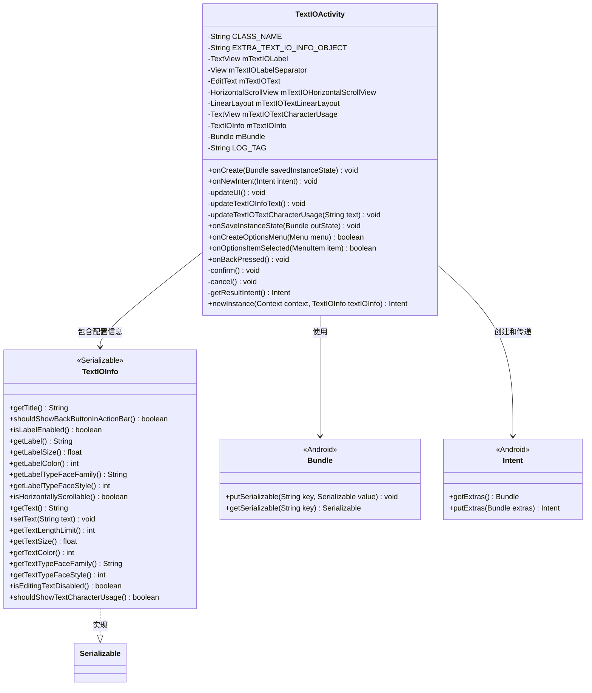
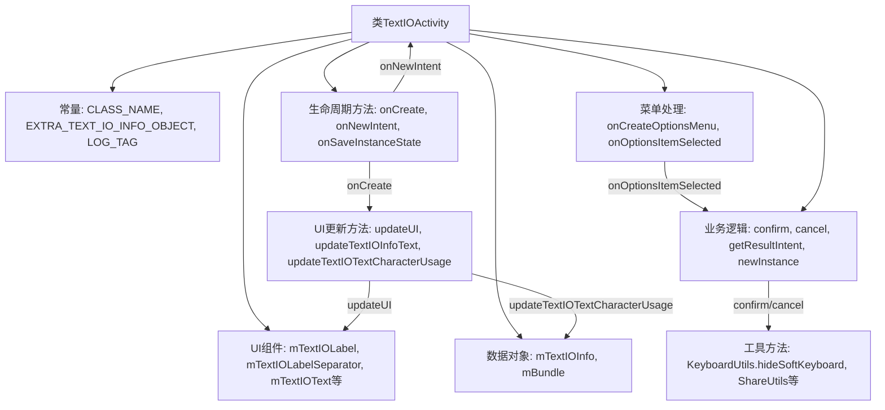
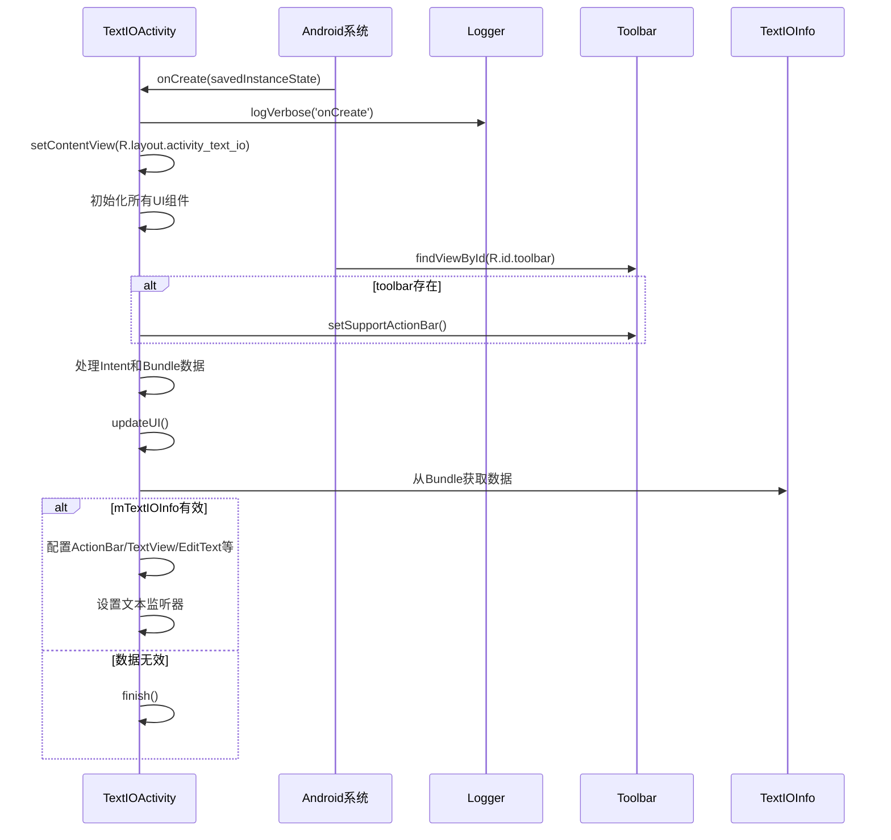

# 基础信息

|      |      |
|------|------|
| 名称 | TextIOActivity |
| 编码语言 | .java |
| 代码路径 | termux-app/termux-shared/src/main/java/com/termux/shared/activities/TextIOActivity.java |
| 包名 | com.termux.shared.activities |
| 依赖项 | ['android.annotation.SuppressLint', 'android.app.Activity', 'android.content.Context', 'android.content.Intent', 'android.graphics.Typeface', 'android.os.Bundle', 'android.text.Editable', 'android.text.InputFilter', 'android.text.TextWatcher', 'android.view.Menu', 'android.view.MenuInflater', 'android.view.MenuItem', 'android.view.View', 'android.view.ViewGroup', 'android.widget.EditText', 'android.widget.HorizontalScrollView', 'android.widget.LinearLayout', 'android.widget.TextView', 'androidx.annotation.NonNull', 'androidx.appcompat.app.ActionBar', 'androidx.appcompat.app.AppCompatActivity', 'androidx.appcompat.widget.Toolbar', 'com.termux.shared.interact.ShareUtils', 'com.termux.shared.logger.Logger', 'com.termux.shared.R', 'com.termux.shared.models.TextIOInfo', 'com.termux.shared.view.KeyboardUtils', 'org.jetbrains.annotations.NotNull', 'java.util.Locale'] |
| 概述说明 | Android文本输入活动类，管理UI和文本操作。 |

# 说明

TextIOActivity是一个Android应用组件，继承自AppCompatActivity，用于处理文本输入输出功能。它通过TextIOInfo对象配置界面元素，包括标签、编辑框、水平滚动视图和字符使用统计。活动支持自定义标题、返回按钮、文本样式、长度限制及编辑禁用等功能。用户可通过菜单项分享、复制文本或取消操作。活动在销毁前保存状态，并通过Intent返回结果给调用者。关键方法包括更新UI、处理选项菜单事件及确认/取消操作。

# 类列表 Class Summary

| 名称   | 类型  | 说明 |
|-------|------|-------------|
| TextIOActivity | class | 安卓文本输入活动类，管理UI和用户交互。 |

## 类 TextIOActivity

|      |      |
|------|------|
| 访问范围 | public |
| 类型 | class |
| 名称 | TextIOActivity |
| 说明 | 安卓文本输入活动类，管理UI和用户交互。 |

### UML类图

这段代码描述了一个Android的TextIOActivity类，主要用于处理文本输入输出界面。该类通过TextIOInfo对象配置界面元素（如标签、编辑框、滚动条等），并提供了确认、取消、分享等操作功能。类图中展示了TextIOActivity与TextIOInfo、Bundle、Intent等Android组件的关系，其中TextIOInfo实现了Serializable接口以便于在Activity间传递。整个设计体现了Android Activity的典型生命周期管理和界面配置模式。

### 内部方法调用关系图

这段代码实现了一个Android文本输入/输出活动(TextIOActivity)，主要功能包括：1) 通过Bundle接收TextIOInfo配置对象；2) 动态构建可定制的文本编辑界面；3) 提供字符计数、水平滚动等扩展功能；4) 处理菜单项和返回操作。流程图展示了类结构和主要方法调用关系，时序图则详细描述了从创建活动到UI初始化的完整过程。该实现充分考虑了配置变更、数据恢复和用户交互等场景，通过模块化设计使文本输入功能具有高度可定制性。

### 字段列表 Field List

| 名称  | 类型  | 说明 |
|-------|-------|------|
| mBundle | Bundle | 私有Bundle对象mBundle |
| EXTRA_TEXT_IO_INFO_OBJECT = CLASS_NAME + ".EXTRA_TEXT_IO_INFO_OBJECT" | String | 定义常量EXTRA_TEXT_IO_INFO_OBJECT，值为类名加后缀。 |
| mTextIOTextLinearLayout | LinearLayout | 私有线性布局变量mTextIOTextLinearLayout |
| mTextIOHorizontalScrollView | HorizontalScrollView | 私有横向滚动视图mTextIOHorizontalScrollView |
| mTextIOText | EditText | 私有文本输入控件mTextIOText |
| CLASS_NAME = ReportActivity.class.getCanonicalName() | String | 定义私有常量CLASS_NAME，值为ReportActivity的规范类名。 |
| LOG_TAG = "TextIOActivity" | String | 私有静态常量LOG_TAG值为TextIOActivity |
| mTextIOLabelSeparator | View | 私有视图组件mTextIOLabelSeparator |
| mTextIOInfo | TextIOInfo | 私有文本IO信息对象 |
| mTextIOTextCharacterUsage | TextView | 私有TextView控件，用于显示文本字符使用情况。 |
| mTextIOLabel | TextView | 私有文本视图控件mTextIOLabel |

### 方法列表 Method List

| 名称  | 类型  | 说明 |
|-------|-------|------|
| confirm | void | 确认操作：更新文本、隐藏键盘、返回结果并结束。 |
| cancel | void | 取消操作：隐藏键盘，返回取消结果并结束活动。 |
| getResultIntent | Intent | 创建返回Intent，包含序列化对象mTextIOInfo。 |
| newInstance | Intent | 静态方法创建Intent，传入Context和TextIOInfo，存入Bundle后返回。 |
| onBackPressed | void | 重写返回键逻辑，调用确认方法。 |
| onOptionsItemSelected | boolean | 重写菜单项选择逻辑：主页键确认，取消键取消，分享键分享文本，复制键复制文本。 |
| onCreate | void | 重写onCreate方法，初始化UI组件和工具栏，处理Intent数据，更新界面。 |
| onCreateOptionsMenu | boolean | 重写菜单创建方法，加载指定菜单资源。 |
| updateTextIOInfoText | void | 更新文本IO信息显示内容。 |
| updateUI | void | 更新UI逻辑：检查数据有效性，设置标题、标签、文本样式及滚动行为，处理文本选择和字符统计。 |
| updateTextIOTextCharacterUsage | void | 更新文本字符使用情况：显示当前文本长度与限制长度。 |
| onSaveInstanceState | void | 保存状态时更新文本信息并存入Bundle。 |
| onNewIntent | void | 重写onNewIntent方法，记录日志并重启活动以更新视图配置。 |

