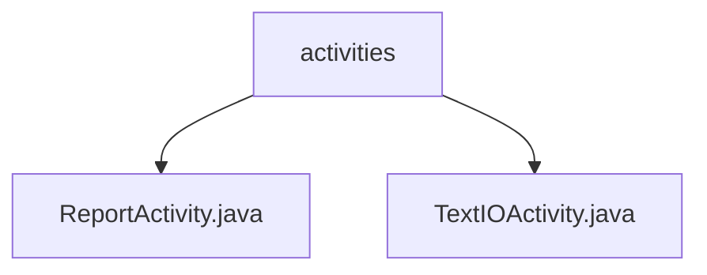

# 基础信息

|      |      |
|------|------|
| 名称 | activities |
| 编码语言 | .java |
| 代码路径 | termux-app/termux-shared/src/main/java/com/termux/shared/activities |
| 包名 | termux-app.termux-shared.src.main.java.com.termux.shared.activities |
| 概述说明 | ReportActivity处理报告显示分享保存，TextIOActivity管理文本输入输出功能。 |

# 说明

```markdown
## 概述

该代码模块包含两个核心Android活动组件：`ReportActivity`和`TextIOActivity`，均继承自`AppCompatActivity`，属于Termux应用的共享功能模块。两个组件分别专注于报告处理和文本交互场景，采用现代化Android开发模式，支持数据持久化、生命周期管理及跨组件通信。

## 主要业务场景

### ReportActivity
1. **报告展示与渲染**
   - 接收`ReportInfo`对象或文件路径作为输入
   - 使用`RecyclerView`和`Markwon`库实现Markdown格式内容渲染
   - 支持大文件分块处理以避免`TransactionTooLargeException`

2. **报告操作功能**
   - 提供分享报告内容到其他应用的能力
   - 实现文本复制到剪贴板功能
   - 支持将报告保存为本地文件

3. **资源管理**
   - 自动清理临时文件防止存储泄漏
   - 通过`BroadcastReceiver`处理通知删除关联文件
   - 包含定期清理过期缓存文件的工具方法

### TextIOActivity
1. **文本交互界面**
   - 通过`TextIOInfo`对象动态配置界面元素（标签/编辑框/统计视图）
   - 支持水平滚动视图处理长文本
   - 提供字符使用统计显示功能

2. **文本操作功能**
   - 支持通过菜单进行文本分享和复制
   - 实现编辑禁用模式和文本长度限制
   - 允许自定义标题栏和返回按钮行为

3. **状态管理**
   - 在销毁前自动保存UI状态
   - 通过Intent返回用户操作结果给调用者
   - 处理确认/取消操作的完整生命周期
```


### 包内部结构视图



该流程图展示了Termux项目中共享活动模块的层级结构。顶层节点"activities"包含两个具体的活动类：ReportActivity和TextIOActivity，这两个类都继承自activities目录。这种结构清晰地反映了Android应用中活动类的组织方式，其中基础目录下包含多个具体的活动实现类。

# 文件列表 File List

| 名称   | 类型  | 说明 |
|-------|------|-------------|
| [ReportActivity.java](ReportActivity.md) | file | 报告活动类，处理报告信息显示与文件操作，支持分享、复制和保存功能。 |
| [TextIOActivity.java](TextIOActivity.md) | file | Android文本输入活动类，管理UI和文本操作。 |


