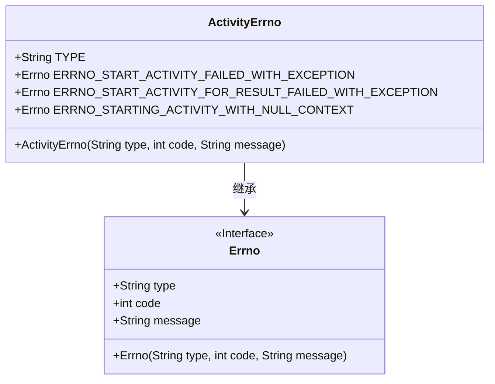
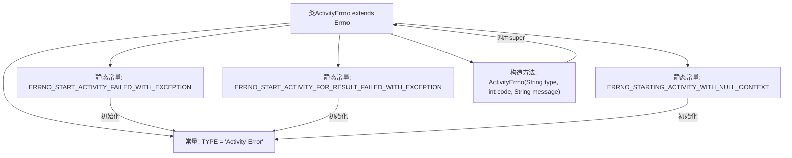

# 基础信息

|      |      |
|------|------|
| 名称 | ActivityErrno |
| 编码语言 | .java |
| 代码路径 | termux-app/termux-shared/src/main/java/com/termux/shared/activity/ActivityErrno.java |
| 包名 | com.termux.shared.activity |
| 依赖项 | ['com.termux.shared.errors.Errno'] |
| 概述说明 | 活动错误类，定义启动失败及空上下文异常代码和描述。 |

# 说明

该内容定义了一个名为ActivityErrno的Java类，继承自Errno类，用于表示活动相关的错误。类中包含三个静态错误常量：ERRNO_START_ACTIVITY_FAILED_WITH_EXCEPTION（代码100）表示启动活动失败并抛出异常；ERRNO_START_ACTIVITY_FOR_RESULT_FAILED_WITH_EXCEPTION（代码101）表示启动活动以获取结果失败并抛出异常；ERRNO_STARTING_ACTIVITY_WITH_NULL_CONTEXT（代码102）表示无法使用空上下文启动活动。每个错误都包含类型、代码和消息模板。类中还有一个构造函数，用于初始化错误类型、代码和消息。

# 类列表 Class Summary

| 名称   | 类型  | 说明 |
|-------|------|-------------|
| ActivityErrno | class | 活动错误类，包含启动失败、结果返回失败及空上下文异常代码。 |

## 类 ActivityErrno

|      |      |
|------|------|
| 访问范围 | public |
| 类型 | class |
| 名称 | ActivityErrno |
| 说明 | 活动错误类，包含启动失败、结果返回失败及空上下文异常代码。 |

### UML类图

这段代码定义了一个ActivityErrno类，继承自Errno接口，用于表示Activity相关的错误类型。类中包含三个静态常量错误码对象，分别对应启动Activity失败、带结果启动Activity失败和使用空Context启动Activity三种错误场景。每个错误码都包含类型标识、错误代码和格式化错误消息。类图清晰地展示了继承关系和类成员结构，其中Errno作为接口定义了基础错误信息的结构，ActivityErrno则具体实现了Activity领域的错误类型。

### 内部方法调用关系图

这段代码定义了一个ActivityErrno类，继承自Errno类，用于表示活动相关的错误。类中包含三个静态常量错误码，分别对应启动活动失败、启动活动获取结果失败和空上下文启动活动的错误情况。每个错误码都通过构造方法初始化，并传递类型、代码和消息模板。构造方法调用父类Errno的构造方法完成初始化。流程图清晰地展示了类的继承关系、常量定义和初始化过程。

### 字段列表 Field List

| 名称  | 类型  | 说明 |
|-------|-------|------|
| ERRNO_START_ACTIVITY_FAILED_WITH_EXCEPTION = new Errno(TYPE, 100, "Failed to start \"%1$s\" activity.\nException: %2$s") | Errno | 启动活动失败，异常信息：%1$s，%2$s。 |
| TYPE = "Activity Error" | String | 活动错误类型常量 |
| ERRNO_START_ACTIVITY_FOR_RESULT_FAILED_WITH_EXCEPTION = new Errno(TYPE, 101, "Failed to start \"%1$s\" activity for result.\nException: %2$s") | Errno | 启动活动异常，错误码101 |
| ERRNO_STARTING_ACTIVITY_WITH_NULL_CONTEXT = new Errno(TYPE, 102, "Cannot start \"%1$s\" activity with null Context") | Errno | 启动活动时上下文为空 |

### 方法列表 Method List

| 名称  | 类型  | 说明 |
|-------|-------|------|

