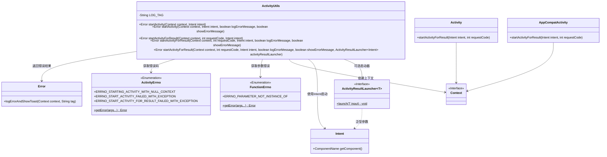
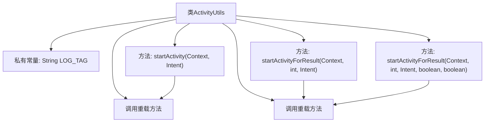
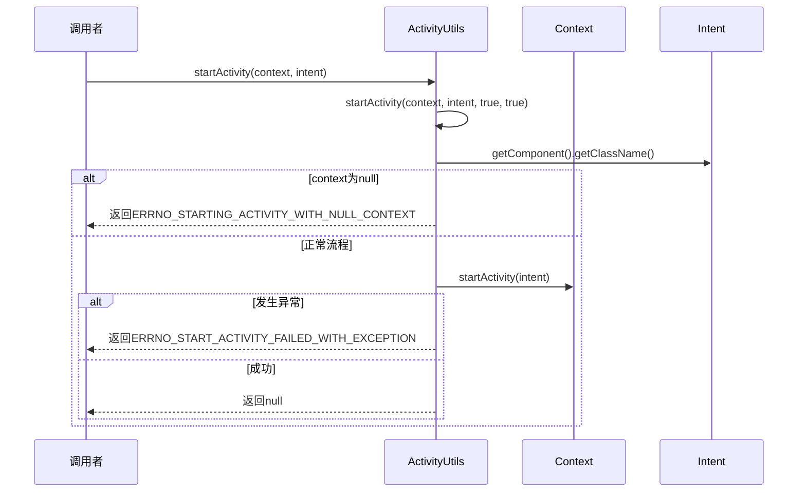

# 基础信息

|      |      |
|------|------|
| 名称 | ActivityUtils |
| 编码语言 | .java |
| 代码路径 | termux-app/termux-shared/src/main/java/com/termux/shared/activity/ActivityUtils.java |
| 包名 | com.termux.shared.activity |
| 依赖项 | ['android.app.Activity', 'android.content.Context', 'android.content.Intent', 'androidx.activity.result.ActivityResultLauncher', 'androidx.annotation.NonNull', 'androidx.annotation.Nullable', 'androidx.appcompat.app.AppCompatActivity', 'com.termux.shared.errors.Error', 'com.termux.shared.errors.FunctionErrno'] |
| 概述说明 | ActivityUtils提供启动Activity和带结果启动的方法，处理错误和日志。 |

# 说明

ActivityUtils是一个工具类，提供启动Activity的方法。包含startActivity和startActivityForResult两个核心方法，支持错误处理和日志记录。startActivity方法通过Intent启动Activity，可控制是否记录错误和显示Toast。startActivityForResult方法支持通过传统方式或ActivityResultLauncher启动，并处理请求码和上下文类型校验。两者均返回错误对象，失败时记录日志或显示提示。

# 类列表 Class Summary

| 名称   | 类型  | 说明 |
|-------|------|-------------|
| ActivityUtils | class | ActivityUtils提供启动Activity的方法，支持错误处理和结果返回。 |

## 类 ActivityUtils

|      |      |
|------|------|
| 访问范围 | public |
| 类型 | class |
| 名称 | ActivityUtils |
| 说明 | ActivityUtils提供启动Activity的方法，支持错误处理和结果返回。 |

### UML类图

这段代码展示了一个Android工具类ActivityUtils，主要用于安全启动Activity和处理启动过程中的各种错误情况。类图清晰地呈现了核心类之间的关系：ActivityUtils通过静态方法封装了基础启动逻辑，依赖Context、Intent等Android基础组件，使用枚举类ActivityErrno和FunctionErrno定义错误类型，并通过Error类统一处理错误日志和用户提示。特别值得注意的是对传统startActivityForResult和新式ActivityResultLauncher的兼容处理，体现了良好的API设计。

### 内部方法调用关系图

这段代码是Android开发中用于启动Activity的工具类，提供了基础启动和带返回结果启动两种核心功能。流程图展示了类结构和4个主要方法之间的调用关系，其中3个重载方法最终都会调用最完整的参数版本。时序图则详细描述了startActivity()方法的执行流程，包括参数校验、异常处理和正常启动路径。代码通过错误码机制和日志/Toast反馈机制，实现了健壮的Activity启动功能，能处理空上下文、类型不匹配和运行时异常等多种边界情况。

### 字段列表 Field List

| 名称  | 类型  | 说明 |
|-------|-------|------|
| LOG_TAG = "ActivityUtils" | String | 私有常量LOG_TAG值为"ActivityUtils"。 |

### 方法列表 Method List

| 名称  | 类型  | 说明 |
|-------|-------|------|
| startActivity | Error | 静态方法startActivity启动活动，返回错误类型，参数为上下文和意图。 |
| startActivityForResult | Error | 静态方法启动活动并返回错误码，可选记录和显示错误信息。 |
| startActivityForResult | Error | 静态方法启动活动并返回结果，带请求码和意图参数。 |
| startActivity | Error | 启动Activity方法，检查上下文，处理异常并返回错误信息。 |
| startActivityForResult | Error | 启动Activity并处理错误，支持ActivityResultLauncher或传统方式，检查上下文类型，记录错误日志。 |

