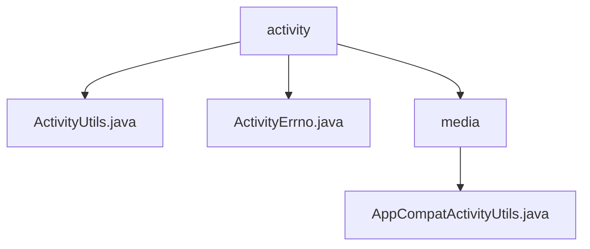

# 基础信息

|      |      |
|------|------|
| 名称 | activity |
| 编码语言 | .java |
| 代码路径 | termux-app/termux-shared/src/main/java/com/termux/shared/activity |
| 包名 | termux-app.termux-shared.src.main.java.com.termux.shared.activity |
| 概述说明 | ActivityUtils提供启动Activity方法，含错误处理。ActivityErrno定义活动错误常量。AppCompatActivityUtils简化常见操作。 |

# 说明

## 概述

该代码模块主要提供与Android Activity相关的工具类和错误处理功能，旨在简化Activity的启动、结果处理、界面模式切换以及工具栏设置等常见操作。模块包含以下核心组件：

1. **ActivityUtils**：提供启动Activity的核心方法，包括`startActivity`和`startActivityForResult`，支持错误处理和日志记录。
2. **ActivityErrno**：定义Activity相关的错误码和消息，用于标识启动Activity过程中可能发生的异常情况。
3. **AppCompatActivityUtils**：简化`AppCompatActivity`的常见操作，如夜间模式切换、工具栏设置等。

## 主要业务场景

1. **Activity启动与结果处理**：
   - 通过`ActivityUtils`安全地启动Activity，支持普通启动和带结果的启动（`startActivityForResult`）。
   - 处理启动过程中的异常，如空上下文或启动失败，并通过`ActivityErrno`提供标准化的错误码和消息。

2. **错误处理与日志记录**：
   - 使用`ActivityErrno`定义的标准错误码（如`ERRNO_START_ACTIVITY_FAILED_WITH_EXCEPTION`）标识启动Activity时的错误。
   - 在工具类中记录错误日志或显示用户提示（如Toast），便于调试和问题追踪。

3. **AppCompatActivity的界面配置**：
   - 通过`AppCompatActivityUtils`快速设置夜间模式（本地或全局），支持`NightMode`枚举切换。
   - 简化工具栏的绑定、标题设置（支持自定义样式）和返回按钮的显示控制。
   - 所有方法均包含空值检查和异常捕获，确保健壮性。

### 包内部结构视图

该流程图展示了Termux项目中activity模块的层级结构。根节点为activity目录，包含两个直接子文件ActivityUtils.java和ActivityErrno.java，以及一个子目录media。media目录下又包含AppCompatActivityUtils.java文件，形成了清晰的三层结构，反映了代码的组织方式。

# 文件列表 File List

| 名称   | 类型  | 说明 |
|-------|------|-------------|
| [ActivityUtils.java](ActivityUtils.md) | file | ActivityUtils提供启动Activity和带结果启动的方法，处理错误和日志。 |
| [ActivityErrno.java](ActivityErrno.md) | file | 活动错误类，定义启动失败及空上下文异常代码和描述。 |
| [media](media/_module.md) | package | AppCompatActivity工具类，提供夜间模式、工具栏设置及标题样式配置功能。 |

