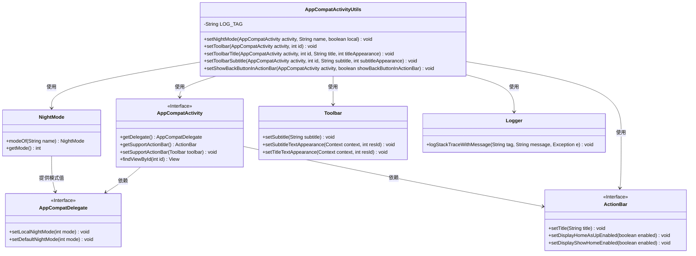
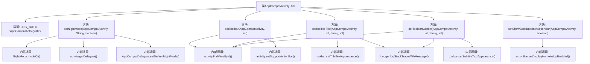

# 基础信息

|      |      |
|------|------|
| 名称 | AppCompatActivityUtils |
| 编码语言 | .java |
| 代码路径 | termux-app/termux-shared/src/main/java/com/termux/shared/activity/media/AppCompatActivityUtils.java |
| 包名 | com.termux.shared.activity.media |
| 依赖项 | ['androidx.annotation.IdRes', 'androidx.annotation.NonNull', 'androidx.annotation.StyleRes', 'androidx.appcompat.app.ActionBar', 'androidx.appcompat.app.AppCompatActivity', 'androidx.appcompat.app.AppCompatDelegate', 'androidx.appcompat.widget.Toolbar', 'com.termux.shared.logger.Logger', 'com.termux.shared.theme.NightMode'] |
| 概述说明 | AppCompatActivity工具类，提供夜间模式、工具栏设置及标题样式配置功能。 |

# 说明

AppCompatActivityUtils是一个工具类，提供了一系列静态方法来简化AppCompatActivity的常见操作。主要功能包括设置夜间模式（通过NightMode枚举和AppCompatDelegate实现本地或全局模式切换）、设置工具栏（包括绑定Toolbar到Activity的ActionBar）、设置工具栏标题和副标题（支持自定义文本样式）、以及控制返回按钮的显示。所有方法都包含空值检查，并在设置文本样式时捕获异常并记录日志。

# 类列表 Class Summary

| 名称   | 类型  | 说明 |
|-------|------|-------------|
| AppCompatActivityUtils | class | 工具类提供AppCompatActivity的夜间模式、工具栏及返回按钮设置功能。 |

## 类 AppCompatActivityUtils

|      |      |
|------|------|
| 访问范围 | public |
| 类型 | class |
| 名称 | AppCompatActivityUtils |
| 说明 | 工具类提供AppCompatActivity的夜间模式、工具栏及返回按钮设置功能。 |

### UML类图

这段代码展示了一个Android工具类`AppCompatActivityUtils`，主要用于处理AppCompatActivity的夜间模式切换、工具栏设置和标题样式配置。该类通过静态方法封装了与AppCompat组件（如Toolbar、ActionBar）的交互逻辑，并处理了样式设置时的异常情况。类图清晰地展示了工具类与Android系统组件（AppCompatActivity、AppCompatDelegate等）的依赖关系，以及工具类如何通过Logger进行错误日志记录。所有方法都采用防御性编程，对空值和异常情况进行处理。

### 内部方法调用关系图

这段代码是AppCompatActivity的工具类，包含5个核心方法：设置夜间模式(setNightMode)、设置工具栏(setToolbar)、设置标题(setToolbarTitle)、设置副标题(setToolbarSubtitle)和控制返回按钮显示(setShowBackButtonInActionBar)。每个方法都处理特定的UI配置任务，通过AppCompatActivity实例和资源ID进行操作，包含空值检查、异常捕获和日志记录等健壮性设计。夜间模式方法会根据参数选择本地或全局模式设置，工具栏相关方法则统一处理视图查找和样式应用。

### 字段列表 Field List

| 名称  | 类型  | 说明 |
|-------|-------|------|
| LOG_TAG = "AppCompatActivityUtils" | String | 私有常量LOG_TAG值为AppCompatActivityUtils |

### 方法列表 Method List

| 名称  | 类型  | 说明 |
|-------|-------|------|
| setToolbarSubtitle | void | 设置工具栏副标题，支持样式和异常处理。 |
| setToolbarTitle | void | 静态方法设置工具栏标题，支持样式和异常处理。 |
| setNightMode | void | 静态方法设置夜间模式，根据参数选择本地或全局应用。 |
| setToolbar | void | 静态方法设置工具栏，传入活动和ID，非空则设为支持操作栏。 |
| setShowBackButtonInActionBar | void | 静态方法设置活动返回按钮显示状态，根据参数启用或禁用。 |

