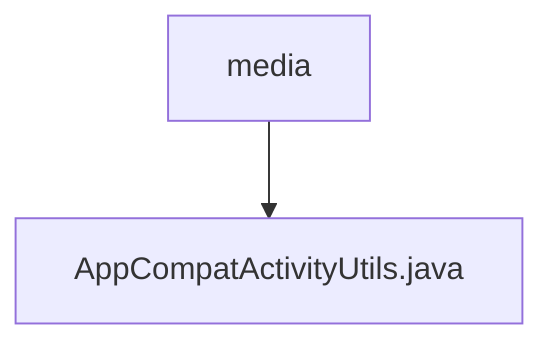

# 基础信息

|      |      |
|------|------|
| 名称 | media |
| 编码语言 | .java |
| 代码路径 | termux-app/termux-shared/src/main/java/com/termux/shared/activity/media |
| 包名 | termux-app.termux-shared.src.main.java.com.termux.shared.activity.media |
| 概述说明 | AppCompatActivity工具类，提供夜间模式、工具栏设置及标题样式配置功能。 |

# 说明

AppCompatActivityUtils是一个工具类，提供了一系列静态方法来简化AppCompatActivity的常见操作。主要功能包括设置夜间模式（通过NightMode枚举和AppCompatDelegate实现本地或全局模式切换）、设置工具栏（包括绑定Toolbar到Activity的ActionBar）、设置工具栏标题和副标题（支持自定义文本样式）、以及控制返回按钮的显示。所有方法都包含空值检查，并在设置文本样式时捕获异常并记录日志。

### 包内部结构视图

该流程图展示了Termux项目中媒体相关模块的简单结构。media文件夹作为父节点，包含一个子文件AppCompatActivityUtils.java。这种结构表明该模块目前仅包含一个工具类文件，可能用于处理与AppCompatActivity相关的媒体操作功能。路径关系清晰体现了单一功能模块的简洁设计。

# 文件列表 File List

| 名称   | 类型  | 说明 |
|-------|------|-------------|
| [AppCompatActivityUtils.java](AppCompatActivityUtils.md) | file | AppCompatActivity工具类，提供夜间模式、工具栏设置及标题样式配置功能。 |

