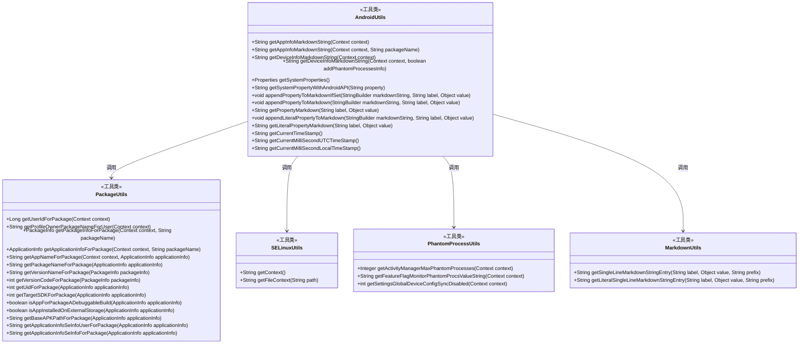
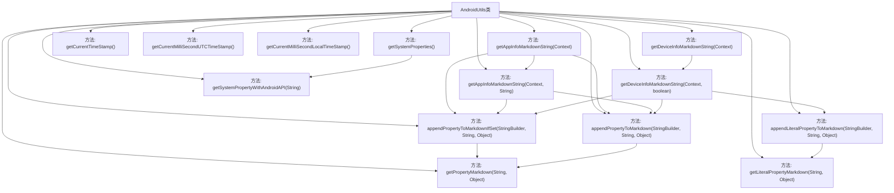

# 基础信息

|      |      |
|------|------|
| 名称 | AndroidUtils |
| 编码语言 | .java |
| 代码路径 | termux-app/termux-shared/src/main/java/com/termux/shared/android/AndroidUtils.java |
| 包名 | com.termux.shared.android |
| 依赖项 | ['android.annotation.SuppressLint', 'android.content.Context', 'android.content.pm.ApplicationInfo', 'android.content.pm.PackageInfo', 'android.os.Build', 'androidx.annotation.NonNull', 'com.google.common.base.Joiner', 'com.termux.shared.R', 'com.termux.shared.data.DataUtils', 'com.termux.shared.logger.Logger', 'com.termux.shared.markdown.MarkdownUtils', 'java.io.BufferedReader', 'java.io.IOException', 'java.io.InputStream', 'java.io.InputStreamReader', 'java.text.SimpleDateFormat', 'java.util.Date', 'java.util.Properties', 'java.util.TimeZone', 'java.util.regex.Matcher', 'java.util.regex.Pattern'] |
| 概述说明 | Android工具类，获取应用和设备信息并生成Markdown格式字符串。 |

# 说明

AndroidUtils类提供了一系列静态方法用于获取应用和设备信息并格式化为Markdown字符串。主要功能包括：获取应用信息（包名、版本、UID、调试状态等），检查文件目录和用户ID，处理SELinux上下文；获取设备信息（系统版本、硬件型号、ABI支持等），支持Android 12以上幻影进程监控；还包含系统属性读取工具和Markdown格式化辅助方法。类中提供了时间戳生成功能，支持UTC和本地时间格式。所有方法均为静态，通过Context参数获取运行时信息。

# 类列表 Class Summary

| 名称   | 类型  | 说明 |
|-------|------|-------------|
| AndroidUtils | class | Android工具类，获取应用和设备信息并生成Markdown格式字符串。 |

## 类 AndroidUtils

|      |      |
|------|------|
| 访问范围 | public |
| 类型 | class |
| 名称 | AndroidUtils |
| 说明 | Android工具类，获取应用和设备信息并生成Markdown格式字符串。 |

### UML类图

这段代码展示了一个Android工具类AndroidUtils，它提供了多种静态方法来获取应用信息、设备信息并生成Markdown格式的字符串。类图中包含了AndroidUtils与PackageUtils、SELinuxUtils、PhantomProcessUtils和MarkdownUtils等工具类之间的依赖关系。AndroidUtils通过调用这些工具类的方法来收集应用包信息、SELinux上下文、幻影进程信息等，并使用MarkdownUtils来格式化输出。这些方法主要用于生成详细的调试信息，便于开发者分析和诊断问题。

### 内部方法调用关系图

这段代码是AndroidUtils工具类，主要提供三类功能：1) 获取应用信息的Markdown格式字符串(包含包信息、文件路径、用户ID等)；2) 获取设备信息的Markdown格式字符串(包含系统版本、硬件信息、安全补丁等)；3) 通用工具方法(属性追加、时间戳生成等)。核心方法通过调用PackageUtils、SELinuxUtils等工具类获取系统信息，并使用Markdown格式化输出。流程图展示了类方法之间的调用关系，特别是getAppInfoMarkdownString()和getDeviceInfoMarkdownString()这两个核心方法与其他辅助方法的交互逻辑。

### 字段列表 Field List

| 名称  | 类型  | 说明 |
|-------|-------|------|

### 方法列表 Method List

| 名称  | 类型  | 说明 |
|-------|-------|------|
| getLiteralPropertyMarkdown | String | 静态方法生成带标签和值的单行Markdown字符串。 |
| getPropertyMarkdown | String | 静态方法生成带标记的单行属性文本。 |
| getCurrentTimeStamp | String | 静态方法返回UTC时间戳，格式为"yyyy-MM-dd HH:mm:ss z"。 |
| getSystemProperties | Properties | 获取系统属性，解析getprop输出，返回键值对。 |
| getCurrentMilliSecondLocalTimeStamp | String | 获取本地当前毫秒级时间戳，格式为yyyy-MM-dd_HH.mm.ss.SSS。 |
| getAppInfoMarkdownString | String | 获取应用信息并生成Markdown格式字符串，包含名称、版本、权限等关键数据。 |
| getCurrentMilliSecondUTCTimeStamp | String | 获取当前UTC时间戳，精确到毫秒。 |
| appendPropertyToMarkdownIfSet | void | 静态方法检查非空值后追加Markdown格式属性。 |
| getDeviceInfoMarkdownString | String | 获取设备信息的静态方法，接受上下文参数。 |
| appendLiteralPropertyToMarkdown | void | 静态方法将标签和值转为Markdown格式并追加到字符串。 |
| getSystemPropertyWithAndroidAPI | String | 获取系统属性，失败返回null并记录日志。 |
| appendPropertyToMarkdown | void | 静态方法将属性追加到Markdown字符串。 |
| getDeviceInfoMarkdownString | String | 获取设备软硬件信息的Java方法，包括系统属性、版本、制造商等。 |
| getAppInfoMarkdownString | String | 获取应用信息并生成Markdown字符串，包含文件目录、用户ID和配置文件所有者。 |

