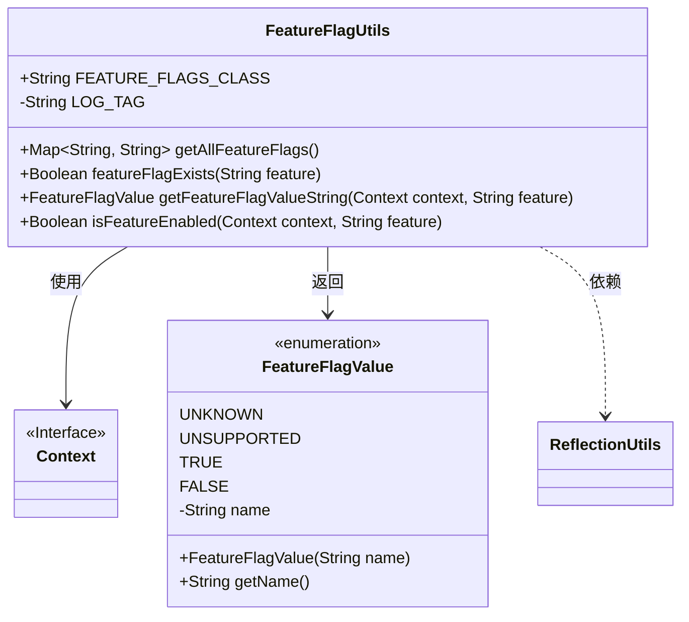
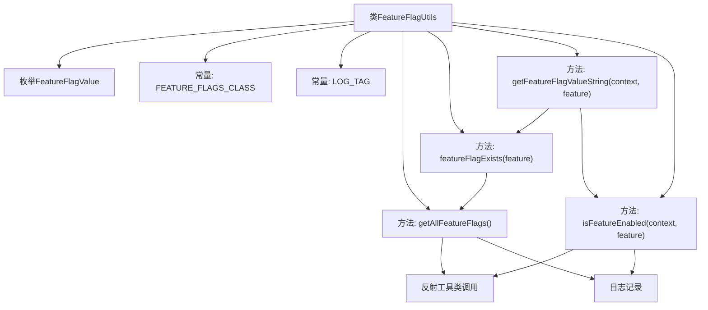

# 基础信息

|      |      |
|------|------|
| 名称 | FeatureFlagUtils |
| 编码语言 | .java |
| 代码路径 | termux-app/termux-shared/src/main/java/com/termux/shared/android/FeatureFlagUtils.java |
| 包名 | com.termux.shared.android |
| 依赖项 | ['android.annotation.SuppressLint', 'android.content.Context', 'androidx.annotation.NonNull', 'androidx.annotation.Nullable', 'com.termux.shared.logger.Logger', 'com.termux.shared.reflection.ReflectionUtils', 'java.lang.reflect.Method', 'java.util.Map'] |
| 概述说明 | FeatureFlagUtils类提供功能标志操作，包括获取所有标志、检查存在性及状态。 |

# 说明

FeatureFlagUtils是一个用于管理功能标志的工具类，包含枚举FeatureFlagValue表示标志状态（未知、不支持、启用、未启用）。提供方法获取所有标志、检查标志是否存在、获取标志值及检查标志是否启用。通过反射访问隐藏API，处理异常并记录日志。关键方法包括getAllFeatureFlags、featureFlagExists、getFeatureFlagValueString和isFeatureEnabled。

# 类列表 Class Summary

| 名称   | 类型  | 说明 |
|-------|------|-------------|
| FeatureFlagUtils | class | 功能标志工具类，含枚举值、获取所有标志、检查存在性及启用状态。 |

## 类 FeatureFlagUtils

|      |      |
|------|------|
| 访问范围 | public |
| 类型 | class |
| 名称 | FeatureFlagUtils |
| 说明 | 功能标志工具类，含枚举值、获取所有标志、检查存在性及启用状态。 |

### UML类图

类图描述：该图展示了FeatureFlagUtils工具类的结构，它通过反射机制操作Android隐藏API来管理特性标志。核心类FeatureFlagUtils包含4个公共方法，分别用于获取所有标志、检查标志存在性、获取标志值字符串表示和检查标志是否启用。枚举类FeatureFlagValue定义了4种可能的状态值，包含UNKNOWN、UNSUPPORTED等。Context接口作为参数类型被使用，ReflectionUtils是辅助工具类。整体设计体现了对Android隐藏API的安全访问机制和错误处理策略。

### 内部方法调用关系图

这段代码流程图展示了FeatureFlagUtils工具类的核心结构。该类通过反射机制访问Android隐藏API来管理特性标志，包含枚举定义、常量声明和四个核心方法。主要流程包括：获取所有特性标志、检查标志是否存在、获取标志状态值字符串表示以及检查标志是否启用。所有方法都通过反射工具类操作，并配有完善的错误处理和日志记录机制。流程图清晰呈现了方法间的调用关系，特别是getFeatureFlagValueString()作为主要入口点，协调其他方法的执行流程。

### 字段列表 Field List

| 名称  | 类型  | 说明 |
|-------|-------|------|
| LOG_TAG = "FeatureFlagUtils" | String | 私有常量LOG_TAG值为"FeatureFlagUtils"。 |
| FEATURE_FLAGS_CLASS = "android.util.FeatureFlagUtils" | String | 安卓功能标志工具类路径。 |

### 方法列表 Method List

| 名称  | 类型  | 说明 |
|-------|-------|------|
| getAllFeatureFlags | Map<String, String> | 通过反射获取所有功能标志，处理异常并返回结果。 |
| getFeatureFlagValueString | FeatureFlagValue | 检查特性标志状态，返回存在性及值，错误时记录日志。 |
| featureFlagExists | Boolean | 检查特性标志是否存在，返回布尔或空。 |
| isFeatureEnabled | Boolean | 检查功能是否启用的静态方法，通过反射调用，异常返回null。 |

