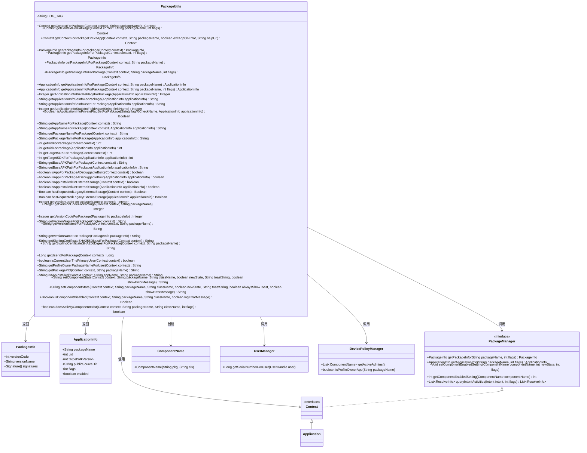

# 基础信息

|      |      |
|------|------|
| 名称 | PackageUtils |
| 编码语言 | .java |
| 代码路径 | termux-app/termux-shared/src/main/java/com/termux/shared/android/PackageUtils.java |
| 包名 | com.termux.shared.android |
| 依赖项 | ['android.app.ActivityManager', 'android.app.admin.DevicePolicyManager', 'android.content.ComponentName', 'android.content.Context', 'android.content.Intent', 'android.content.pm.ApplicationInfo', 'android.content.pm.PackageInfo', 'android.content.pm.PackageManager', 'android.os.Build', 'android.os.UserHandle', 'android.os.UserManager', 'androidx.annotation.NonNull', 'androidx.annotation.Nullable', 'androidx.annotation.RequiresApi', 'com.termux.shared.R', 'com.termux.shared.data.DataUtils', 'com.termux.shared.interact.MessageDialogUtils', 'com.termux.shared.logger.Logger', 'com.termux.shared.reflection.ReflectionUtils', 'java.lang.reflect.Field', 'java.security.MessageDigest', 'java.util.List'] |
| 概述说明 | PackageUtils类提供Android包管理工具，包括获取上下文、包信息、应用状态及组件控制等功能。 |

# 说明

PackageUtils是一个Android工具类，提供了一系列静态方法来获取和操作应用程序包信息。主要功能包括：获取包上下文、包信息、应用信息、版本信息、签名证书、用户ID、进程ID等；检查应用安装状态、调试模式、外部存储状态、组件状态；设置组件启用/禁用状态。该类封装了PackageManager和反射操作，处理了异常情况并返回null或错误信息，支持从Android 7.0到12.0的多个API版本。

# 类列表 Class Summary

| 名称   | 类型  | 说明 |
|-------|------|-------------|
| PackageUtils | class | PackageUtils提供获取应用包信息、上下文及组件状态管理的工具方法。 |

## 类 PackageUtils

|      |      |
|------|------|
| 访问范围 | public |
| 类型 | class |
| 名称 | PackageUtils |
| 说明 | PackageUtils提供获取应用包信息、上下文及组件状态管理的工具方法。 |

### UML类图

该类图展示了PackageUtils工具类与Android系统核心组件的关系。PackageUtils提供了丰富的静态方法用于获取应用包信息、上下文、组件状态管理等，涉及PackageManager、Context、ApplicationInfo等关键接口。类图清晰地呈现了工具类对系统服务的调用关系，包括包管理、用户管理、设备策略管理等，同时展示了返回的数据结构如PackageInfo和ApplicationInfo。工具类封装了复杂的系统API调用，为上层提供简洁的包信息查询和组件管理接口。

### 内部方法调用关系图

这段代码定义了一个名为PackageUtils的工具类，主要用于处理与Android应用程序包相关的各种操作。该类提供了丰富的方法来获取包信息、上下文、应用名称、版本号、签名证书等，并包含对组件状态的管理和检查功能。通过反射机制访问隐藏API，同时处理各种异常情况，确保在获取信息或执行操作时能够安全地返回默认值或错误信息。代码结构清晰，功能全面，适用于需要深度操作Android包管理的场景。

### 字段列表 Field List

| 名称  | 类型  | 说明 |
|-------|-------|------|
| LOG_TAG = "PackageUtils" | String | 私有静态常量LOG_TAG值为PackageUtils |

### 方法列表 Method List

| 名称  | 类型  | 说明 |
|-------|-------|------|
| isAppInstalledOnExternalStorage | boolean | 检查应用是否安装在外部存储 |
| hasRequestedLegacyExternalStorage | Boolean | 检查应用是否请求旧版外部存储权限。 |
| isCurrentUserThePrimaryUser | boolean | 检查当前用户是否为主用户，需Android 7.0+，用户ID为0时返回真。 |
| getVersionCodeForPackage | Integer | 获取指定应用的版本号。 |
| getPackageInfoForPackage | PackageInfo | 获取应用包信息静态方法，传入上下文参数。 |
| getPackageNameForPackage | String | 获取应用包名的静态方法，返回ApplicationInfo中的packageName字段。 |
| getApplicationInfoForPackage | ApplicationInfo | 获取指定包名的应用信息，失败返回null。 |
| getApplicationInfoSeInfoForPackage | String | 获取应用信息的seInfo字段值，兼容不同SDK版本，异常返回null。 |
| getContextForPackage | Context | 获取指定包名的上下文，失败返回空并记录日志。 |
| getUidForPackage | int | 获取应用信息的UID |
| getApplicationInfoSeInfoUserForPackage | String | 获取应用信息的seInfoUser字段值，SDK版本低于O返回null，异常时记录日志并返回null。 |
| isAppInstalled | String | 检查应用是否安装且启用，返回错误信息或null。 |
| getContextForPackage | Context | 获取指定包名的受限上下文。 |
| hasRequestedLegacyExternalStorage | Boolean | 检查应用是否请求旧版外部存储权限 |
| isAppInstalledOnExternalStorage | boolean | 检查应用是否安装在外部存储。 |
| isAppForPackageADebuggableBuild | boolean | 检查应用是否为调试版本：通过标志位判断是否可调试。 |
| setComponentState | String | 静态方法设置组件状态，参数包括上下文、包名、类名、新状态、提示信息和错误显示。 |
| setComponentState | String | 设置组件状态方法：检查并修改组件启用状态，处理异常和提示信息。 |
| getContextForPackageOrExitApp | Context | 获取指定包名的上下文，失败时根据参数退出应用并报错。 |
| getVersionNameForPackage | String | 获取应用版本名的方法，需上下文参数，返回包名对应版本。 |
| getAppNameForPackage | String | 获取应用包名对应的应用名称。 |
| getUserIdForPackage | Long | 获取应用包的用户ID，需API 24+，可能返回null。 |
| getApplicationInfoStaticIntFieldValue | Integer | 获取ApplicationInfo类静态整型字段值，异常返回null。 |
| getPackagePID | String | 获取指定包名的进程ID，找不到返回null。 |
| getVersionNameForPackage | String | 获取指定应用的版本名称。 |
| getProfileOwnerPackageNameForUser | String | 获取用户配置所有者包名，无则返回空。 |
| getSigningCertificateSHA256DigestForPackage | String | 获取应用签名证书SHA256摘要的静态方法，参数为上下文。 |
| getBaseAPKPathForPackage | String | 获取应用基础APK路径的静态方法，接收上下文参数并返回路径。 |
| getUidForPackage | int | 获取应用UID的静态方法，参数为上下文对象。 |
| getTargetSDKForPackage | int | 获取应用的目标SDK版本号。 |
| isComponentDisabled | Boolean | 检查组件是否禁用，失败返回null并可选记录错误。 |
| getSigningCertificateSHA256DigestForPackage | String | 获取应用签名证书SHA256摘要，异常返回空。 |
| getVersionCodeForPackage | Integer | 获取包版本号，若包信息为空则返回空。 |
| isAppForPackageADebuggableBuild | boolean | 检查应用是否为调试版本。 |
| getPackageNameForPackage | String | 获取应用包名的静态方法，接收Context参数。 |
| isApplicationInfoPrivateFlagSetForPackage | Boolean | 检查应用信息私有标志是否设置 |
| getPackageInfoForPackage | PackageInfo | 获取指定包名的PackageInfo信息。 |
| getApplicationInfoPrivateFlagsForPackage | Integer | 获取应用信息的privateFlags字段值，异常时返回null。 |
| getAppNameForPackage | String | 获取应用包名的静态方法，接收上下文参数。 |
| getApplicationInfoForPackage | ApplicationInfo | 获取指定包名的应用信息，默认标志为0。 |
| getPackageInfoForPackage | PackageInfo | 获取指定包名的PackageInfo，失败返回null。 |
| getVersionNameForPackage | String | 从PackageInfo获取版本名，若为空返回null。 |
| getVersionCodeForPackage | Integer | 获取应用版本号的方法，需传入上下文参数。 |
| getBaseAPKPathForPackage | String | 获取应用安装包路径 |
| getTargetSDKForPackage | int | 获取应用的目标SDK版本。 |
| getPackageInfoForPackage | PackageInfo | 获取指定包名的PackageInfo信息。 |
| doesActivityComponentExist | boolean | 检查Android组件是否存在 |

