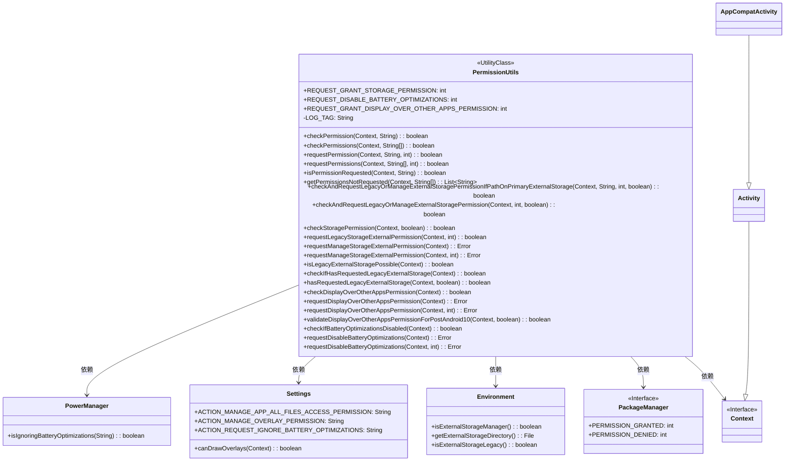

# 基础信息

|      |      |
|------|------|
| 名称 | PermissionUtils |
| 编码语言 | .java |
| 代码路径 | termux-app/termux-shared/src/main/java/com/termux/shared/android/PermissionUtils.java |
| 包名 | com.termux.shared.android |
| 依赖项 | ['android.Manifest', 'android.annotation.SuppressLint', 'android.app.Activity', 'android.app.Service', 'android.content.Context', 'android.content.Intent', 'android.content.pm.PackageInfo', 'android.content.pm.PackageManager', 'android.net.Uri', 'android.os.Build', 'android.os.Environment', 'android.os.PowerManager', 'android.provider.Settings', 'androidx.annotation.NonNull', 'androidx.annotation.RequiresApi', 'androidx.appcompat.app.AppCompatActivity', 'androidx.core.content.ContextCompat', 'com.google.common.base.Joiner', 'com.termux.shared.R', 'com.termux.shared.file.FileUtils', 'com.termux.shared.logger.Logger', 'com.termux.shared.errors.Error', 'com.termux.shared.errors.FunctionErrno', 'com.termux.shared.activity.ActivityUtils', 'java.util.ArrayList', 'java.util.Arrays', 'java.util.Collections', 'java.util.List'] |
| 概述说明 | Android权限工具类，提供存储、悬浮窗、电池优化等权限的检查和请求功能。 |

# 说明

PermissionUtils是一个Android工具类，用于处理应用权限相关操作。它包含检查、请求和管理多种权限的功能，如存储权限、显示在其他应用上层权限和电池优化禁用权限。类中定义了多个请求码常量用于不同权限请求。主要功能包括检查单个或多个权限是否已授予，请求权限，验证权限是否在清单中声明，以及处理特定场景如外部存储权限的兼容性问题。对于需要特殊处理的权限如MANAGE_EXTERNAL_STORAGE和SYSTEM_ALERT_WINDOW，提供了专门的检查与请求方法。类中还包含对Android不同版本和targetSdkVersion的兼容性处理逻辑。

# 类列表 Class Summary

| 名称   | 类型  | 说明 |
|-------|------|-------------|
| PermissionUtils | class | Android权限工具类，提供存储、悬浮窗、电池优化等权限的检查与请求功能。 |

## 类 PermissionUtils

|      |      |
|------|------|
| 访问范围 | public |
| 类型 | class |
| 名称 | PermissionUtils |
| 说明 | Android权限工具类，提供存储、悬浮窗、电池优化等权限的检查与请求功能。 |

### UML类图

这段代码定义了一个名为PermissionUtils的工具类，主要用于处理Android应用中的权限检查和请求。它包含了对多种权限（如存储权限、显示在其他应用上层权限、电池优化权限等）的检查方法，并提供了相应的请求方法。类图中展示了PermissionUtils与Android系统关键组件（如Context、PackageManager、Environment等）的依赖关系，以及Activity和AppCompatActivity的继承关系。该工具类通过静态方法提供跨应用的权限管理功能，支持从Android M(6.0)到R(11.0)的多版本兼容处理。

### 内部方法调用关系图

```mermaid
graph TD
    A["类PermissionUtils"]
    B["常量: REQUEST_GRANT_STORAGE_PERMISSION"]
    C["常量: REQUEST_DISABLE_BATTERY_OPTIMIZATIONS"]
    D["常量: REQUEST_GRANT_DISPLAY_OVER_OTHER_APPS_PERMISSION"]
    E["方法: checkPermission()"]
    F["方法: checkPermissions()"]
    G["方法: requestPermission()"]
    H["方法: requestPermissions()"]
    I["方法: isPermissionRequested()"]
    J["方法: getPermissionsNotRequested()"]
    K["方法: checkAndRequestLegacyOrManageExternalStoragePermissionIfPathOnPrimaryExternalStorage()"]
    L["方法: checkAndRequestLegacyOrManageExternalStoragePermission()"]
    M["方法: checkStoragePermission()"]
    N["方法: requestLegacyStorageExternalPermission()"]
    O["方法: requestManageStorageExternalPermission()"]
    P["方法: isLegacyExternalStoragePossible()"]
    Q["方法: checkIfHasRequestedLegacyExternalStorage()"]
    R["方法: hasRequestedLegacyExternalStorage()"]
    S["方法: checkDisplayOverOtherAppsPermission()"]
    T["方法: requestDisplayOverOtherAppsPermission()"]
    U["方法: validateDisplayOverOtherAppsPermissionForPostAndroid10()"]
    V["方法: checkIfBatteryOptimizationsDisabled()"]
    W["方法: requestDisableBatteryOptimizations()"]

    A --> B
    A --> C
    A --> D
    A --> E
    A --> F
    A --> G
    A --> H
    A --> I
    A --> J
    A --> K
    A --> L
    L --> M
    L --> N
    L --> O
    L --> P
    L --> Q
    L --> R
    A --> S
    A --> T
    A --> U
    A --> V
    A --> W
```

这段代码是Android权限管理工具类，主要功能包括检查/请求运行时权限、存储权限、悬浮窗权限和电池优化豁免权限。核心流程分为权限检查（如checkPermissions）、权限请求（如requestPermissions）和特殊权限处理（如存储权限的Legacy/Manage模式切换）。通过ContextCompat和系统API实现权限状态检测，并针对不同Android版本做了兼容处理，同时提供详细的错误日志和用户提示机制。

### 字段列表 Field List

| 名称  | 类型  | 说明 |
|-------|-------|------|
| REQUEST_GRANT_DISPLAY_OVER_OTHER_APPS_PERMISSION = 2001 | int | 请求悬浮窗权限常量定义，值为2001。 |
| REQUEST_DISABLE_BATTERY_OPTIMIZATIONS = 2000 | int | 静态常量REQUEST_DISABLE_BATTERY_OPTIMIZATIONS值为2000 |
| REQUEST_GRANT_STORAGE_PERMISSION = 1000 | int | 申请存储权限请求码1000 |
| LOG_TAG = "PermissionUtils" | String | 权限工具类日志标签 |

### 方法列表 Method List

| 名称  | 类型  | 说明 |
|-------|-------|------|
| checkPermission | boolean | 检查单个权限的静态方法。 |
| isPermissionRequested | boolean | 检查权限是否已申请。 |
| requestDisplayOverOtherAppsPermission | Error | 请求悬浮窗权限的静态方法，带上下文参数。 |
| checkStoragePermission | boolean | 检查存储权限，兼容旧版系统，新版需管理器权限。 |
| getPermissionsNotRequested | List<String> | 获取未申请的权限列表，对比传入权限与已申请权限，返回未申请的权限。 |
| checkPermissions | boolean | 检查权限是否已授予，未请求的权限报错。 |
| hasRequestedLegacyExternalStorage | boolean | 检查应用是否请求旧版外部存储权限，未请求则记录错误并提示。 |
| checkAndRequestLegacyOrManageExternalStoragePermissionIfPathOnPrimaryExternalStorage | boolean | 检查路径是否在主外部存储目录，若在则验证权限。 |
| requestLegacyStorageExternalPermission | boolean | 请求旧版外部存储权限的方法，需API级别23以上。 |
| checkDisplayOverOtherAppsPermission | boolean | 检查应用是否有在其他应用上层显示的权限，SDK版本低于M默认返回true。 |
| checkIfHasRequestedLegacyExternalStorage | boolean | 检查是否请求旧版外部存储权限，根据SDK版本判断。 |
| checkAndRequestLegacyOrManageExternalStoragePermission | boolean | 检查并请求外部存储权限，支持旧版和管理权限，根据版本和配置处理。 |
| requestManageStorageExternalPermission | Error | 请求外部存储管理权限的静态方法，需Android R及以上版本。 |
| requestPermission | boolean | 请求运行时权限的静态方法，需API 23以上，返回权限请求结果。 |
| isLegacyExternalStoragePossible | boolean | 检查是否支持旧版外部存储：SDK版本低于R且目标SDK也低于R。 |
| requestManageStorageExternalPermission | Error | 请求管理外部存储权限，处理不同上下文和错误回退。 |
| requestPermissions | boolean | 检查并请求未授权权限，处理异常和错误。 |
| requestDisplayOverOtherAppsPermission | Error | 请求悬浮窗权限的静态方法，处理不同上下文和版本兼容性。 |
| validateDisplayOverOtherAppsPermissionForPostAndroid10 | boolean | 检查Android 10及以上版本的悬浮窗权限，返回是否授权并记录日志。 |
| checkIfBatteryOptimizationsDisabled | boolean | 检查电池优化是否禁用，Android M及以上版本有效。 |
| requestDisableBatteryOptimizations | Error | 静态方法请求禁用电池优化，参数为上下文，返回错误类型。 |
| requestDisableBatteryOptimizations | Error | 请求禁用电池优化功能，适配不同上下文和Android版本。 |

