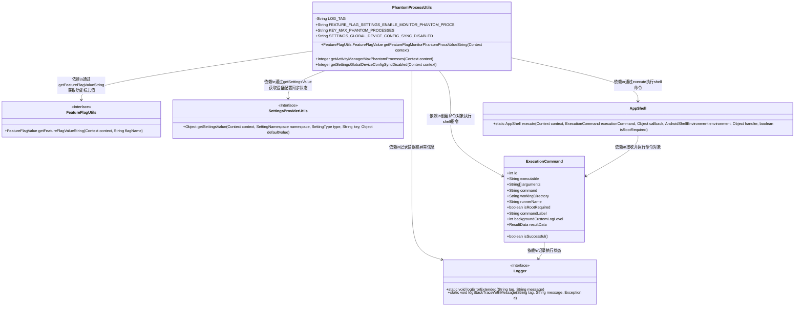
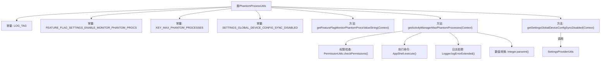

# 基础信息

|      |      |
|------|------|
| 名称 | PhantomProcessUtils |
| 编码语言 | .java |
| 代码路径 | termux-app/termux-shared/src/main/java/com/termux/shared/android/PhantomProcessUtils.java |
| 包名 | com.termux.shared.android |
| 依赖项 | ['android.Manifest', 'android.content.Context', 'androidx.annotation.NonNull', 'androidx.annotation.Nullable', 'com.termux.shared.logger.Logger', 'com.termux.shared.shell.command.environment.AndroidShellEnvironment', 'com.termux.shared.shell.command.ExecutionCommand', 'com.termux.shared.shell.command.runner.app.AppShell'] |
| 概述说明 | PhantomProcessUtils类提供监控幻影进程和设备配置同步状态的工具方法。 |

# 说明

PhantomProcessUtils类提供了管理幻影进程和设备配置的工具。包含三个关键常量：FEATURE_FLAG_SETTINGS_ENABLE_MONITOR_PHANTOM_PROCS用于控制幻影进程监控功能开关，KEY_MAX_PHANTOM_PROCESSES定义最大幻影进程数，SETTINGS_GLOBAL_DEVICE_CONFIG_SYNC_DISABLED表示设备配置同步是否禁用。提供三个核心方法：getFeatureFlagMonitorPhantomProcsValueString获取功能开关状态，getActivityManagerMaxPhantomProcesses通过dumpsys命令获取当前最大幻影进程数（默认32），getSettingsGlobalDeviceConfigSyncDisabled读取设备配置同步状态。执行dumpsys命令需要DUMP和PACKAGE_USAGE_STATS权限。

# 类列表 Class Summary

| 名称   | 类型  | 说明 |
|-------|------|-------------|
| PhantomProcessUtils | class | PhantomProcessUtils类提供管理幻影进程的功能，包括特性标志、最大进程数和设备配置同步状态。 |

## 类 PhantomProcessUtils

|      |      |
|------|------|
| 访问范围 | public |
| 类型 | class |
| 名称 | PhantomProcessUtils |
| 说明 | PhantomProcessUtils类提供管理幻影进程的功能，包括特性标志、最大进程数和设备配置同步状态。 |

### UML类图

这段代码定义了一个名为PhantomProcessUtils的工具类，主要用于管理Android系统中的幽灵进程相关功能。该类包含三个核心方法：获取功能标志状态、查询最大幽灵进程数限制、检查设备配置同步禁用状态。通过依赖FeatureFlagUtils、SettingsProviderUtils等接口获取系统配置，使用ExecutionCommand和AppShell执行shell命令查询进程信息，并借助Logger进行错误记录。整个设计体现了对Android系统底层进程管理的封装，特别关注权限控制和异常处理。

### 内部方法调用关系图

该流程图展示了PhantomProcessUtils类的结构和主要方法调用关系。类包含3个关键常量和3个核心方法：获取幻影进程监控功能标志值、获取最大幻影进程数、获取设备配置同步禁用状态。其中getActivityManagerMaxPhantomProcesses方法涉及权限检查、Shell命令执行、错误日志记录和结果转换等复杂流程，而其他方法则直接调用外部工具类完成功能。整体结构清晰体现了Android系统级工具类的典型设计模式。

### 字段列表 Field List

| 名称  | 类型  | 说明 |
|-------|-------|------|
| FEATURE_FLAG_SETTINGS_ENABLE_MONITOR_PHANTOM_PROCS = "settings_enable_monitor_phantom_procs" | String | 静态常量FEATURE_FLAG_SETTINGS_ENABLE_MONITOR_PHANTOM_PROCS用于监控幽灵进程。 |
| LOG_TAG = "PhantomProcessUtils" | String | 私有静态常量LOG_TAG值为"PhantomProcessUtils"。 |
| SETTINGS_GLOBAL_DEVICE_CONFIG_SYNC_DISABLED = "device_config_sync_disabled" | String | 设备配置同步禁用设置项 |
| KEY_MAX_PHANTOM_PROCESSES = "max_phantom_processes" | String | 定义常量KEY_MAX_PHANTOM_PROCESSES，值为"max_phantom_processes"。 |

### 方法列表 Method List

| 名称  | 类型  | 说明 |
|-------|-------|------|
| getFeatureFlagMonitorPhantomProcsValueString | FeatureFlagUtils.FeatureFlagValue | 获取监控幻影进程功能开关的字符串值。 |
| getActivityManagerMaxPhantomProcesses | Integer | 获取Android设备MAX_PHANTOM_PROCESSES值，需权限检查失败返回null。 |
| getSettingsGlobalDeviceConfigSyncDisabled | Integer | 获取设备配置同步禁用状态的静态方法，返回整型或空值。 |

