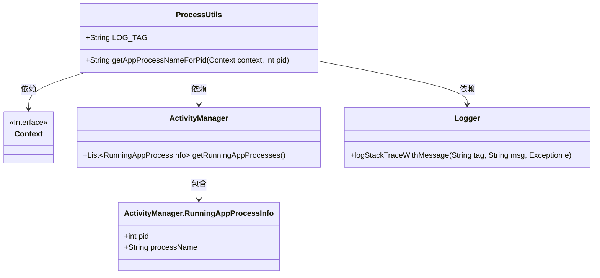
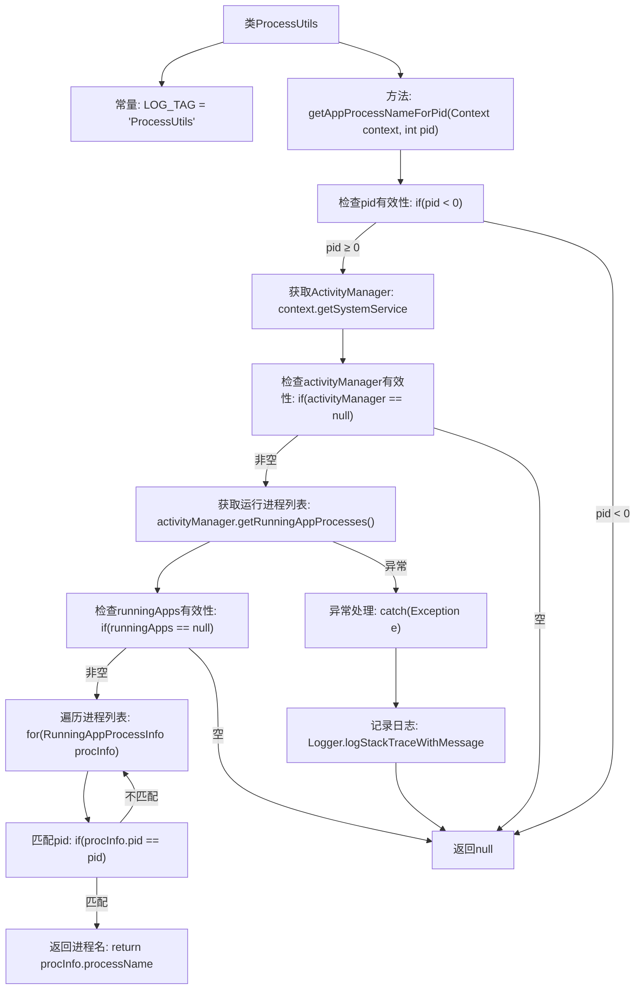

# 基础信息

|      |      |
|------|------|
| 名称 | ProcessUtils |
| 编码语言 | .java |
| 代码路径 | termux-app/termux-shared/src/main/java/com/termux/shared/android/ProcessUtils.java |
| 包名 | com.termux.shared.android |
| 依赖项 | ['android.app.ActivityManager', 'android.content.Context', 'androidx.annotation.NonNull', 'androidx.annotation.Nullable', 'com.termux.shared.logger.Logger', 'java.util.List'] |
| 概述说明 | 获取进程名的方法，通过ActivityManager查询，不包含子进程名。 |

# 说明

ProcessUtils类包含一个静态方法getAppProcessNameForPid，用于通过ActivityManager.getRunningAppProcesses()获取指定pid对应的应用进程名。该方法接收Context和pid参数，首先检查pid有效性，然后获取ActivityManager服务。若服务可用，则遍历运行中的进程列表，匹配给定pid并返回对应的进程名。该方法无法获取子进程名（Android 12之前系统不记录），异常时会记录错误日志。成功时返回进程名，失败返回null。文档提供了相关源码链接和替代方案提示。

# 类列表 Class Summary

| 名称   | 类型  | 说明 |
|-------|------|-------------|
| ProcessUtils | class | 获取进程名方法，通过ActivityManager查询运行中进程列表匹配PID，不适用于子进程。 |

## 类 ProcessUtils

|      |      |
|------|------|
| 访问范围 | public |
| 类型 | class |
| 名称 | ProcessUtils |
| 说明 | 获取进程名方法，通过ActivityManager查询运行中进程列表匹配PID，不适用于子进程。 |

### UML类图

这段代码展示了一个工具类`ProcessUtils`，主要用于通过进程ID获取应用进程名称。核心方法`getAppProcessNameForPid`通过`ActivityManager`服务获取正在运行的进程列表，并匹配指定PID来返回进程名。该过程涉及与Android系统服务交互，包含异常处理和日志记录功能。类图中清晰地展示了`ProcessUtils`与`Context`、`ActivityManager`及其内部类`RunningAppProcessInfo`的依赖关系，以及错误处理时与`Logger`的交互。

### 内部方法调用关系图

这段流程图描述了ProcessUtils类中getAppProcessNameForPid方法的完整执行流程。方法首先检查pid有效性，然后通过Context获取ActivityManager服务，查询当前运行的所有应用进程列表，遍历查找与给定pid匹配的进程信息。如果找到匹配项则返回进程名，否则返回null。整个过程包含异常处理机制，当出现异常时会记录日志并返回null。该方法主要用于通过进程ID获取对应的应用进程名称。

### 字段列表 Field List

| 名称  | 类型  | 说明 |
|-------|-------|------|
| LOG_TAG = "ProcessUtils" | String | 定义日志标签常量"ProcessUtils"。 |

### 方法列表 Method List

| 名称  | 类型  | 说明 |
|-------|-------|------|
| getAppProcessNameForPid | String | 根据PID获取应用进程名，失败返回null。 |

