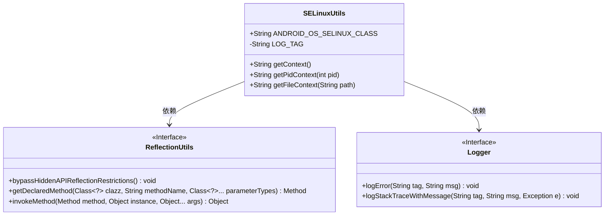
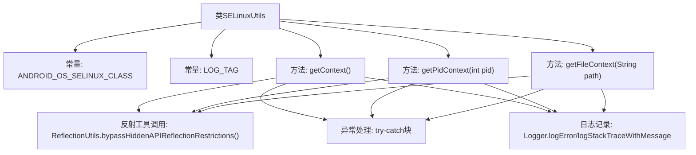

# 基础信息

|      |      |
|------|------|
| 名称 | SELinuxUtils |
| 编码语言 | .java |
| 代码路径 | termux-app/termux-shared/src/main/java/com/termux/shared/android/SELinuxUtils.java |
| 包名 | com.termux.shared.android |
| 依赖项 | ['android.annotation.SuppressLint', 'androidx.annotation.NonNull', 'androidx.annotation.Nullable', 'com.termux.shared.logger.Logger', 'com.termux.shared.reflection.ReflectionUtils', 'java.lang.reflect.Method'] |
| 概述说明 | SELinux工具类，获取进程和文件的安全上下文。 |

# 说明

SELinuxUtils是一个工具类，提供获取安全上下文的方法。它包含三个静态方法：getContext获取当前进程的安全上下文，getPidContext通过进程ID获取安全上下文，getFileContext获取文件对象的安全上下文。这些方法通过反射调用android.os.SELinux类的隐藏API，处理异常并记录错误日志，失败时返回null。

# 类列表 Class Summary

| 名称   | 类型  | 说明 |
|-------|------|-------------|
| SELinuxUtils | class | SELinux工具类，通过反射获取进程、PID和文件的SELinux安全上下文。 |

## 类 SELinuxUtils

|      |      |
|------|------|
| 访问范围 | public |
| 类型 | class |
| 名称 | SELinuxUtils |
| 说明 | SELinux工具类，通过反射获取进程、PID和文件的SELinux安全上下文。 |

### UML类图

这段代码展示了一个Android工具类SELinuxUtils，它通过反射调用android.os.SELinux类的隐藏API来获取进程、PID和文件的安全上下文。类图清晰地呈现了SELinuxUtils与ReflectionUtils和Logger两个工具接口的依赖关系，其中ReflectionUtils负责处理反射相关操作，Logger用于错误日志记录。所有方法都采用静态调用方式，通过异常处理和日志记录确保健壮性。

### 内部方法调用关系图

这段代码流程图展示了SELinuxUtils工具类的结构，包含3个核心方法(getContext/getPidContext/getFileContext)通过反射机制调用Android系统隐藏API。每个方法都遵循相同模式：先绕过隐藏API限制，然后通过反射获取目标类方法，最后处理可能出现的异常并记录日志。所有方法都返回安全上下文字符串或在异常时返回null，体现了统一的错误处理机制和日志记录策略。

### 字段列表 Field List

| 名称  | 类型  | 说明 |
|-------|-------|------|
| ANDROID_OS_SELINUX_CLASS = "android.os.SELinux" | String | 安卓系统SELinux类常量定义 |
| LOG_TAG = "SELinuxUtils" | String | 私有常量LOG_TAG值为"SELinuxUtils"。 |

### 方法列表 Method List

| 名称  | 类型  | 说明 |
|-------|-------|------|
| getContext | String | 反射获取Android系统SELinux上下文，失败返回null。 |
| getPidContext | String | 通过反射调用Android隐藏API获取进程上下文信息，失败返回null。 |
| getFileContext | String | 反射调用Android隐藏API获取文件上下文 |

