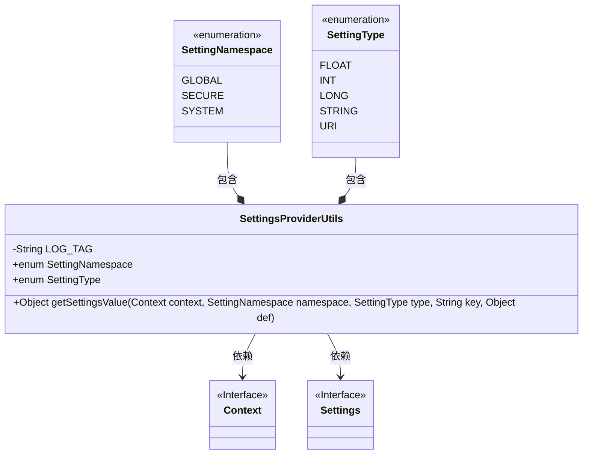
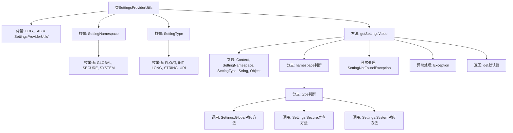

# 基础信息

|      |      |
|------|------|
| 名称 | SettingsProviderUtils |
| 编码语言 | .java |
| 代码路径 | termux-app/termux-shared/src/main/java/com/termux/shared/android/SettingsProviderUtils.java |
| 包名 | com.termux.shared.android |
| 依赖项 | ['android.content.Context', 'android.provider.Settings', 'androidx.annotation.NonNull', 'androidx.annotation.Nullable', 'com.termux.shared.logger.Logger'] |
| 概述说明 | SettingsProviderUtils类提供获取系统设置值的方法，支持不同命名空间和类型。 |

# 说明

SettingsProviderUtils类提供了从Android系统设置中获取键值的方法。它包含两个枚举：SettingNamespace定义GLOBAL、SECURE和SYSTEM三种命名空间，SettingType定义FLOAT、INT、LONG、STRING和URI五种值类型。核心方法getSettingsValue接收上下文、命名空间、类型、键名和默认值参数，根据命名空间和类型调用对应的Settings方法获取值，异常时返回默认值并记录错误日志。

# 类列表 Class Summary

| 名称   | 类型  | 说明 |
|-------|------|-------------|
| SettingsProviderUtils | class | 提供设置键值的工具类，支持全局、安全、系统命名空间及多种数据类型。 |

## 类 SettingsProviderUtils

|      |      |
|------|------|
| 访问范围 | public |
| 类型 | class |
| 名称 | SettingsProviderUtils |
| 说明 | 提供设置键值的工具类，支持全局、安全、系统命名空间及多种数据类型。 |

### UML类图

这段代码展示了一个Android工具类`SettingsProviderUtils`，它封装了从系统设置（Global/Secure/System）中获取不同类型配置值的操作。类中包含两个枚举类型`SettingNamespace`和`SettingType`分别表示设置命名空间和值类型，核心方法`getSettingsValue`通过双重switch结构处理不同命名空间和类型的组合查询，并内置异常处理机制。该类依赖Android的`Context`和`Settings`接口来访问系统设置服务。

### 内部方法调用关系图

这段代码是Android平台的一个工具类，用于从系统设置中获取不同类型的配置值。流程图展示了类结构、枚举定义和核心方法getSettingsValue的逻辑流程。该方法通过双重switch结构（先判断namespace再判断type）调用对应的Settings.Global/Secure/System方法获取值，并处理可能出现的异常情况。当出现异常或未找到设置值时，会返回传入的默认值def。整个流程体现了对Android系统设置API的安全封装和类型安全处理。

### 字段列表 Field List

| 名称  | 类型  | 说明 |
|-------|-------|------|
| LOG_TAG = "SettingsProviderUtils" | String | 日志标签设为SettingsProviderUtils |

### 方法列表 Method List

| 名称  | 类型  | 说明 |
|-------|-------|------|
| getSettingsValue | Object | 获取系统设置值的方法，支持全局、安全、系统命名空间及多种类型。 |

