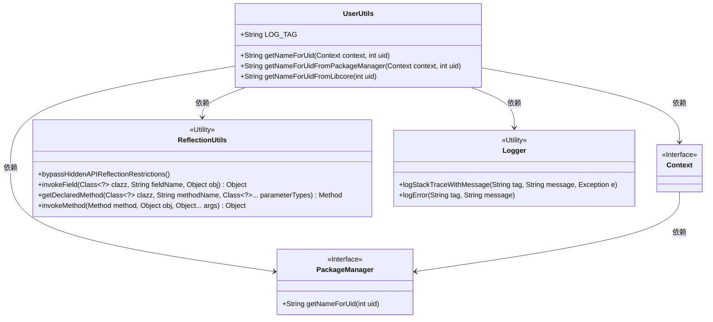
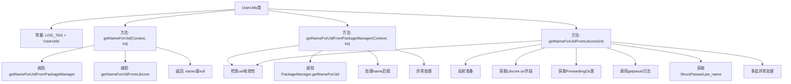
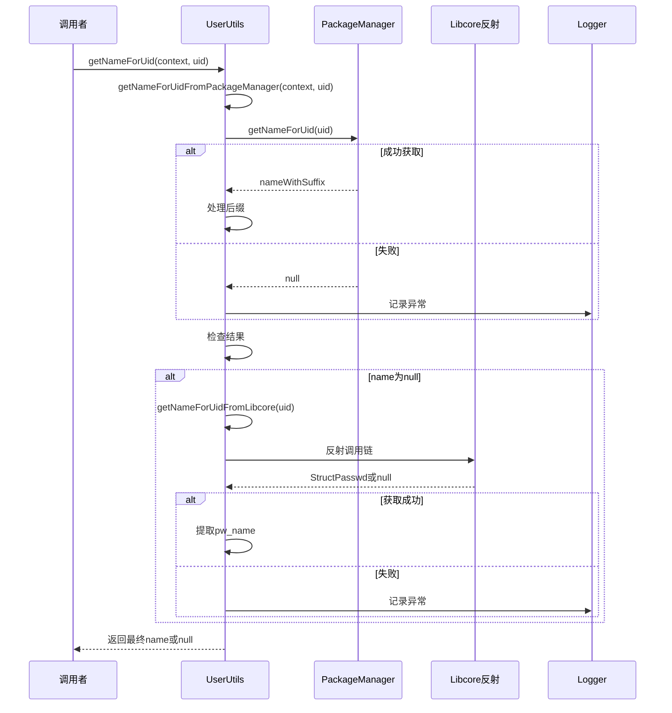

# 基础信息

|      |      |
|------|------|
| 名称 | UserUtils |
| 编码语言 | .java |
| 代码路径 | termux-app/termux-shared/src/main/java/com/termux/shared/android/UserUtils.java |
| 包名 | com.termux.shared.android |
| 依赖项 | ['android.content.Context', 'android.content.pm.PackageManager', 'androidx.annotation.NonNull', 'androidx.annotation.Nullable', 'com.termux.shared.logger.Logger', 'com.termux.shared.reflection.ReflectionUtils', 'java.lang.reflect.Method'] |
| 概述说明 | 工具类通过包管理器或反射获取用户ID对应的用户名。 |

# 说明

UserUtils类提供了两个静态方法获取用户ID对应的用户名。getNameForUid方法优先调用getNameForUidFromPackageManager，失败时回退到getNameForUidFromLibcore。前者通过PackageManager获取应用用户名，会过滤非应用用户如root；后者通过Libcore反射调用系统级getpwuid方法，支持所有用户但性能较低且需绕过隐藏API限制。两个方法都处理异常并记录日志，返回null表示失败。

# 类列表 Class Summary

| 名称   | 类型  | 说明 |
|-------|------|-------------|
| UserUtils | class | UserUtils类提供通过uid获取用户名的方法，优先查询PackageManager，失败则通过Libcore反射查询。 |

## 类 UserUtils

|      |      |
|------|------|
| 访问范围 | public |
| 类型 | class |
| 名称 | UserUtils |
| 说明 | UserUtils类提供通过uid获取用户名的方法，优先查询PackageManager，失败则通过Libcore反射查询。 |

### UML类图

这段代码描述了一个用户工具类`UserUtils`，主要用于通过用户ID获取用户名。它提供了两种获取方式：通过`PackageManager`获取应用用户名称，或通过反射调用`Libcore`底层方法获取系统用户名称。类图中展示了`UserUtils`与`Context`、`PackageManager`接口的依赖关系，以及它与工具类`ReflectionUtils`和`Logger`的交互。该设计体现了分层获取用户名的策略，先尝试标准API，失败后回退到底层反射机制，同时包含完善的错误处理和日志记录功能。

### 内部方法调用关系图

这段代码实现了一个用户工具类，主要功能是通过两种方式获取用户ID对应的用户名：首选通过PackageManager获取应用用户名称，失败后通过Libcore反射获取系统级用户名称。流程图展示了类结构和主要方法调用关系，时序图详细描述了获取用户名时的完整交互流程，包括异常处理和日志记录。代码特别处理了UID有效性验证、名称后缀修剪以及复杂的反射调用过程，体现了对Android系统底层API的深入理解和健壮的错误处理机制。

### 字段列表 Field List

| 名称  | 类型  | 说明 |
|-------|-------|------|
| LOG_TAG = "UserUtils" | String | 定义常量LOG_TAG值为UserUtils |

### 方法列表 Method List

| 名称  | 类型  | 说明 |
|-------|-------|------|
| getNameForUid | String | 根据UID获取名称，优先从包管理器查询，失败则从Libcore获取。 |
| getNameForUidFromPackageManager | String | 根据UID获取应用名称，处理异常并移除后缀。 |
| getNameForUidFromLibcore | String | 通过反射获取Libcore中指定UID的用户名，失败返回null。 |

