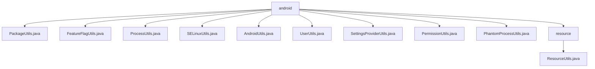

# 基础信息

|      |      |
|------|------|
| 名称 | android |
| 编码语言 | .java |
| 代码路径 | termux-app/termux-shared/src/main/java/com/termux/shared/android |
| 包名 | termux-app.termux-shared.src.main.java.com.termux.shared.android |
| 概述说明 | PackageUtils操作应用包信息；FeatureFlagUtils管理功能标志；ProcessUtils获取进程名；SELinuxUtils处理安全上下文；AndroidUtils格式化设备信息；UserUtils获取用户名；SettingsProviderUtils读取系统设置；PermissionUtils处理权限；PhantomProcessUtils管理幻影进程；ResourceUtils获取资源ID。 |

# 说明

```markdown
## 概述

该代码模块是Termux应用中的Android共享工具库，提供了一系列系统级操作的封装工具类。这些工具类主要围绕Android系统API进行封装，处理了不同API版本的兼容性问题，并通过反射机制访问部分隐藏API。模块功能覆盖包管理、进程管理、权限控制、系统设置访问、资源获取等核心系统操作，同时包含SELinux安全上下文、幻影进程监控等高级功能。所有工具类均采用静态方法设计，具有完善的异常处理和日志记录机制。

## 主要业务场景

1. **应用信息管理**  
   - 通过`PackageUtils`获取包信息、版本号、签名证书等应用元数据
   - 使用`AndroidUtils`格式化应用信息为Markdown报告
   - 通过`ResourceUtils`动态获取应用资源ID

2. **系统权限控制**  
   - 使用`PermissionUtils`处理运行时权限请求和特殊权限（如MANAGE_EXTERNAL_STORAGE）
   - 通过`SettingsProviderUtils`读取全局系统设置
   - 利用`FeatureFlagUtils`管理功能开关状态

3. **进程监控与管理**  
   - 通过`ProcessUtils`获取进程名称信息
   - 使用`PhantomProcessUtils`监控幻影进程状态
   - 结合`SELinuxUtils`检查进程安全上下文

4. **用户与设备信息**  
   - 通过`UserUtils`解析UID对应用户名
   - 使用`AndroidUtils`收集设备硬件和系统信息
   - 获取设备配置同步状态等系统级参数

5. **兼容性处理**  
   - 处理Android 7.0-12.0的API差异
   - 通过反射机制绕过隐藏API限制
   - 对特殊权限和功能进行版本适配检查

6. **安全审计**  
   - 检查应用调试状态和组件启用状态
   - 验证SELinux安全上下文
   - 监控异常进程行为

该模块作为Termux应用的基础设施层，为上层功能提供稳定可靠的系统操作接口，同时处理了大量Android系统版本差异和特殊权限场景的兼容性问题。
```


### 包内部结构视图



该流程图展示了Termux项目中android目录下的文件结构关系。根节点为android文件夹，包含10个子节点：9个工具类Java文件（如PackageUtils.java、ProcessUtils.java等）和1个resource子目录。resource目录下又包含ResourceUtils.java文件。整个结构清晰地呈现了Android相关工具类的组织方式，所有工具类文件均直接位于android目录下，仅资源工具类被单独归类到resource子目录中。

# 文件列表 File List

| 名称   | 类型  | 说明 |
|-------|------|-------------|
| [UserUtils.java](UserUtils.md) | file | 工具类通过包管理器或反射获取用户ID对应的用户名。 |
| [AndroidUtils.java](AndroidUtils.md) | file | Android工具类，获取应用和设备信息并生成Markdown格式字符串。 |
| [SELinuxUtils.java](SELinuxUtils.md) | file | SELinux工具类，获取进程和文件的安全上下文。 |
| [ProcessUtils.java](ProcessUtils.md) | file | 获取进程名的方法，通过ActivityManager查询，不包含子进程名。 |
| [FeatureFlagUtils.java](FeatureFlagUtils.md) | file | FeatureFlagUtils类提供功能标志操作，包括获取所有标志、检查存在性及状态。 |
| [PackageUtils.java](PackageUtils.md) | file | PackageUtils类提供Android包管理工具，包括获取上下文、包信息、应用状态及组件控制等功能。 |
| [PhantomProcessUtils.java](PhantomProcessUtils.md) | file | PhantomProcessUtils类提供监控幻影进程和设备配置同步状态的工具方法。 |
| [PermissionUtils.java](PermissionUtils.md) | file | Android权限工具类，提供存储、悬浮窗、电池优化等权限的检查和请求功能。 |
| [SettingsProviderUtils.java](SettingsProviderUtils.md) | file | SettingsProviderUtils类提供获取系统设置值的方法，支持不同命名空间和类型。 |
| [resource](resource/_module.md) | package | ResourceUtils类提供获取Android资源ID的方法，支持颜色、布局等类型。 |


