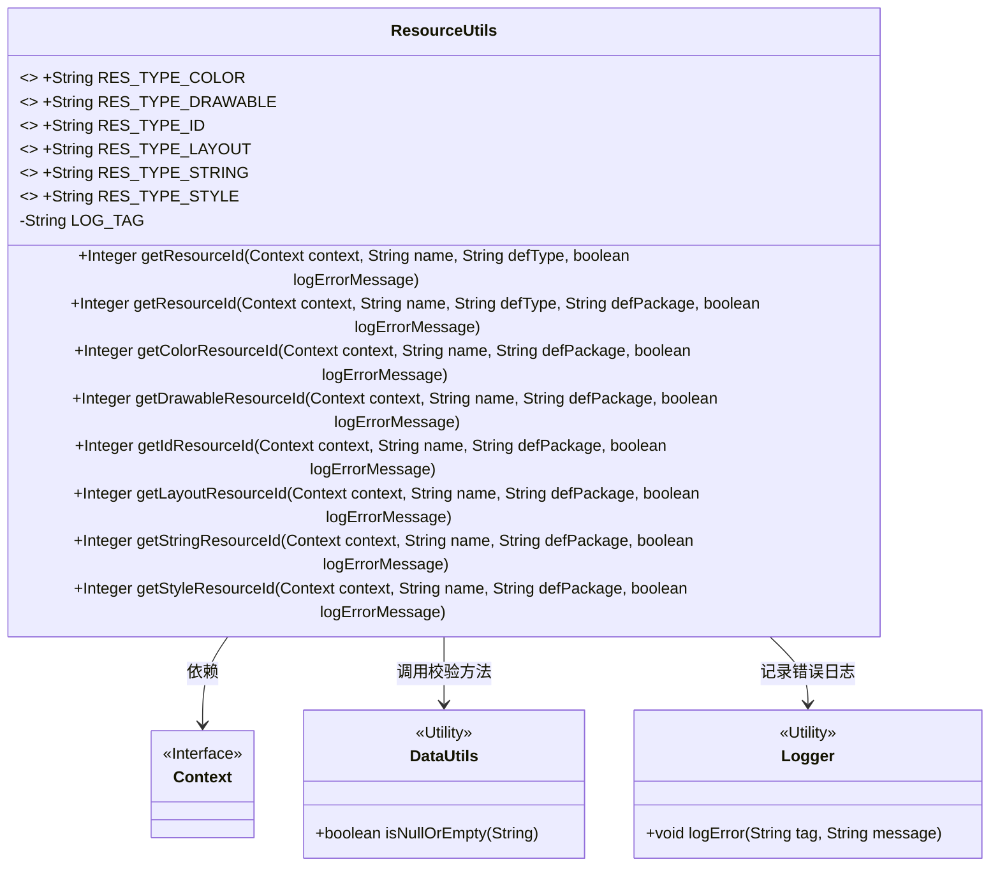
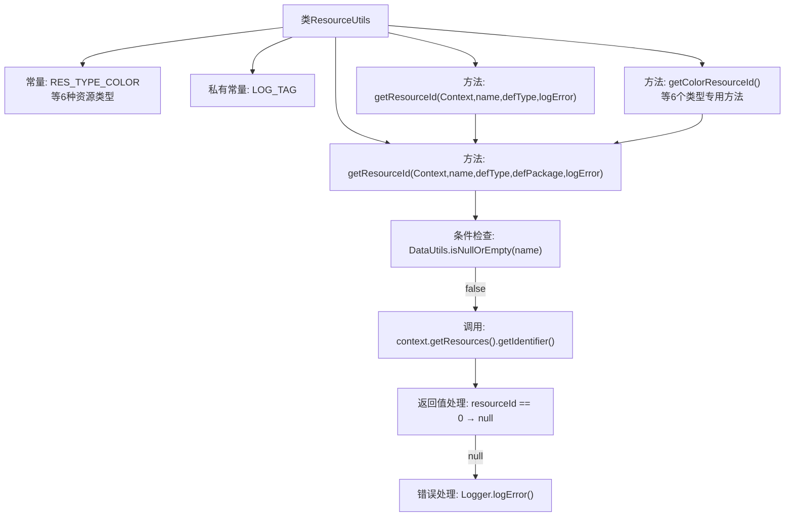

# 基础信息

|      |      |
|------|------|
| 名称 | ResourceUtils |
| 编码语言 | .java |
| 代码路径 | termux-app/termux-shared/src/main/java/com/termux/shared/android/resource/ResourceUtils.java |
| 包名 | com.termux.shared.android.resource |
| 依赖项 | ['android.content.Context', 'androidx.annotation.NonNull', 'androidx.annotation.Nullable', 'com.termux.shared.data.DataUtils', 'com.termux.shared.logger.Logger'] |
| 概述说明 | ResourceUtils类提供获取Android资源ID的方法，支持颜色、布局等类型。 |

# 说明

ResourceUtils是一个工具类，用于获取Android应用中各种资源的标识符。它定义了常见资源类型的常量，如颜色、可绘制对象、ID、布局、字符串和样式。核心方法getResourceId通过上下文、资源名称、类型和包名来查找资源ID，支持可选错误日志记录。此外，提供了针对特定资源类型的便捷方法，如getColorResourceId、getDrawableResourceId等，简化了常见资源的获取过程。若查找失败且启用日志，会记录错误信息。所有方法均返回Integer类型的资源ID，未找到时返回null。

# 类列表 Class Summary

| 名称   | 类型  | 说明 |
|-------|------|-------------|
| ResourceUtils | class | 工具类ResourceUtils提供获取各类资源ID的方法。 |

## 类 ResourceUtils

|      |      |
|------|------|
| 访问范围 | public |
| 类型 | class |
| 名称 | ResourceUtils |
| 说明 | 工具类ResourceUtils提供获取各类资源ID的方法。 |

### UML类图

这段代码展示了一个Android资源工具类ResourceUtils，主要用于通过资源名称获取不同类型资源的ID。该类包含6个公共常量定义资源类型，提供核心方法getResourceId()及其多个类型特化的便捷方法（如getColorResourceId()）。通过Context获取Resources对象，处理可能的异常情况，并支持错误日志记录。依赖DataUtils进行空校验，使用Logger记录错误信息。所有方法均为静态工具方法，符合实用工具类的设计模式。

### 内部方法调用关系图

该流程图展示了ResourceUtils类的核心结构和工作流程。类包含6种资源类型常量和主要资源获取方法，其中getResourceId是核心方法，其他类型专用方法都调用它。流程从参数检查开始，通过Context获取资源ID，处理返回值（0转为null），失败时记录错误日志。所有类型专用方法（如getColorResourceId）最终都委托给核心方法处理，体现了清晰的职责分层设计。

### 字段列表 Field List

| 名称  | 类型  | 说明 |
|-------|-------|------|
| RES_TYPE_DRAWABLE = "drawable" | String | 定义字符串常量RES_TYPE_DRAWABLE，值为"drawable"。 |
| RES_TYPE_LAYOUT = "layout" | String | 定义静态常量RES_TYPE_LAYOUT，值为"layout"。 |
| RES_TYPE_ID = "id" | String | 静态常量字符串，标识资源类型为ID。 |
| RES_TYPE_STRING = "string" | String | 定义字符串类型常量RES_TYPE_STRING，值为"string"。 |
| RES_TYPE_COLOR = "color" | String | 定义颜色资源类型的静态常量字符串"color"。 |
| LOG_TAG = "ResourceUtils" | String | 私有静态常量LOG_TAG值为ResourceUtils |
| RES_TYPE_STYLE = "style" | String | 静态常量字符串，值为"style"。 |

### 方法列表 Method List

| 名称  | 类型  | 说明 |
|-------|-------|------|
| getIdResourceId | Integer | 获取资源ID的静态方法，参数包括上下文、名称、包名和错误日志标志。 |
| getColorResourceId | Integer | 获取颜色资源ID，参数含上下文、名称、包名及错误日志开关。 |
| getStringResourceId | Integer | 获取字符串资源ID，参数包括上下文、名称、包名和错误日志标志。 |
| getResourceId | Integer | 获取资源ID方法，参数含上下文、名称、类型及错误日志开关。 |
| getDrawableResourceId | Integer | 获取Drawable资源ID，参数：上下文、名称、包名、错误日志开关。 |
| getResourceId | Integer | 获取资源ID的方法，处理异常并记录错误。 |
| getLayoutResourceId | Integer | 获取布局资源ID，参数包括上下文、名称、包名和错误日志标志。 |
| getStyleResourceId | Integer | 获取样式资源ID的方法，参数包括上下文、名称、包名和错误日志标志。 |

