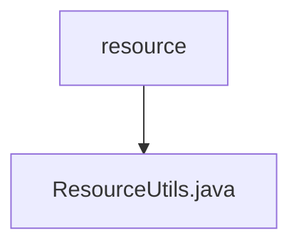

# 基础信息

|      |      |
|------|------|
| 名称 | resource |
| 编码语言 | .java |
| 代码路径 | termux-app/termux-shared/src/main/java/com/termux/shared/android/resource |
| 包名 | termux-app.termux-shared.src.main.java.com.termux.shared.android.resource |
| 概述说明 | ResourceUtils类提供获取Android资源ID的方法，支持颜色、布局等类型。 |

# 说明

ResourceUtils是一个工具类，用于获取Android应用中各种资源的标识符。它定义了常见资源类型的常量，如颜色、可绘制对象、ID、布局、字符串和样式。核心方法getResourceId通过上下文、资源名称、类型和包名来查找资源ID，支持可选错误日志记录。此外，提供了针对特定资源类型的便捷方法，如getColorResourceId、getDrawableResourceId等，简化了常见资源的获取过程。若查找失败且启用日志，会记录错误信息。所有方法均返回Integer类型的资源ID，未找到时返回null。

### 包内部结构视图

该流程图展示了Termux项目中资源管理模块的层级结构。根节点"resource"代表资源目录，其下包含一个关键工具类"ResourceUtils.java"，用于处理Android资源相关操作。这种简洁的层级关系体现了单一职责原则，所有资源工具方法都集中在一个文件中，便于维护和调用。

# 文件列表 File List

| 名称   | 类型  | 说明 |
|-------|------|-------------|
| [ResourceUtils.java](ResourceUtils.md) | file | ResourceUtils类提供获取Android资源ID的方法，支持颜色、布局等类型。 |

