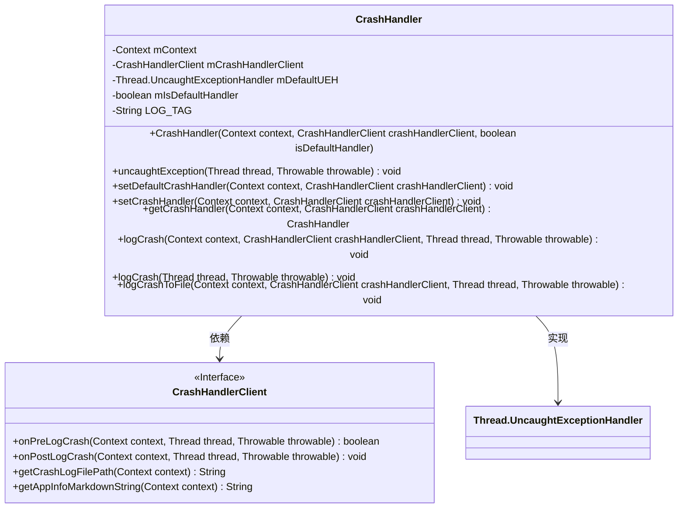
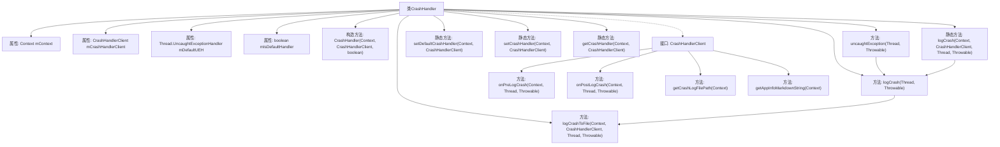

# 基础信息

|      |      |
|------|------|
| 名称 | CrashHandler |
| 编码语言 | .java |
| 代码路径 | termux-app/termux-shared/src/main/java/com/termux/shared/crash/CrashHandler.java |
| 包名 | com.termux.shared.crash |
| 依赖项 | ['android.content.Context', 'androidx.annotation.NonNull', 'com.termux.shared.file.FileUtils', 'com.termux.shared.logger.Logger', 'com.termux.shared.markdown.MarkdownUtils', 'com.termux.shared.errors.Error', 'com.termux.shared.android.AndroidUtils', 'java.nio.charset.Charset'] |
| 概述说明 | CrashHandler处理未捕获异常，记录崩溃日志并支持自定义处理。 |

# 说明

CrashHandler是一个实现Thread.UncaughtExceptionHandler接口的类，用于处理未捕获异常。它包含Context、CrashHandlerClient和默认异常处理器等成员变量。主要功能包括设置默认或当前线程的异常处理器、记录崩溃日志到文件。CrashHandlerClient接口定义了崩溃处理前后的回调方法，以及获取崩溃日志文件路径和应用信息的方法。崩溃日志包含线程、时间戳、错误信息和堆栈跟踪等详细信息，并支持Markdown格式输出。

# 类列表 Class Summary

| 名称   | 类型  | 说明 |
|-------|------|-------------|
| CrashHandler | class | CrashHandler处理未捕获异常，记录崩溃日志并支持自定义回调。 |

## 类 CrashHandler

|      |      |
|------|------|
| 访问范围 | public |
| 类型 | class |
| 名称 | CrashHandler |
| 说明 | CrashHandler处理未捕获异常，记录崩溃日志并支持自定义回调。 |

### UML类图

这段代码定义了一个崩溃处理系统，主要由CrashHandler类和CrashHandlerClient接口组成。CrashHandler实现了Thread.UncaughtExceptionHandler接口，用于捕获和处理未捕获的异常。它通过构造函数接收上下文、客户端处理器和是否作为默认处理器的标志，提供了设置默认处理器、记录崩溃日志等功能。CrashHandlerClient接口定义了预处理、后处理、获取日志文件路径和应用信息等方法，允许客户端自定义崩溃处理行为。整个系统能够灵活地处理主线程和非主线程的崩溃，并将崩溃信息以Markdown格式记录到文件中。

### 内部方法调用关系图

这段代码实现了一个线程未捕获异常处理器CrashHandler，用于捕获和处理应用程序中的崩溃。流程图展示了类结构、方法调用关系和接口定义。核心功能包括：设置默认/当前线程的异常处理器、记录崩溃日志到文件、通过CrashHandlerClient接口实现自定义预处理/后处理逻辑。崩溃处理流程会先检查预处理条件，然后生成Markdown格式的崩溃报告并写入文件，最后执行后处理回调。

### 字段列表 Field List

| 名称  | 类型  | 说明 |
|-------|-------|------|
| mIsDefaultHandler | boolean | 私有布尔变量，标识是否为默认处理器。 |
| LOG_TAG = "CrashUtils" | String | CrashUtils日志标签常量 |
| mContext | Context | 
私有上下文变量mContext |
| mCrashHandlerClient | CrashHandlerClient | 私有崩溃处理客户端实例。 |
| mDefaultUEH | Thread.UncaughtExceptionHandler | 私有线程异常处理器mDefaultUEH |

### 方法列表 Method List

| 名称  | 类型  | 说明 |
|-------|-------|------|
| setCrashHandler | void | 设置线程未捕获异常处理器，绑定上下文和客户端。 |
| getCrashHandler | CrashHandler | 获取CrashHandler实例，需传入上下文和客户端对象。 |
| uncaughtException | void | 处理未捕获异常：记录日志，非主线程不终止应用。 |
| logCrash | void | 静态方法logCrash记录崩溃信息，调用CrashHandler处理异常。 |
| logCrash | void | 记录崩溃日志，处理前后回调并写入文件。 |
| logCrashToFile | void | 记录崩溃信息到文件，包含线程、时间、消息、堆栈和设备详情。 |
| setDefaultCrashHandler | void | 设置默认崩溃处理器，若非自定义则替换。 |

