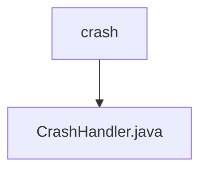

# 基础信息

|      |      |
|------|------|
| 名称 | crash |
| 编码语言 | .java |
| 代码路径 | termux-app/termux-shared/src/main/java/com/termux/shared/crash |
| 包名 | termux-app.termux-shared.src.main.java.com.termux.shared.crash |
| 概述说明 | CrashHandler处理未捕获异常，记录崩溃日志并支持自定义处理。 |

# 说明

CrashHandler是一个实现Thread.UncaughtExceptionHandler接口的类，用于处理未捕获异常。它包含Context、CrashHandlerClient和默认异常处理器等成员变量。主要功能包括设置默认或当前线程的异常处理器、记录崩溃日志到文件。CrashHandlerClient接口定义了崩溃处理前后的回调方法，以及获取崩溃日志文件路径和应用信息的方法。崩溃日志包含线程、时间戳、错误信息和堆栈跟踪等详细信息，并支持Markdown格式输出。

### 包内部结构视图

该流程图展示了Termux项目中crash目录与CrashHandler.java文件的层级关系。crash作为父目录节点，包含一个子节点CrashHandler.java，表示这是处理崩溃相关功能的Java类文件。整个结构简洁明了，符合Java项目标准目录布局，体现了单一功能模块的文件组织方式。

# 文件列表 File List

| 名称   | 类型  | 说明 |
|-------|------|-------------|
| [CrashHandler.java](CrashHandler.md) | file | CrashHandler处理未捕获异常，记录崩溃日志并支持自定义处理。 |

