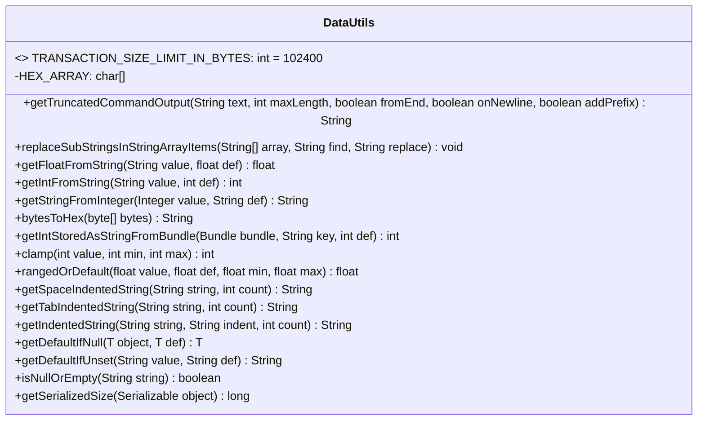

# 基础信息

|      |      |
|------|------|
| 名称 | DataUtils |
| 编码语言 | .java |
| 代码路径 | termux-app/termux-shared/src/main/java/com/termux/shared/data/DataUtils.java |
| 包名 | com.termux.shared.data |
| 依赖项 | ['android.os.Bundle', 'androidx.annotation.NonNull', 'androidx.annotation.Nullable', 'com.google.common.base.Strings', 'java.io.ByteArrayOutputStream', 'java.io.ObjectOutputStream', 'java.io.Serializable', 'java.util.Collections'] |
| 概述说明 | DataUtils类提供数据处理工具，包括截断字符串、类型转换、范围限制、空值处理和序列化大小计算。 |

# 说明

DataUtils类提供了一系列数据处理工具方法，包括：1.定义事务数据大小限制常量100KB；2.字符串截断功能，支持前后截断、换行符处理及前缀添加；3.字符串数组内容替换；4.字符串与数值类型转换，含异常处理；5.字节数组转十六进制字符串；6.Bundle中数值类型数据读取；7.数值范围限制与默认值处理；8.字符串缩进处理，支持空格和制表符；9.空值检查与默认值返回；10.可序列化对象大小计算。所有方法均包含空值安全处理。

# 类列表 Class Summary

| 名称   | 类型  | 说明 |
|-------|------|-------------|
| DataUtils | class | 工具类提供数据转换、截断、替换及序列化大小计算功能。 |

## 类 DataUtils

|      |      |
|------|------|
| 访问范围 | public |
| 类型 | class |
| 名称 | DataUtils |
| 说明 | 工具类提供数据转换、截断、替换及序列化大小计算功能。 |

### UML类图

该代码定义了一个名为DataUtils的工具类，包含多种静态方法用于数据处理和转换。主要功能包括：字符串截断与处理、数组字符串替换、数值类型转换、十六进制转换、Bundle数据获取、数值范围限制、字符串缩进处理、空值检查以及对象序列化大小计算等。类中包含一个常量TRANSACTION_SIZE_LIMIT_IN_BYTES用于限制事务传输大小，以及私有字符数组HEX_ARRAY用于十六进制转换。所有方法均为静态方法，可直接通过类名调用，无需实例化。

### 内部方法调用关系图

```mermaid
graph TD
    A["类DataUtils"]
    B["常量: TRANSACTION_SIZE_LIMIT_IN_BYTES"]
    C["常量: HEX_ARRAY"]
    D["方法: getTruncatedCommandOutput"]
    E["方法: replaceSubStringsInStringArrayItems"]
    F["方法: getFloatFromString"]
    G["方法: getIntFromString"]
    H["方法: getStringFromInteger"]
    I["方法: bytesToHex"]
    J["方法: getIntStoredAsStringFromBundle"]
    K["方法: clamp"]
    L["方法: rangedOrDefault"]
    M["方法: getSpaceIndentedString"]
    N["方法: getTabIndentedString"]
    O["方法: getIndentedString"]
    P["方法: getDefaultIfNull"]
    Q["方法: getDefaultIfUnset"]
    R["方法: isNullOrEmpty"]
    S["方法: getSerializedSize"]

    A --> B
    A --> C
    A --> D
    A --> E
    A --> F
    A --> G
    A --> H
    A --> I
    A --> J
    A --> K
    A --> L
    A --> M
    A --> N
    A --> O
    A --> P
    A --> Q
    A --> R
    A --> S
```

该流程图展示了DataUtils工具类的完整结构，包含2个常量和17个实用方法。主要功能包括：字符串截断处理(带多种控制参数)、数组字符串替换、基本类型转换(支持异常处理)、十六进制转换、Bundle数据读取、数值范围限制、字符串缩进处理、空值安全检查以及对象序列化大小计算。这些方法都经过精心设计，考虑了null安全、异常处理和边缘情况，适合在Android等需要严格数据处理的场景中使用。

### 字段列表 Field List

| 名称  | 类型  | 说明 |
|-------|-------|------|
| HEX_ARRAY = "0123456789ABCDEF".toCharArray() | char[] | 字符数组HEX_ARRAY存储十六进制字符0-9和A-F。 |
| TRANSACTION_SIZE_LIMIT_IN_BYTES = 100 * 1024 | int | 交易大小限制为100KB。 |

### 方法列表 Method List

| 名称  | 类型  | 说明 |
|-------|-------|------|
| getIndentedString | String | 静态方法：用指定缩进字符串格式化输入字符串，次数为count。空输入返回原值。 |
| getFloatFromString | float | 静态方法：字符串转浮点数，失败返回默认值。 |
| getSpaceIndentedString | String | 静态方法：用指定数量缩进格式化字符串，空输入返回原值。 |
| replaceSubStringsInStringArrayItems | void | 替换字符串数组中各元素的子串。 |
| getIntStoredAsStringFromBundle | int | 从Bundle获取字符串存储的整数值，失败返回默认值。 |
| getIntFromString | int | 字符串转整型，失败返回默认值。 |
| bytesToHex | String | 将字节数组转换为十六进制字符串。 |
| getTruncatedCommandOutput | String | 截取字符串，可控制前缀、方向、换行及长度。 |
| getStringFromInteger | String | 静态方法：整数转字符串，空值返回默认值。 |
| clamp | int | 静态方法clamp限制数值在min和max之间。 |
| getTabIndentedString | String | 静态方法：用制表符缩进字符串，指定次数。 |
| rangedOrDefault | float | 检查数值范围，越界返回默认值，否则返回原值。 |
| getDefaultIfNull | T | 静态方法：若对象为空返回默认值，否则返回对象。 |
| getDefaultIfUnset | String | 空值或空字符串时返回默认值def，否则返回原值。 |
| isNullOrEmpty | boolean | 检查字符串为空或null |
| getSerializedSize | long | 计算可序列化对象的字节长度，成功返回长度，失败返回-1，空对象返回0。 |

