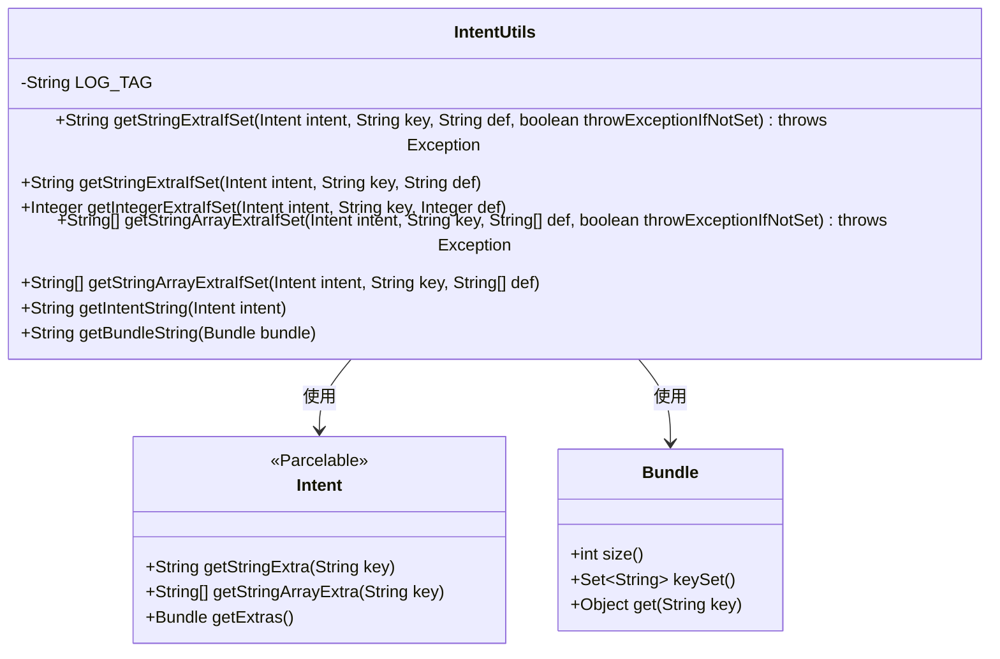
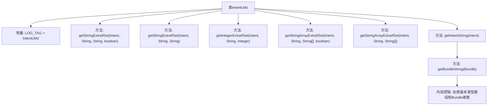

# 基础信息

|      |      |
|------|------|
| 名称 | IntentUtils |
| 编码语言 | .java |
| 代码路径 | termux-app/termux-shared/src/main/java/com/termux/shared/data/IntentUtils.java |
| 包名 | com.termux.shared.data |
| 依赖项 | ['android.content.Intent', 'android.os.Bundle', 'android.os.Parcelable', 'androidx.annotation.NonNull', 'java.util.Arrays'] |
| 概述说明 | Intent工具类，提供安全获取Intent中String、Integer、String数组的方法，支持默认值和异常处理。 |

# 说明

IntentUtils类提供了一系列静态方法用于从Intent对象中安全提取不同类型的数据。包含获取字符串、整型和字符串数组的方法，支持设置默认值和异常抛出选项。还提供了将Intent和Bundle内容格式化为字符串的工具方法，能处理各种数组类型和嵌套Bundle情况。所有方法都包含空值检查和异常处理机制，确保数据提取的可靠性。

# 类列表 Class Summary

| 名称   | 类型  | 说明 |
|-------|------|-------------|
| IntentUtils | class | Intent工具类，提供安全获取Intent中String、Integer、String数组数据的方法，支持默认值和异常处理。 |

## 类 IntentUtils

|      |      |
|------|------|
| 访问范围 | public |
| 类型 | class |
| 名称 | IntentUtils |
| 说明 | Intent工具类，提供安全获取Intent中String、Integer、String数组数据的方法，支持默认值和异常处理。 |

### UML类图

这段代码展示了一个Android工具类`IntentUtils`，主要用于安全地从`Intent`对象中提取各种类型的额外数据(extra)。类提供了多种静态方法，包括获取字符串、整型、字符串数组等数据类型，并支持默认值设置和空值检查。其中`getBundleString()`方法能递归地将Bundle内容格式化为可读字符串。类通过`Intent`和`Bundle`这两个Android基础类进行操作，体现了对Android平台数据传递机制的封装和增强。所有方法都考虑了空值处理和异常抛出，增强了代码的健壮性。

### 内部方法调用关系图

流程图描述：
该流程图展示了IntentUtils工具类的完整结构，包含7个核心方法和1个常量定义。主要功能分为三大类：字符串类型参数提取(getStringExtraIfSet)、整型参数提取(getIntegerExtraIfSet)和字符串数组提取(getStringArrayExtraIfSet)，每个方法都有带异常处理和不带异常处理的版本。特别展示了getIntentString和getBundleString方法之间的调用关系，以及getBundleString方法内部对15种不同数据类型(包括8种基本类型数组和Bundle嵌套)的特殊处理逻辑。

### 字段列表 Field List

| 名称  | 类型  | 说明 |
|-------|-------|------|
| LOG_TAG = "IntentUtils" | String | 私有常量LOG_TAG值为"IntentUtils"。 |

### 方法列表 Method List

| 名称  | 类型  | 说明 |
|-------|-------|------|
| getStringExtraIfSet | String | 从Intent获取字符串值，若未设置且需抛异常则抛出，否则返回默认值。 |
| getIntegerExtraIfSet | Integer | 从Intent获取整型参数，失败返回默认值。 |
| getStringExtraIfSet | String | 从Intent获取字符串参数，若未设置则返回默认值或null。 |
| getStringArrayExtraIfSet | String[] | 从Intent获取字符串数组，未设置时根据参数决定是否抛异常。 |
| getStringArrayExtraIfSet | String[] | 从Intent获取字符串数组，若未设置则返回默认值或null。 |
| getIntentString | String | 静态方法：获取Intent及其Bundle的字符串表示，空则返回null。 |
| getBundleString | String | 将Bundle内容转为字符串，处理空Bundle和数组类型，递归处理嵌套Bundle。 |

