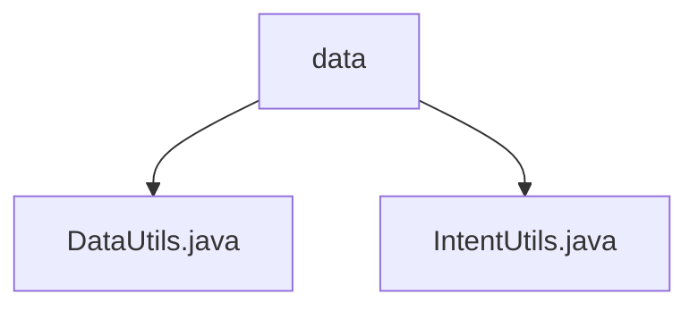

# 基础信息

|      |      |
|------|------|
| 名称 | data |
| 编码语言 | .java |
| 代码路径 | termux-app/termux-shared/src/main/java/com/termux/shared/data |
| 包名 | termux-app.termux-shared.src.main.java.com.termux.shared.data |
| 概述说明 | DataUtils类提供数据处理工具方法，如字符串处理、类型转换等。IntentUtils类提供安全提取Intent数据的方法，含异常处理。 |

# 说明

## 概述

该代码模块是一个数据处理工具集，主要包含两个核心工具类：`DataUtils`和`IntentUtils`。这两个类提供了丰富的数据处理和安全操作功能，旨在增强数据操作的可靠性和便捷性。所有方法均实现了空值安全处理和异常处理机制，确保在各类业务场景下的稳定性。

## 主要业务场景

1. **数据预处理与转换**  
   - 处理事务数据大小限制（如100KB常量定义）
   - 字符串操作（截断、换行符处理、前缀添加、缩进格式化）
   - 类型转换（字符串与数值互转、字节数组转十六进制字符串）
   - 数值范围校验与默认值处理

2. **Intent数据安全提取**  
   - 从Intent/Bundle中安全提取字符串、整型、字符串数组等数据类型
   - 支持默认值设置和异常抛出配置
   - 格式化输出Intent/Bundle内容（含嵌套结构处理）

3. **数据可靠性保障**  
   - 全面的空值检查机制
   - 可序列化对象大小计算
   - 所有操作均内置异常处理
   - 支持数组内容替换等批量操作

4. **调试与日志支持**  
   - 提供Bundle和Intent内容的可视化格式化方法
   - 支持复杂数据结构（如嵌套Bundle）的字符串表示

该模块典型应用于需要高强度数据校验的移动端场景（如Termux这类终端模拟器应用），特别是在处理跨组件通信（Intent/Bundle）、用户输入预处理以及日志格式化等需求时发挥核心作用。

### 包内部结构视图

该流程图展示了Termux项目中shared模块下的data目录结构。data作为父节点包含两个Java文件：DataUtils.java和IntentUtils.java，这两个文件都是处理数据相关功能的工具类。结构清晰地反映了数据工具类的组织方式，符合典型的Java项目资源目录布局规范。

# 文件列表 File List

| 名称   | 类型  | 说明 |
|-------|------|-------------|
| [DataUtils.java](DataUtils.md) | file | DataUtils类提供数据处理工具，包括截断字符串、类型转换、范围限制、空值处理和序列化大小计算。 |
| [IntentUtils.java](IntentUtils.md) | file | Intent工具类，提供安全获取Intent中String、Integer、String数组的方法，支持默认值和异常处理。 |

