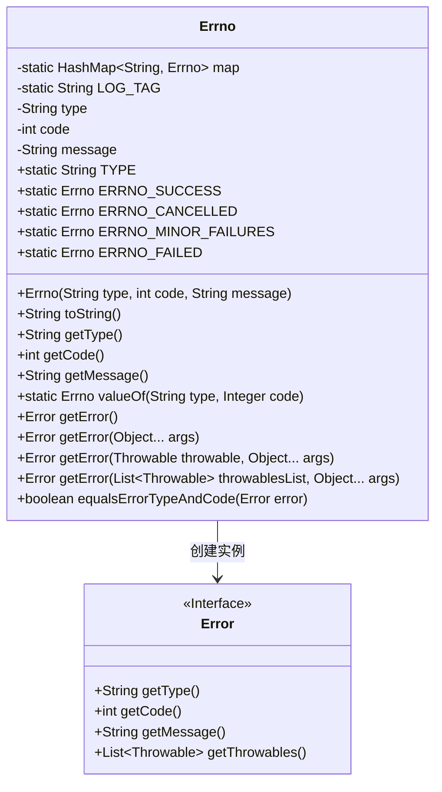
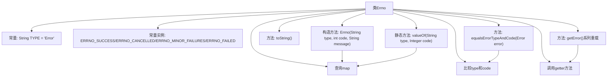

# 基础信息

|      |      |
|------|------|
| 名称 | Errno |
| 编码语言 | .java |
| 代码路径 | termux-app/termux-shared/src/main/java/com/termux/shared/errors/Errno.java |
| 包名 | com.termux.shared.errors |
| 依赖项 | ['android.app.Activity', 'androidx.annotation.NonNull', 'com.termux.shared.logger.Logger', 'java.util.Arrays', 'java.util.Collections', 'java.util.HashMap', 'java.util.List'] |
| 概述说明 | Errno类定义错误码，含类型、代码和消息，提供格式化错误和异常处理功能。 |

# 说明

Errno类是一个用于管理错误码和错误信息的工具类。它包含静态常量ERRNO_SUCCESS、ERRNO_CANCELLED、ERRNO_MINOR_FAILURES和ERRNO_FAILED，分别表示成功、取消、轻微失败和失败的错误状态。每个Errno实例包含类型、代码和消息三个属性，并通过HashMap进行存储和检索。类提供了多种方法来获取错误信息，包括格式化消息、处理异常和比较错误类型与代码。此外，它还支持将Errno转换为Error对象，并提供了异常处理和日志记录功能。

# 类列表 Class Summary

| 名称   | 类型  | 说明 |
|-------|------|-------------|
| Errno | class | Errno类定义错误类型、代码和消息，提供错误生成和比较功能。 |

## 类 Errno

|      |      |
|------|------|
| 访问范围 | public |
| 类型 | class |
| 名称 | Errno |
| 说明 | Errno类定义错误类型、代码和消息，提供错误生成和比较功能。 |

### UML类图

类图描述：
Errno类是一个错误码管理类，通过静态HashMap维护错误码映射关系，包含类型、代码和消息三个核心属性。该类提供了多种getError()方法重载，支持格式化错误消息和异常处理，并能通过valueOf()方法查询特定错误码。Error接口定义了错误信息的基本规范，Errno通过创建Error实例来封装错误信息。类设计中考虑了空值安全、异常处理和格式化失败的回退机制。

### 内部方法调用关系图

流程图描述：该流程图展示了Errno类的完整结构，包含静态常量、实例属性、构造方法和主要功能方法。核心是通过静态HashMap维护错误码映射，构造方法自动注册实例到map，valueOf方法实现反向查询。getError()系列方法提供多种错误生成方式，支持参数格式化、异常嵌套等场景，并通过equals方法实现错误类型比对。所有操作围绕type/code/message三个核心属性展开，形成完整的错误码管理机制。

### 字段列表 Field List

| 名称  | 类型  | 说明 |
|-------|-------|------|
| message | String | 受保护的最终字符串消息。 |
| map = new HashMap<>() | HashMap<String, Errno> | 私有静态哈希映射存储字符串与错误码的对应关系。 |
| code | int | 受保护的整型常量code |
| ERRNO_CANCELLED = new Errno(TYPE, Activity.RESULT_CANCELED, "Cancelled") | Errno | 定义取消错误码ERRNO_CANCELLED，类型为TYPE，值为Activity.RESULT_CANCELED，描述为"Cancelled"。 |
| ERRNO_MINOR_FAILURES = new Errno(TYPE, Activity.RESULT_FIRST_USER, "Minor failure") | Errno | 静态常量ERRNO_MINOR_FAILURES表示次要错误，类型为Errno。 |
| ERRNO_FAILED = new Errno(TYPE, Activity.RESULT_FIRST_USER + 1, "Failed") | Errno | 定义错误码ERRNO_FAILED，类型为TYPE，值为用户首个结果码+1，描述为"Failed"。 |
| LOG_TAG = "Errno" | String | 私有静态常量字符串LOG_TAG值为"Errno"。 |
| TYPE = "Error" | String | 错误类型常量定义 |
| type | String | 受保护不可变字符串类型变量 |
| ERRNO_SUCCESS = new Errno(TYPE, Activity.RESULT_OK, "Success") | Errno | 定义成功错误码ERRNO_SUCCESS，类型TYPE，结果RESULT_OK，描述"Success"。 |

### 方法列表 Method List

| 名称  | 类型  | 说明 |
|-------|-------|------|
| getError | Error | 获取错误信息的方法，返回类型、代码和消息。 |
| getError | Error | 方法getError根据参数格式化错误消息，失败时返回未格式化消息并记录异常。 |
| equalsErrorTypeAndCode | boolean | 检查错误类型和代码是否相同。 |
| getCode | int | 获取代码值的方法。 |
| valueOf | Errno | 静态方法valueOf根据类型和代码返回Errno枚举值，参数无效时返回null。 |
| toString | String | 重写toString方法，返回type、code和message的拼接字符串。 |
| getError | Error | 方法根据异常和参数返回错误对象，无异常时仅用参数处理。 |
| getMessage | String | 非空方法返回字符串message |
| getType | String | 非空方法返回字符串类型变量type。 |
| getError | Error | 方法根据异常列表和参数生成错误对象，处理格式化失败时返回未格式化消息。 |

