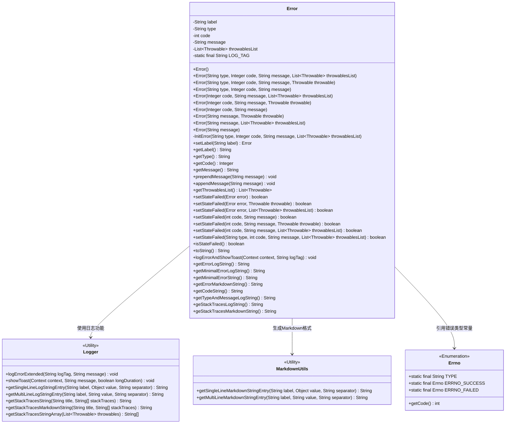
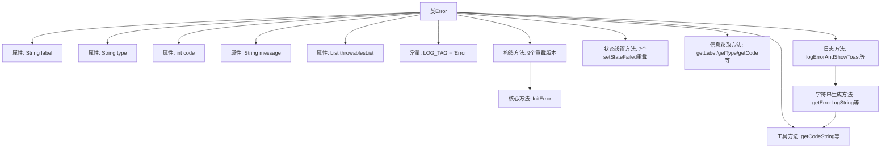

# 基础信息

|      |      |
|------|------|
| 名称 | Error |
| 编码语言 | .java |
| 代码路径 | termux-app/termux-shared/src/main/java/com/termux/shared/errors/Error.java |
| 包名 | com.termux.shared.errors |
| 依赖项 | ['android.content.Context', 'androidx.annotation.NonNull', 'com.termux.shared.logger.Logger', 'com.termux.shared.markdown.MarkdownUtils', 'java.io.Serializable', 'java.util.ArrayList', 'java.util.Collections', 'java.util.List'] |
| 概述说明 | 错误处理类，包含类型、代码、消息和异常列表，支持多种构造和状态设置方法。 |

# 说明

该内容描述了一个名为Error的Java类，用于封装错误信息。类包含私有字段如label、type、code、message和throwablesList，分别表示错误标签、类型、代码、消息和异常列表。提供了多个构造函数和初始化方法InitError，支持不同参数组合。包含设置和获取错误状态的方法如setStateFailed和isStateFailed，以及日志和字符串处理方法如getErrorLogString和getMinimalErrorString。还支持将错误信息转换为Markdown格式和显示Toast通知。

# 类列表 Class Summary

| 名称   | 类型  | 说明 |
|-------|------|-------------|
| Error | class | 错误处理类，包含类型、代码、消息和异常列表，支持多种构造和状态设置方法。 |

## 类 Error

|      |      |
|------|------|
| 访问范围 | public |
| 类型 | class |
| 名称 | Error |
| 说明 | 错误处理类，包含类型、代码、消息和异常列表，支持多种构造和状态设置方法。 |

### UML类图

类图描述：Error类是一个可序列化的错误处理类，包含错误标签、类型、代码、消息和异常列表等属性，提供多种构造方法和状态设置方法。该类依赖Logger和MarkdownUtils工具类进行日志记录和格式化输出，同时引用Errno枚举类获取错误类型常量。Error类封装了完整的错误处理逻辑，包括状态管理、日志记录、消息拼接和多种格式的字符串生成功能。

### 内部方法调用关系图

这段代码实现了一个完整的错误处理类Error，包含错误信息存储、状态管理、日志记录和多种字符串格式化功能。流程图展示了类的主要结构：5个核心属性存储错误信息，9个构造方法通过InitError统一初始化，7个setStateFailed方法管理错误状态，以及多个日志记录和字符串生成方法。特别值得注意的是所有构造方法最终都汇聚到InitError方法进行统一处理，而各种toString变体方法(getErrorLogString等)则共享底层的工具方法如getCodeString。

### 字段列表 Field List

| 名称  | 类型  | 说明 |
|-------|-------|------|
| message | String | 私有字符串变量message |
| LOG_TAG = "Error" | String | 私有静态常量字符串LOG_TAG值为"Error"。 |
| code | int | 私有整型变量code |
| label | String | 私有字符串标签变量。 |
| throwablesList = new ArrayList<>() | List<Throwable> | 私有异常列表初始化 |
| type | String | 私有字符串类型变量type |

### 方法列表 Method List

| 名称  | 类型  | 说明 |
|-------|-------|------|
| logErrorAndShowToast | void | 记录错误并显示提示，需上下文、标签和错误对象。 |
| getTypeAndMessageLogString | String | 方法返回格式化错误日志字符串，包含类型和消息。 |
| getMinimalErrorLogString | String | 静态方法，返回错误日志字符串，若错误为空返回"null"。 |
| setStateFailed | boolean | 同步方法设置失败状态，接收错误对象和异常列表，调用内部方法处理。 |
| getMinimalErrorLogString | String | 生成最小错误日志字符串，包含代码和类型信息。 |
| getLabel | String | 获取标签值的字符串方法。 |
| setStateFailed | boolean | 同步方法设置失败状态，更新类型、代码、消息和异常列表，验证并处理无效错误码。 |
| setStateFailed | boolean | 同步方法设置失败状态，返回布尔值，参数为错误对象。 |
| appendMessage | void | 方法在状态失败时追加非空消息到现有消息。 |
| getCode | Integer | 获取整数类型代码值的方法。 |
| getMinimalErrorString | String | 生成最小错误字符串，格式为"(代码) 类型: 消息"。 |
| setStateFailed | boolean | 同步方法setStateFailed，通过类型、代码、消息和异常列表设置失败状态。 |
| setLabel | Error | 方法设置标签并返回自身，错误时抛出异常。 |
| getMessage | String | 获取message字符串的方法。 |
| setStateFailed | boolean | 同步方法设置失败状态，返回布尔值，含错误码和消息。 |
| prependMessage | void | 方法在状态失败时将新消息拼接到原消息前。 |
| getErrorLogString | String | 静态方法，返回错误日志字符串，若错误为空返回"null"。 |
| toString | String | 重写toString方法，返回错误日志字符串。 |
| getThrowablesList | List<Throwable> | 方法返回不可修改的异常列表。 |
| logErrorAndShowToast | void | 记录错误日志并显示提示。 |
| getErrorLogString | String | 生成错误日志字符串，包含代码、类型、消息及堆栈信息。 |
| getCodeString | String | 方法返回格式化错误码日志字符串。 |
| setStateFailed | boolean | 同步方法setStateFailed，传入错误和异常，调用同名方法设置失败状态。 |
| getMinimalErrorString | String | 静态方法，返回错误对象的最小错误字符串，若空则返回"null"。 |
| InitError | void | 初始化错误方法：设置类型、代码、消息和异常列表。 |
| isStateFailed | boolean | 方法检查状态是否失败：代码大于成功值返回真。 |
| getErrorMarkdownString | String | 静态方法，返回错误的Markdown字符串，若错误为空返回"null"。 |
| setStateFailed | boolean | 同步方法setStateFailed，设置失败状态并返回布尔值。参数：code、message、throwable。调用重载方法处理。 |
| getType | String | 获取类型字符串的方法。 |
| getErrorMarkdownString | String | 生成错误信息的Markdown字符串，包含错误代码、消息及堆栈跟踪。 |
| geStackTracesLogString | String | 方法返回异常堆栈日志字符串，调用Logger工具处理异常列表。 |
| geStackTracesMarkdownString | String | 方法返回异常堆栈的Markdown格式字符串。 |

